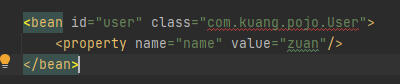

# Spring
## HelloSpring
- Hello 对象是由谁创建的？
- hello 对象是由Spring创建的
- Hello 对象的属性是怎么设置的？
- hello 对象的属性是由Spring容器设置的

这个过程就叫控制反转

- 控制：谁来控制对象的创建，传统应用程序的对象是由程序本事控制创建的，使用Spring之后，对象是由Spring来创建的
- 反转：程序本身不创建对象，而变成被动的接受对象
- 依赖注入：就是利用set方法来进行注入的

IOC是一种编程思想，由主动的编程变成被动的接收

IOC就一句话搞定：对象由Spring来创建，管理，装配！

## IOC的创建方式
Spring没有无参构造反射会失败

没有无参构造方法直接就报错了

1. 使用无参构造创建对象，默认！
2. 假设我们要使用有参构造创建对象。
   1. 下标赋值
      ~~~xml
      <!--第一种，下标赋值！-->
      <bean id="user" class="com.kuang.pojo.User">
        <constructor-arg index="0" value="狂神说Java"/>
      </bean>
   2. 类型
      ~~~xml
      <!--第二种，同类类型创建，不建议使用！-->
      <bean id="user" class="com.kuang.pojo.User">
        <constructor-arg type="java.lang.String" value="qinjiang"/>
      </bean>
   3. 参数名
      ~~~xml
      <!--第三种，直接通过参数名设置-->
      <bean id="user" class="com.kuang.pojo.User">
        <constructor-arg name="name" value="秦将"/>
      </bean>

总结：在配置文件加载的适合，容器中管理的对象就已经实例化了。

## Spring配置说明
- 别名
  ~~~xml
  <!--别名，如果添加了别名，也可以使用别名获取到这个对象-->
  <alias name="user" alias="userNew"/>
- Bean的配置
  ~~~xml
  <!--
  id：bean的唯一标识符，也就是相当于我们学的对象名
  class：bean对象所对应的权限定名，包名 + 类型
  name：也是别名，而且name更高级，可以同时取多个别名（比 alias 好）
  -->
  <bean id="userT" class="com.kuang.pojo.UserT" name="user2, u2">
     <property name="name" value="西部开源"/>
  </bean>
- import
   - 这个import，一般用于团队开发使用，他可以将多个配置文件，导入合并为一个

## 依赖注入
- 构造器注入
- Set方式注入【重点】
   - 依赖注入：Set注入
      - 依赖：bean对象的创建依赖于容器
   - 注入：bean对象中的所有属性，由容器来注入
- 拓展方式注入
   - 我们可以使用p命名空间和c命名空间进行注入
    
注意点：p命名和c命名空间不能直接使用，需要导入xml约束，官网上有

## Bean的自动装配
- 自动装配是Spring满足bean依赖一种方式！
- Spring回在上下文中自动寻找，并自动给bean装配属性！

在Spring中有三种装配的方式
1. 在xml中显示的配置
2. 在java中显示配置
3. 隐式的自动装配bean【重要】

### ByType自动装配
~~~xml
    <!--
    byName：会自动在容器上下文中查找，和自己对象set方法后面的值对应的bean id！
    byType：会自动在容器上下文中查找，和自己对象属性类型相同的bean！
    -->
    <bean id="people" class="com.kuang.pojo.People" autowire="byName">
        <property name="name" value="小狂神"/>

        <!--&lt;!&ndash;这里要重点注意，这里是要获得来源而不是赋值，所有用ref&ndash;&gt;-->
        <!--<property name="dog1" ref="dog1"/>-->
        <!--<property name="cat" ref="cat"/>-->
    </bean>
~~~

小结：
- byname的时候，需要保证所有bean的id唯一，并且这个bean需要和自动注入的属性的set方法的值一致！
- bytype的时候，需要保证所有bean的class唯一，并且这个bean需要和自动注入的属性的类型一致！

### 使用注解实现自动装配
jdk1.5支持的注解，Spring2.5就支持注解

要使用注解须知：
1. 导入约束
2. 配置注解的支持：<context:annotation-config/> 【重要】
~~~xml
<?xml version="1.0" encoding="UTF-8"?>
<beans xmlns="http://www.springframework.org/schema/beans"
    xmlns:xsi="http://www.w3.org/2001/XMLSchema-instance"
    xmlns:context="http://www.springframework.org/schema/context"
    xsi:schemaLocation="http://www.springframework.org/schema/beans
        https://www.springframework.org/schema/beans/spring-beans.xsd
        http://www.springframework.org/schema/context
        https://www.springframework.org/schema/context/spring-context.xsd">

    <context:annotation-config/>

</beans>
~~~

@Autowired

直接在属性上使用即可，也可以忽略set方法，通过反射实现

使用AutoWired 我们可以不用便携Set方法了，前提是你这个自动装配的属性在IOC（Spring）容器中存在，先找byType再找byName！

如果@Autowird自动装配的环境比较赋值，自动装配无法通过一个注解【@Autowired】完成的时候，我们可以使用@Qualifier(value = "xxx")去匹配@Autowired的使用，指定一个唯一的bean对象注入！

@Resource注解

小结：
@Resouce和@AutoWired的区别：
- 都是用来自动装配的，都可以放在属性字段上
- @Autowired 默认通过byType的方式实现，而且必须要求这个对象存在，不然就空指针了
- @Resoutce 默认通过byName的方式实现，如果找不到名字，则通过byType实现！如果两个都找不到，就报错。

## 使用注解开发

@Component：组件，放在类上，说明这个类被Spring管理了，就是bean！

1. bean
2. 属性如何注入
3. 衍生的注解
   @Component有几个衍生注解，我们在web开发中，会按照mvc三层架构分层
    - dao 【@Repository】
    - service 【@Service】
    - controller 【@Controller】
    这四个注解功能都是一样的，都是代表将某个类注册到Spring中，装配Bean
4. 自动装配置
5. 作用域
6. 小结
    xml与注解：
    - xml更加万能，适用于各种场合，维护简单方便
    - 注解 不是自己类用不了，维护相对复杂
    
    xml与注解最佳实践
    - xml用来管理bean
    - 注解只负责完成属性的注入
    - 我们在使用的过程中，只需要注意一个问题：必须让注解生效，就需要开启注解的支持
    
## 代理模式AOP
代理模式的分类：
- 静态代理
- 动态代理

### 静态代理

角色分析：
- 抽象角色（租房）：一般会使用接口或者类来解决
- 真实角色（房东）：被代理的角色
- 代理角色（中介）： 代理真实角色，代理真实角色后，我们一般会做一些附属操作
- 客户：访问代理对象的人

代理步骤：
1. 接口
    ~~~java
    public interface Rent {
        public void rent();
    }
2. 真实角色
    ~~~java
    public class Host implements Rent{
        @Override
        public void rent() {
            System.out.println("房东要出租房子！");
        }
    }
3. 代理角色
    ~~~java
    public class Proxy implements Rent {

        private Host host;
    
        public Proxy() {
        }
    
        public Proxy(Host host) {
            this.host = host;
        }
    
        @Override
        public void rent() {
            seeHouse();
            hetong();
            host.rent();
            fare();
        }
    
        //看房
        public void seeHouse() {
            System.out.println("中介带你看房");
        }
    
        //签合同
        public void hetong() {
            System.out.println("签租赁合同");
        }
    
        //收中介费
        public void fare() {
            System.out.println("收中介费");
        }
    }
4. 客户端访问代理角色
    ~~~java
    public class Client {
        public static void main(String[] args) {
            //房东要租房子
            Host host = new Host();
            //代理，中介帮房东租房子，但是代理角色一般会有些附属操作
            Proxy proxy = new Proxy(host);
    
            //你不用面对房东，直接找中介租房即可！
            proxy.rent();
        }
    }

代理模式的好处：
- 可以使真实角色的操作更加纯粹！不用去关注一些公共的业务
- 公共也就交给代理角色，实现了业务的分工
- 公共业务发生拓展的时候，方便集中管理

缺点：
- 一个真实角色就会产生一个代理角色；代码里会翻倍，开发效率会变低

### 动态代理
- 动态代理和静态代理角色一样
- 动态代理的代理类是动态生成的，不是我们直接写好的！
- 动态代理分为两大类：基于接口的动态代理，基于类的动态代理
    - 基于接口---JDK动态代理
    - 基于类：cglib
    - Java字节码实现：Javassist
    
真实角色只负责业务，代理角色负责加入日志等非核心业务功能

动态代理的好处：
- 可以使真实角色的操作更加纯粹！不用去关注一些公共的业务
- 公共也就交给代理角色，实现了业务的分工
- 公共业务发生拓展的时候，方便集中管理
- 一个动态代理的是一个接口，一般就是对应的一类业务
- 一个动态代理类可以代理多个类，只要是实现同一个接口即可，复用成本极低

## 什么是AOP
AOP意为面向切面编程，通过预编译方式和运行器动态代理实现程序功能的统一维护的一种技术

提供声明式事务；允许用户自定义切面

横切关注点：跨越应用程序多个模块的方法或功能
切面（Aspect）：横切关注点被模块化的特殊对象，即，它是一个类
通知（Advice）：切面必须要完成的工作。即，它是类中的一个方法
目标（Target）：被通知对象
代理（Proxy）：向目标对象应用通知之后创建的对象
切入点（PointCut）：切面通知执行的”地点“的定义
连接点（JointPoint）：与切入点匹配的执行点

要加入三个依赖
~~~xml
    <dependency>
        <groupId>org.aspectj</groupId>
        <artifactId>aspectjmatcher</artifactId>
        <version>1.9.6</version>
    </dependency>
    <dependency>
        <groupId>org.aspectj</groupId>
        <artifactId>aspectjweaver</artifactId>
        <version>1.9.6</version>
    </dependency>
    <dependency>
        <groupId>aopalliance</groupId>
        <artifactId>aopalliance</artifactId>
        <version>1.0</version>
    </dependency>
~~~

### 使用Spring实现Aop
- 方式一：使用Spring的API接口【主要SpringAPI接口实现】
    - 注意点：动态代理的是接口
- 方法二：自定义实现AOP【主要是切面定义】
- 方式三：使用注解实现

## 声明式事务
### 回顾事务  
- 把一组业务当成一个业务来做；要么都成功，要么都失败
- 事务在项目开发中，十分重要，设计到数据的一致性，不能马虎！
- 确保完整性和一致性

事务ACID原则：
- 原子性
- 一致性
- 隔离性
    - 多个业务可能操作同一个资源，防止数据损坏
- 持久性
    - 事务一旦提交，无论系统发生声明问题，结果都不会被影响，被持久化的写到存储器中
