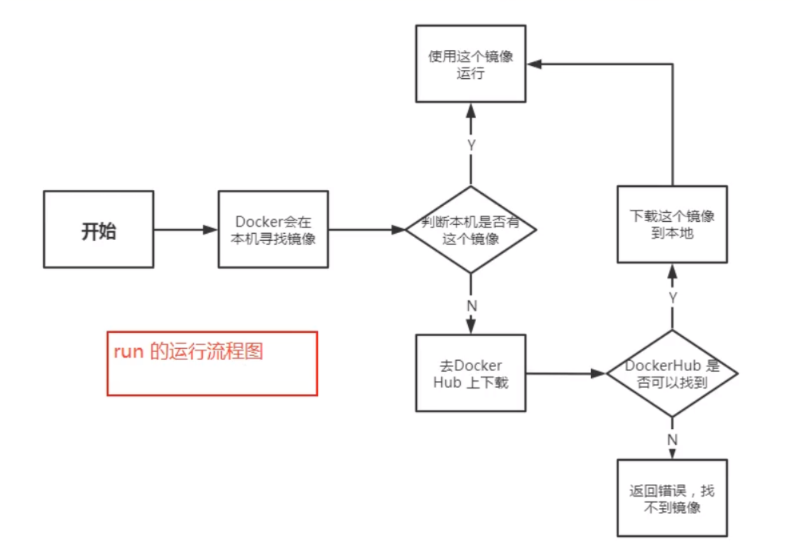
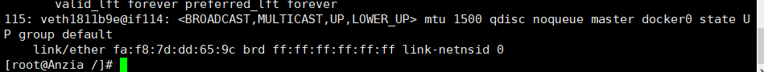
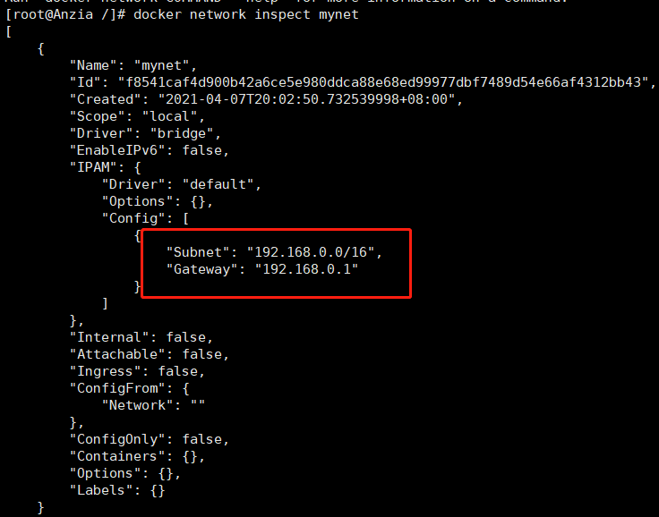

# Docker学习笔记

## Docker概述

### Docker为什么出现

Docker的思想来自于集装箱

JRE - 多个应用（端口冲突）-- 原来都是交叉的

隔离：Docker核心思想，打包装箱，每个箱子都是互相隔离的

Docker通过隔离机制，可以将服务器利用到极致

### Docker的历史

Docker 是 [PaaS](https://baike.baidu.com/item/PaaS) 提供商 dotCloud 开源的一个基于 [LXC](https://baike.baidu.com/item/LXC) 的高级容器引擎，源代码托管在 [Github](https://baike.baidu.com/item/Github) 上, 基于[go语言](https://baike.baidu.com/item/go语言)并遵从Apache2.0协议开源。

### Docker能干嘛

> 之前的虚拟机技术

虚拟机技术的缺点：

1. 资源占用十分多
2. 冗余步骤多
3. 启动很慢

> 容器化技术

==容器化技术不是是个完整的操作系统==

比较Docker和虚拟机技术的不同

- 传统虚拟机，虚拟出一个完整的操作系统，然后在这个系统上安装和运行软件
- 容器内的应用直接在宿主机的内容，容器是没有自己的内核的，也没有虚拟我们的硬件，所以就轻便了
- 每个容器间是互相隔离，每个容器内都有一个属于自己的文件系统，互补影响

> DevOps（开发，运维）

**应用更快速的交付和部署**

传统：一堆帮助文档，安装程序

Docker：打包镜像发布测试，一键运行

**更便捷的升级和扩缩容**

使用Docker之后，我们部署应用就和搭积木一样

项目打包为一个镜像，扩展服务器A 服务器B

**更简单的系统运维**

在容器化之后，我们在开发，测试环境都是高度一致的

**更高效的计算资源利用**

Docker是内核级别的虚拟化，可以在一个物理机上运行很多的容器实例

## Docker安装

镜像（image）：

docker镜像就好比是一个模板，可以是通过这个模板来创建容器服务，tomcat镜像== >run== >tomcat01容器（提供服务的），通过这个镜像可以创建多个容器（最终服务运行就是在容器中的）

容器（container）：

Docker利用容器技术，独立运行一个或者一个组应用，通过镜像来创建的

启动，停止，删除，基本命令

目前就可以把这个容器理解为一个简易的linux系统

仓库（repository）：

存放容器的地方

### Docker的基本组成

> 环境准备

~~~bash
#需要的安装包
yum install -y yum-utils
#设置镜像的仓库
yum-config-manager \
> --add-repo \
> http://mirrors.aliyun.com/docker-ce/linux/centos/docker-ce.repo #推荐使用阿里云镜像
#更新软件包索引
yum makecache fast
#安装docker相关的内容
yum install docker-ce-cli containerd.io
#启动docker
systemctl start docker
# 使用docker version查看是否安装成功
docker version
#测试
docker run hello-world
#查看一下下载的这个hello-world镜像
docker images
#卸载docker
#1.删除依赖
yum remove docker-ce docker-ce-cli containerd.io
#2.删除资源
rm -rf /var/lib/docker #docker的默认工作路径
~~~

### 阿里云镜像加速

### 回顾helloworld流程

### 底层原理

**docker是怎么工作的**

Docker是一个Client-Server结构的系统，Docker的守护进程运行在主机上，通过Socket从客户端访问

DockerServer接收到Client-Server的指令，就会执行这个命令

**Docker为什么比VM快**

1. Docker有着比虚拟机更少的抽象层
2. docker利用的是宿主机的内核，vm需要的是GuestOS

所以说，新建一个容器的时候，docker不需要像虚拟机一样重新加载一个操作系统内核，避免引导。虚拟机时加载GuestOS，分钟级别的；而docker是利用宿主机的操作系统，省略了这个复杂的过程，妙级！

## Docker的常用命令

### 帮助命令

~~~bash
docker version #显示docker的版本信息
docker info #显示docker的系统信息，包括镜像和容器的数量
docker 命令 --help #万能命令
~~~

### 镜像命令

**docker images**

~~~bash
[root@Anzia ~]# docker images
REPOSITORY    TAG       IMAGE ID       CREATED       SIZE
hello-world   latest    d1165f221234   4 weeks ago   13.3kB
#解释
REPOSITORY	镜像的仓库源
TAG			镜像的标签
IMAGE ID	镜像的id
CREATED		镜像的创建时间
SIZE		镜像的大小

#可选项
  -a, --all             Show all images (default hides intermediate images)
      --digests         Show digests
  -f, --filter filter   Filter output based on conditions provided
      --format string   Pretty-print images using a Go template
      --no-trunc        Don't truncate output
  -q, --quiet           Only show image IDs

docker images -a #列出所有镜像
docker images -q #只显示镜像的id
~~~

**docker search 搜索镜像**

~~~bash
[root@Anzia ~]# docker search mysql
NAME                              DESCRIPTION                                     STARS     OFFICIAL   AUTOMATED
mysql                             MySQL is a widely used, open-source relation…   10702     [OK]       
#可选项，通过收藏来过滤
[root@Anzia ~]# docker search mysql --filter=stars=5000
NAME      DESCRIPTION                                     STARS     OFFICIAL   AUTOMATED
mysql     MySQL is a widely used, open-source relation…   10702     [OK]  
~~~

**docker pull 下载镜像**

~~~bash
#下载镜像 docker pull 镜像名[:tag]
[root@Anzia ~]# docker pull mysql
Using default tag: latest #如果不写tag，默认就是latest
latest: Pulling from library/mysql
a076a628af6f: Pull complete  #分层下载，docker images的核心，联合文件系统
f6c208f3f991: Pull complete 
88a9455a9165: Pull complete 
406c9b8427c6: Pull complete 
7c88599c0b25: Pull complete 
25b5c6debdaf: Pull complete 
43a5816f1617: Pull complete 
1a8c919e89bf: Pull complete 
9f3cf4bd1a07: Pull complete 
80539cea118d: Pull complete 
201b3cad54ce: Pull complete 
944ba37e1c06: Pull complete 
Digest: sha256:feada149cb8ff54eade1336da7c1d080c4a1c7ed82b5e320efb5beebed85ae8c #签名
Status: Downloaded newer image for mysql:latest
docker.io/library/mysql:latest #真实地址

#等价于它
docker pull mysql
docker pull docker.io/library/mysql:latest

#指定版本地址
[root@Anzia ~]# docker pull mysql:5.7
5.7: Pulling from library/mysql
a076a628af6f: Already exists 
f6c208f3f991: Already exists 
88a9455a9165: Already exists 
406c9b8427c6: Already exists 
7c88599c0b25: Already exists 
25b5c6debdaf: Already exists 
43a5816f1617: Already exists 
1831ac1245f4: Pull complete 
37677b8c1f79: Pull complete 
27e4ac3b0f6e: Pull complete 
7227baa8c445: Pull complete 
Digest: sha256:b3d1eff023f698cd433695c9506171f0d08a8f92a0c8063c1a4d9db9a55808df
Status: Downloaded newer image for mysql:5.7
docker.io/library/mysql:5.7
~~~

**docker rmi 删除镜像**

~~~bash
docker rmi -f 镜像id #删除指定镜像
docker rmi -f 镜像id 镜像id 镜像id #删除多个镜像
docker rmi -f $(docker images -aq) #删除全部镜像
~~~

### 容器命令

**说明：我们有了镜像才能创建容器，linux，下载一个centos镜像来测试学习**

~~~bash
docker pull centos
~~~

**新建容器并启动**

~~~bash
docker run [可选参数] image

#参数说明
--name="Name" 容器名字 tomcat01 tomcat02 用来区分容器
-d 后台方式运行
-it 使用交互方式运行，进入容器查看内容
-p 指定容器的端口 -p 8080:8080
	-p ip:主机端口:容器端口
	-p 主机端口:容器端口 （常用）
	-p 容器端口
-P 随机指定端口

#测试，启动并进入容器
[root@Anzia ~]# docker run -it centos /bin/bash
[root@c7da5d34f5eb /]# ls #查看容器内的centos，基础版本，很多命令都是不完善的
bin  dev  etc  home  lib  lib64  lost+found  media  mnt  opt  proc  root  run  sbin  srv  sys  tmp  usr  var

#从容器中退回到主机
[root@c7da5d34f5eb /]# exit
exit
~~~

**列出所有运行的容器**

~~~bash
#docker ps 命令
   #列出当前正在运行的容器
-a #列出当前正在运行的容器 + 带出历史运行过的容器
-n=？ #显示最近创建的容器
-q #只显示容器的编号

[root@Anzia //]# docker ps
CONTAINER ID   IMAGE     COMMAND   CREATED   STATUS    PORTS     NAMES
[root@Anzia //]# docker ps -a
CONTAINER ID   IMAGE          COMMAND       CREATED          STATUS                      PORTS     NAMES
c7da5d34f5eb   centos         "/bin/bash"   15 minutes ago   Exited (0) 12 minutes ago             adoring_gagarin
d9a74f16ff3d   d1165f221234   "/hello"      10 hours ago     Exited (0) 10 hours ago               compassionate_golick
62d61b2250aa   d1165f221234   "/hello"      11 days ago      Exited (0) 11 days ago                cool_keller
~~~

**退出容器**

~~~bash
exit #直接停止容器并退出
ctrl + p + q #容器不停止退出
~~~

**删除容器**

~~~bash
docker rm 容器id #删除指定容器，不能删除正在运行的容器，如果要强制删除 rm -f
docker rm -f $(docker ps -aq) #删除所有容器
docker ps -a -q|xargs docker rm #删除所有的容器
~~~

**启动和停止容器的操作**

~~~bash
docker start 容器id #启动容器
docker restart 容器id #重启容器
docker stop 容器id #停止当前正在运行的容器
docker kill 容器id #强制停止当前正在运行的容器
~~~

### **常用基本命令**

**后台启动容器**

~~~bash
#命令 docker run -d 镜像名
[root@Anzia //]# docker run -d centos

#问题：docker ps 发现centos停止了

#常见的坑，docker容器使用后台运行，就必须要有一个前台进程，docker发现没有应用，就会自动停止
#nginx，容器启动后，发现自己没有提供服务，就会立刻停止，就是没有进程了
~~~

**查看日志**

~~~bash
docker log -f -t --tail 容器，没有日志

#自己编写一段shell脚本
[root@Anzia //]# docker run -d centos /bin/sh -c "while true;do echo kuangshen;sleep 1;done"

[root@Anzia //]# docker ps
CONTAINER ID   IMAGE     
95d1a498a3b7   centos    

#显示日志
-t #时间戳
-f #动态显示
--tail 数字 #要显示的日志条数
[root@Anzia //]# docker logs -f -t --tail 10 95d1a498a3b7
~~~

**查看容器中进程信息**

~~~bash
#命令 docker top 容器id
[root@Anzia //]# docker top 95d1a498a3b7
UID                 PID                 PPID                C                   STIME               TTY                 TIME                CMD
root                21077               21043               0                   13:42               ?                   00:00:00            /bin/sh -c while true;do echo kuangshen;sleep 1;done
root                21597               21077               0                   13:49               ?                   00:00:00            /usr/bin/coreutils --coreutils-prog-shebang=sleep /usr/bin/sleep 1
~~~

**查看镜像的元数据**

~~~bash
#命令 docker inspect 容器id
[root@Anzia //]# docker inspect 95d1a498a3b7
~~~

**进入当前正在运行的容器**

~~~bash
#我们通常容器都是使用后台方式运行的，需要进入容器，修改一些配置

#命令
docker exec -it 容器id bashSell

#测试
[root@Anzia //]# docker exec -it 95d1a498a3b7 /bin/bash
[root@95d1a498a3b7 /]# ls
bin  etc   lib	  lost+found  mnt  proc  run   srv  tmp  var
dev  home  lib64  media       opt  root  sbin  sys  usr

#方式二
docker attach 容器id

#测试
[root@Anzia ~]# docker attach 95d1a498a3b7 /bin/bash

# docker exec    #进入容器后开启一个新的终端，可以在里面操作（常用）
# docker attach  #进入容器正在执行的终端，不会启动新的进程
~~~

**从容器内拷贝文件到主机内**

~~~bash
docker ps 容器id：容器内路径 目的主机路径

#查看当前主机目录下
[root@Anzia home]# touch kuangshen.java
[root@Anzia home]# ls
kuangshen.java
[root@Anzia home]# docker ps
CONTAINER ID   IMAGE     COMMAND       CREATED              STATUS              PORTS     NAMES
4132744dd350   centos    "/bin/bash"   About a minute ago   Up About a minute             competent_shtern
#进入docker容器内部
[root@Anzia home]# docker attach 4132744dd350
[root@4132744dd350 /]# cd /home
#在容器内新建一个文件
[root@4132744dd350 home]# touch test.java
[root@4132744dd350 home]# ls
test.java
[root@4132744dd350 home]# exit
exit
[root@Anzia home]# docker ps -a
CONTAINER ID   IMAGE     COMMAND       CREATED         STATUS                     PORTS     NAMES
4132744dd350   centos    "/bin/bash"   3 minutes ago   Exited (0) 6 seconds ago             competent_shtern
#将这文件拷贝出来到这个主机上
[root@Anzia home]# docker cp 4132744dd350:/home/test.java /home
[root@Anzia home]# ls
kuangshen.java  test.java

#拷贝是一个手动的过程，未来我们使用 -v 的技术，可以实现同步
~~~

### 小结

~~~bash
  attach      Attach local standard input, output, and error streams to a running container
  build       Build an image from a Dockerfile
  commit      Create a new image from a container's changes
  cp          Copy files/folders between a container and the local filesystem
  create      Create a new container
  diff        Inspect changes to files or directories on a container's filesystem
  events      Get real time events from the server
  exec        Run a command in a running container
  export      Export a container's filesystem as a tar archive
  history     Show the history of an image
  images      List images
  import      Import the contents from a tarball to create a filesystem image
  info        Display system-wide information
  inspect     Return low-level information on Docker objects
  kill        Kill one or more running containers
  load        Load an image from a tar archive or STDIN
  login       Log in to a Docker registry
  logout      Log out from a Docker registry
  logs        Fetch the logs of a container
  pause       Pause all processes within one or more containers
  port        List port mappings or a specific mapping for the container
  ps          List containers
  pull        Pull an image or a repository from a registry
  push        Push an image or a repository to a registry
  rename      Rename a container
  restart     Restart one or more containers
  rm          Remove one or more containers
  rmi         Remove one or more images
  run         Run a command in a new container
  save        Save one or more images to a tar archive (streamed to STDOUT by default)
  search      Search the Docker Hub for images
  start       Start one or more stopped containers
  stats       Display a live stream of container(s) resource usage statistics
  stop        Stop one or more running containers
  tag         Create a tag TARGET_IMAGE that refers to SOURCE_IMAGE
  top         Display the running processes of a container
  unpause     Unpause all processes within one or more containers
  update      Update configuration of one or more containers
  version     Show the Docker version information
  wait        Block until one or more containers stop, then print their exit codes
~~~

### 作业练习

> Docker安装Nginx

~~~bash
#1. 搜索镜像 search 建议大家去docker hub搜索，可以看到帮助文档
#2. 下载镜像 pull
#3. 运行测试
[root@Anzia home]# docker images
REPOSITORY   TAG       IMAGE ID       CREATED        SIZE
nginx        latest    f6d0b4767a6c   2 months ago   133MB
centos       latest    300e315adb2f   3 months ago   209MB
#-d 后台运行
#--name 给容器命名
#-p 宿主机端口，容器内部端口
[root@Anzia home]# docker run -d --name nginx01 -p:3344:80 nginx
9ebe86a481ff92e44f92a4cacadd322fd1ba931d89cb4fdaddd5809944cdef19
[root@Anzia home]# docker ps
CONTAINER ID   IMAGE     COMMAND                  CREATED         STATUS         PORTS                  NAMES
9ebe86a481ff   nginx     "/docker-entrypoint.…"   8 seconds ago   Up 7 seconds   0.0.0.0:3344->80/tcp   nginx01
[root@Anzia home]# curl localhost:3344

#进入容器
[root@Anzia home]# docker exec -it nginx01 /bin/bash
root@9ebe86a481ff:/# whereis nginx
nginx: /usr/sbin/nginx /usr/lib/nginx /etc/nginx /usr/share/nginx
root@9ebe86a481ff:/# cd /etc/nginx
root@9ebe86a481ff:/etc/nginx# ls
conf.d		koi-utf  mime.types  nginx.conf   uwsgi_params
fastcgi_params	koi-win  modules     scgi_params  win-utf
~~~

**端口暴露的概念**

思考问题：我们每次改动nginx配置文件，都需要进入容器内部？十分的麻烦，我要是在容器外部提供一个映射路径，达到在容器修改文件，容器内部就可以自动修改？ -v 数据卷

> docker来装一个tomcat

~~~bash
#官方的使用
docker run -it --rm tomcat:9.0

#我们之前的启动都是在后台，停止了容器之后，容器还是可以查到 docker run -it --rm 一般用来测试，用完删除

#下载再删除
[root@Anzia home]# docker pull tomcat:9.0

#启动运行
[root@Anzia home]# docker run -d -p 3355:8080 --name tomcat01 tomcat:9.0

#测试访问没有问题

#进入容器
[root@Anzia home]# docker run -d -p 9090:8080 --name tomcat01 tomcat:9.0
756d83b604dce9a60612be9d3c6036ccf88ab6c61d916cbd740b919d81c5155f
[root@Anzia home]# docker exec -it tomcat01 /bin/bash

#发现问题：1. linux命令少了 2. 没有webapps。阿里云镜像的原因，默认是最小的镜像，所有不必要的都剔除掉
#保证最小可运行环境
~~~

思考问题：我们以后要部署项目，如果每次都要进入容器是不是十分麻烦？我要是可以在容器外部提供一个映射路径，webapps，我们在外部放置项目，就自动同步到内部就好了

> 部署 es + kibana

~~~bash
#es 暴露的端口很多
#es 十分的耗内存
#es 的数据一般需要放置到安全目录挂载
# --net somenetwork ? 网络配置

#启动elasticsearch
docker run -d --name elasticsearch -p 9200:9200 -p 9300:9300 -e "discovery.type=single-node" elasticsearch:7.6.2

#查看 docker stats

#测试 curl localhost:9200

#增加内存限制
docker run -d --name elasticsearch -p 9200:9200 -p 9300:9300 -e "discovery.type=single-node" -e ES_JAVA_OPTS="-Xms64m -Xms512m" elasticsearch:7.6.2
~~~

> 使用kibana连接es，思考网络如何才能连接过去

### 可视化

- portainer（先用这个）

~~~bash
docker run -d -p 8088:9000 \
--restart=always -v /var/run/docker.sock:/var/run/docker.sock --privileged=true portainer/portainer
~~~

- Rancher（CI/CD再用）

**什么是portainer？**

Docker图形化界面管理！提供一个后台面板供我们操作

## Docker镜像讲解

### 镜像是什么

我们下载的时候看到的一层层就是这个！

镜像是一种轻量级、可执行的独立软件包，用来打包软件运行环境和机遇运行环境开发的软件，它包含运行某个软件所需的所有内容，包括代码，运行时、库、环境变量和配置文件

所有的应用，直接打包docker镜像，就可以直接跑起来！

### Docker镜像加载原理

> UnionFS（联合文件系统）

UnionFS（联合文件系统）：Union文件系统（UnionFS）是一种分层、轻量级且高性能的文件系统，它支持对文件系统的修改作为一次提交来一层层叠加，同时可以将不同目录挂载到同一个虚拟文件系统下（unite serveral directories into a single virtual filesystem）。Union文件系统时Docker镜像的基础。镜像可以通过分层来进行继承，基于基础镜像（没有父镜像），可以制作各种具体的应用镜像

特性：一次同时加载多个文件系统，但从外面看起来，只能看到一个文件系统，联合加载会把各层文件系统叠加起来，这样最终的文件系统会包含所有的文件和目录

> Docker镜像加载原理

docker的镜像实际上由一层一层的文件系统组成，这种层级的文件系统UnionFS

bootfs（boot file system）主要包含bootloader和kernel，bootloader主要是引导加载kernel，Linux刚开始启动时会加载bootfs文件系统，在Docker镜像的最底层是bootfs。这一层与我们典型的Linux/Unix系统是一样的，包括boot加载器和内核。当boot加载完成之后整个内核就都在内存中，此时内存的使用权已由bootfs转交给内核，此时系统也会卸载bootfs

rootfs（root file systrm），在bootfs之上。包含的就是典型Linux系统中的/dev,/proc,/bin,/etc等标准目录和文件。rootfs就是各种不同的操作系统发行版，比如Ubuntu，Centos等等

平时我们安装进虚拟机的centos有1.5G，为什么Docker这里才200M？

对于一个精简的OS，rootfs可以很小，只需要包括最基本的命令，工具和工具库就可以了，因为底层直接使用host的kernel，自己只需要提供rootfs就可以了，由此可见对于不同的linux发行版，bootfs基本是一致的，rootfs会有差别，因此不同的发行版可以共用

虚拟机是分钟级别，容器是秒级

### 分层理解

> 特点

Docker镜像都是只读的，当容器启动时，一个新的可写层被加载到镜像的顶部

这一层就是我们通常所说的容器层，容器之下的都叫镜像层

### commit镜像

~~~bash
docker commit #提交容器成为一个新的版本
#命令和git原理类似
docker commit -m="提交的描述信息" -a="作者" 容器id 目标镜像名:[TAG]
~~~

实战测试

~~~bash
#1.启动一个默认的tomcat

#2.发现这个默认的tomcat是没有webapps应用，镜像的原因，官方的镜像默认webapps下时没有文件的

#3.要自己拷贝进入基本的文件webapps.dist拷贝到webapps下

#4.将我们操作过的容器通过commit提交为一个镜像，我们以后就使用我们修改过的镜像即可，这就是我们自己的一个修改镜像
~~~

## 容器数据卷

### **什么是容器数据卷**

**docker的理念回顾**

将应用和环境打包成一个镜像

数据？如果数据都在容器中，那么我们容器删除，数据就会删除！==需求：数据可以持久化==

MySQL，容器删了，删库跑路！==需求：MySQL数据可以存储在本地==

容器之间可以有一个数据共享的技术！Docker容器中产生的数据，同步到本地！

这就是卷技术！目录的挂载，将我们容器内的目录，挂载到Linux上面

**总结一句话：容器的持久化和同步操作！容器间也是可以数据共享的！**

### 使用数据卷

~~~bash
#方式一：直接使用命令来挂载
docker run -it -v -p 主机目录，容器内目录
[root@Anzia home]# docker run -it -v /home/ceshi:/home centos /bin/bash

#启动起来的时候我们可以通过 docker inspect 容器id 来查看容器信息
~~~

测试文件的同步

再来测试

1. 停止容器
2. 宿主机上修改文件
3. 启动容器
4. 容器内的数据已经是同步的

好处：我们以后修改只需要在本地修改即可，容器会自动同步

### 实战：安装MySQL

思考：MySQL的数据持久化问题

~~~bash
#获取镜像
[root@Anzia home]# docker pull mysql:5.7

#运行容器，需要做数据挂载 #安装mysql，需要配置密码，这是要注意点
#官方测试：docker run --name some-mysql -e MYSQL_ROOT_PASSWORD=my-secret-pw -d mysql:tag

#启动我们的
-d 后台运行
-p 端口映射
-v 卷挂载
-e 环境配置
--name 容器名字
[root@Anzia home]# docker run -d -p 3344:3306 -v /home/mysql/conf:/etc/mysql/conf.d -v /home/mysql/data:/var/lib/mysql -e MYSQL_ROOT_PASSWORD=123456 --name mysql01 mysql:5.7

#启动成功之后，我们在本地使用 sqlyog 来接测试一下
#sqlyog-连接到服务器的3344 --- 3344 和 容器内的3306映射，这个时候我们就可以连接上了

#在本地测试创建一个数据库，查看一下我们映射的路径是否ok
~~~

假设我们将容器删除

发现，我们挂载到本地的数据卷依旧没有丢失，这就实现了容器数据持久化功能

### 具名和匿名挂载

~~~bash
#匿名挂载
-v 容器内路径
[root@Anzia data]# docker run -d -P --name nginx01 -v /ect/nginx nginx

#查看所有卷（volume）的情况
[root@Anzia data]# docker volume ls

#这里发现，这种就是匿名挂载，我们在 -v 只写了容器内的路径，没有写容器外的路径

#具名挂载
[root@Anzia data]# docker run -d -P --name nginx02 -v juming-nginx:/etc/nginx nginx
870c07bd5b082f89f80858e446addce17632fed396fdeec1edb3bbcdcb3e1ee1
[root@Anzia data]# docker volume ls
DRIVER    VOLUME NAME
local     juming-nginx

#通过 -v 卷名:容器内路径
#查看一下这个卷
~~~

所有的docker容器内的卷，没有指定目录的情况下都是在`/var/lib/docker/volumes/xxxx/_data`

我们通过具名挂载可以方便的找到一个卷，大多数情况在使用`具名挂载`

~~~bash
#如何确定是具名挂载还是匿名挂载，还是指定路径挂载
-v 容器内路径 #匿名挂载
-v 卷名:容器内路径 #具名挂载
-v /宿主机路径:容器内路径 #指定路径挂载
~~~

拓展：

~~~bash
#通过 -v 容器内路径：ro rw 改变读写权限
ro readonly #只读
rw readwrite #可读可写

#一旦这个设置了容器权限，容器对我们挂载出来就有限定了
docker run -d -P --name nginx02 -v juming-nginx:/etc/nginx:ro nginx
docker run -d -P --name nginx02 -v juming-nginx:/etc/nginx:rw nginx

#ro 只有看到ro就说明这个路径只能通过宿主机来操作，容器内部是无法操作
~~~

### 初识Dockerfile

Dockerfile就是用来构建docker镜像的构建文件 命令脚本

通过这个脚本可以生成镜像，镜像是一层一层的，脚本一个个命令，每个命令都是一层

~~~bash
#创建一个dockerfile文件，名字可以随机 建议 dockerfile
#文件的内容 指令（大写） 参数
FROM centos

VOLUME ["volume01","volume02"]

CMD echo "---end---"

CMD /bin/bash
#这里的每个命令，就是镜像的一层
~~~

启动自己写的容器

这个卷和外部一定有一个同步的目录

查看一下卷挂载的路径

测试一下刚才的文件是否同步出去了

这种方式我们未来使用的十分多，因为我们通常会构建自己的镜像

假设构建镜像时候没有挂载卷，要手动镜像挂载 -v 卷名:容器内路径

### 数据卷容器

启动3个容器，通过我们刚才自己写的镜像启动

~~~bash
#测试，删除了docker01，查看docker02和docker03的文件是否可以访问
#测试依旧可以访问
~~~

**结论：**

容器之间配置信息的传递，数据卷容器的生命周期一直持续到没有容器使用为止

但是一旦你持久化到了本地，这个时候，本地的数据是不会删除的

## DockerFile

### DockerFile介绍

dockerfile是用来构建docker镜像的文件 命令参数脚本

构建步骤：

1. 编写一个dockerfile文件
2. docker build构建成为一个镜像
3. docker run运行镜像
4. docker push 发布镜像（DockerHub、阿里云镜像仓库）

### DockerFile构建过程

**基础知识**

1. 每个保留关键字（指令）都必须是大写字母
2. 执行从上到下顺序执行
3. /# 表示注释
4. 每一个指令都会创建提交一个新的镜像层，并提交

dockerfile是面向开发的，我们以后要发布项目，做镜像，就需要编写dockerfile文件

Docker镜像逐渐成为企业交付标准，必须要掌握

DockerFile：构建文件，定义了一切的步骤，源代码

DockerImages：通过DockerFile构建生成的镜像，最终发布和运行的产品

Docker容器：容器就是镜像运行起来提供服务的

### DockerFile的指令

~~~bash
FROM		#基础的镜像，一切从这里开始构建
MAINTAINER   #镜像是谁写的，姓名 + 邮箱
RUN			#镜像构建的时候需要运行的命令
ADD			#步骤：tomcat镜像，这个tomcat压缩包，添加内容
WORKDIDR	#镜像的工作目录
VOLUME		#挂载的目录
EXPOSE		#暴露端口配置
CMD			#指定这个容器启动的时候要运行的命令，只有最后一个会生效，可被替代
ENTRYPOINT	#指定这个容器启动的时候要运行的命令，可以追加命令
ONBUILD		#当构建一个被继承 DockerFile这个时候就会运行ONBUILD的指令，触发指令
COPY		#类似ADD，将我们文件拷贝到镜像中
ENV			#构建的时候设置环境变量
~~~

### 实战测试

DockerHub中99%镜像都是从这个基础镜像过来的FROM scratch，然后配置需要的软件和配置来进行构建

> 创建一个自己的centos

~~~bash
#编写一个自己的centos
FROM centos

MAINTAINER kuangshen<24736743@qq.com>

ENV MYPATH /usr/local

WORKDIR $MYPATH

RUN yum -y install vim
RUN yum -y install net-tools

EXPOSE 80

CMD echo $MYPATH
CMD echo "---end---"
CMD /bin/bash

#通过这个文件构建镜像
#命令 docker build -f dockerfile文件路径 -t 镜像名:[tag] .
[root@Anzia dockerfile]# docker build -f mydockerfile-centos -t mycentos:0.1 .

Successfully built b84216fdfd0b
Successfully tagged mycentos:0.1
~~~

查看构建过程

> CMD 和 ENTRYPOINT 区别

~~~bash
CMD			#指定这个容器启动的时候要运行的命令，只有最后一个会生效，可被替代
ENTRYPOINT	#指定这个容器启动的时候要运行的命令，可以追加命令
~~~

测试cmd

~~~bash
#编写dockerfile文件
[root@Anzia dockerfile]# vim dockerfile-cmd-test
FROM centos
CMD ["ls","-a"]

#构建镜像
[root@Anzia dockerfile]# docker build -f dockerfile-cmd-test -t cmdtest .

#run运行，发现我们的ls -a命令生效
[root@Anzia dockerfile]# docker run 191a84afdd68
.
..
.dockerenv
bin
dev
etc
home
lib
lib64
lost+found
media
mnt
opt
proc
root
run
sbin
srv
sys
tmp
usr
var

#想追加一个命令 -l		ls -a -l
[root@Anzia dockerfile]# docker run 191a84afdd68 -l
docker: Error response from daemon: OCI runtime create failed: container_linux.go:367: starting container process caused: exec: "-l": executable file not found in $PATH: unknown.

#cmd的处理下 -l 替换了CMD ["ls","-a"]命令， -l 不是命令所以报错
~~~

测试entrypoint

~~~bash
[root@Anzia dockerfile]# vim dockerfile-cmd-entrypoint
FROM centos
ENTRYPOINT ["ls","-a"]

[root@Anzia dockerfile]# docker build -f dockerfile-cmd-entrypoint -t entorypoint .
[root@Anzia dockerfile]# docker run b868c3cf2d67
.
..
.dockerenv
bin
dev
etc
home
lib
lib64
lost+found
media
mnt
opt
proc
root
run
sbin
srv
sys
tmp
usr
var
#我们追加命令，是直接拼接在我们的ENTRYPOINT命令的后面
[root@Anzia dockerfile]# docker run b868c3cf2d67 -l
total 56
drwxr-xr-x   1 root root 4096 Apr  7 04:10 .
drwxr-xr-x   1 root root 4096 Apr  7 04:10 ..
-rwxr-xr-x   1 root root    0 Apr  7 04:10 .dockerenv
lrwxrwxrwx   1 root root    7 Nov  3 15:22 bin -> usr/bin
drwxr-xr-x   5 root root  340 Apr  7 04:10 dev
drwxr-xr-x   1 root root 4096 Apr  7 04:10 etc
drwxr-xr-x   2 root root 4096 Nov  3 15:22 home
lrwxrwxrwx   1 root root    7 Nov  3 15:22 lib -> usr/lib
lrwxrwxrwx   1 root root    9 Nov  3 15:22 lib64 -> usr/lib64
drwx------   2 root root 4096 Dec  4 17:37 lost+found
drwxr-xr-x   2 root root 4096 Nov  3 15:22 media
drwxr-xr-x   2 root root 4096 Nov  3 15:22 mnt
drwxr-xr-x   2 root root 4096 Nov  3 15:22 opt
dr-xr-xr-x 104 root root    0 Apr  7 04:10 proc
dr-xr-x---   2 root root 4096 Dec  4 17:37 root
drwxr-xr-x  11 root root 4096 Dec  4 17:37 run
lrwxrwxrwx   1 root root    8 Nov  3 15:22 sbin -> usr/sbin
drwxr-xr-x   2 root root 4096 Nov  3 15:22 srv
dr-xr-xr-x  13 root root    0 Mar 25 04:08 sys
drwxrwxrwt   7 root root 4096 Dec  4 17:37 tmp
drwxr-xr-x  12 root root 4096 Dec  4 17:37 usr
drwxr-xr-x  20 root root 4096 Dec  4 17:37 var
~~~

DockerFil中很多命令都十分相似，我们需要了解它们的区别，我们最好的学习就是对比他们然后测试效果

### 实战：Tomcat镜像

1. 准备镜像文件 tomcat压缩包，jdk压缩包
   

2. 编写dockerfile文件，官方命名`Dockerfile`，build会自动寻找这个文件，就不需要 -f 指定了

   ~~~bash
   FROM centos
   MAINTAINER kuangshen<24736743@qq.com>
   
   COPY read.text /usr/local/readme.text
   
   ADD jdk-8u281-linux-x64.rpm /usr/local/
   ADD apache-tomcat-9.0.44.tar.gz /usr/local/
   
   RUN yum -y install vim
   
   ENV MYPATH /usr/local
   WORKDIR $MYPATH
   
   ENV JAVA_HOME /usr/local/jdk1.8
   ENV CLASSPATH $JAVA_HOME/lib/dt.jar:$JAVA_HOME/lib/tools.jar
   ENV CATALINA_HOME /usr/local/apache-tomcat-9.0.44
   ENV VATALINA_HOME /usr/local/apache-tomcat-9.0.44
   ENV PATH $PATH:$JAVA_HOME/bin:$CATALINA_HOME/lib:$CATALINA_HOME/bin
   
   EXPOSE 8080
   
   CMD /usr/local/apache-tomcat-9.0.44/bin/startup.sh && tail -F /url/local/apache-tomcat-9.0.44/bin/catal
   ina.out
   ~~~

3. 构建镜像

   ~~~bash
   [root@Anzia zip]# docker build -t diytomcat .
   ~~~

4. 启动容器

   ~~~bash
   [root@Anzia WEB-INF]# docker run -d -p 9090:8080 --name kuangshentomcat02 -v /opt/document/zip/test:/usr/local/apache-tomcat-9.0.44/webapps/test -v /opt/document/zip/tomcatlogs/:/usr/local/apache-tomcat-9.0.44/logs diytomcat
   ~~~

### 发布自己的镜像

> DockerHub

1. 地址：https://hub.docker.com/ 注册自己的账号

2. 确定这个账号可以登陆

3. 在我们服务器上提交自己的镜像

   ~~~bash
   [root@Anzia WEB-INF]# docker login -h
   Flag shorthand -h has been deprecated, please use --help
   
   Usage:  docker login [OPTIONS] [SERVER]
   
   Log in to a Docker registry.
   If no server is specified, the default is defined by the daemon.
   
   Options:
     -p, --password string   Password
         --password-stdin    Take the password from stdin
     -u, --username string   Username
   ~~~

4. 登陆完毕后就可以提交镜像了，就是一步，docker push
   如果push失败，加个tag

   ~~~bash
   docker push 作者/镜像:版本号
   ~~~

> 阿里云镜像服务上

1. 登陆阿里云
2. 找到容器镜像服务
3. 创建命名空间
4. 创建容器镜像
5. 浏览阿里云

### 小结

## Docker网络

### 理解Docker0

清空所有环境

> 测试

~~~bash
[root@Anzia /]# docker run -d -P --name tomcat01 tomcat

#查看容器的内部网络地址 ip addr	发现容器启动的时候会得到一个eth0@if115 ip地址，docker分配的
1: lo: <LOOPBACK,UP,LOWER_UP> mtu 65536 qdisc noqueue state UNKNOWN group default qlen 1000
    link/loopback 00:00:00:00:00:00 brd 00:00:00:00:00:00
    inet 127.0.0.1/8 scope host lo
       valid_lft forever preferred_lft forever
114: eth0@if115: <BROADCAST,MULTICAST,UP,LOWER_UP> mtu 1500 qdisc noqueue state UP group default 
    link/ether 02:42:ac:11:00:02 brd ff:ff:ff:ff:ff:ff link-netnsid 0
    inet 172.17.0.2/16 brd 172.17.255.255 scope global eth0
       valid_lft forever preferred_lft forever

#思考，linux能不能ping通容器内部
[root@Anzia /]# ping 172.17.0.2
PING 172.17.0.2 (172.17.0.2) 56(84) bytes of data.
64 bytes from 172.17.0.2: icmp_seq=1 ttl=64 time=0.078 ms
64 bytes from 172.17.0.2: icmp_seq=2 ttl=64 time=0.062 ms
64 bytes from 172.17.0.2: icmp_seq=3 ttl=64 time=0.070 ms

#linux可以ping通docker容器内部
~~~

> 原理

1. 我们每启动一个容器，docker就会给docker容器分配一个ip，我们只需要安装了docker，就会有一个网卡docker0桥接模式，使用的技术是veth-pair技术
   再次测试ip addr
   

2. 再启动一个容器测试，发现又多了一对网卡
   

   ~~~bash
   #我们发现这个容器带来网卡，都是一对对的
   #veth-pair 就是一对虚拟设备接口，他们都是成对出现的，一段连着协议，一段彼此相连
   #正因为有这个特性，veth-pair 充当一个桥梁，连接各种虚拟网络设备的
   #OpenStack，Docker容器之间的连接，ovs的连接，都是使用veth-pair技术
   ~~~

3. 我们来测试下tomcat01和tomcat02是否能ping通

   ~~~bash
   [root@Anzia /]# docker exec -it tomcat02 ping 172.17.0.1
   PING 172.17.0.1 (172.17.0.1) 56(84) bytes of data.
   64 bytes from 172.17.0.1: icmp_seq=1 ttl=64 time=0.083 ms
   64 bytes from 172.17.0.1: icmp_seq=2 ttl=64 time=0.060 ms
   
   #结论：容器和容器之间可以互相ping通的
   ~~~

结论：tomcat01和tomcat02是共用的一个路由器，docker0

所有的容器不指定网络的情况下，都是docker0路由的，docker会给我们的容器分配一个默认的可以ip

> 小结

Docker使用的是Linux的桥接，宿主机中是一个Docker容器的网球 docker0

Docker中的所有网络接口都是虚拟的，虚拟的转发效率高

只有容器删除了，对应的一对网桥就没了

### --link

> 思考一个场景，我们编写了一个微服务，database url=ip: ，项目不重启，数据库ip换了，我们希望可以处理这个问题，可以用名字来进行访问容器？

~~~bash
[root@Anzia /]# docker exec -it tomcat02 ping tomcat01
ping: tomcat01: Name or service not known

#如何可以解决？
#通过--link既可以解决了网络联通问题
[root@Anzia /]# docker run -d -P --name tomcat03 --link tomcat02 tomcat
a6ee5d56a74243370dc751f2897f9c64fd52567c1682e7404b4e5336916032ff
[root@Anzia /]# docker exec -it tomcat03 ping tomcat02
PING tomcat02 (172.17.0.3) 56(84) bytes of data.
64 bytes from tomcat02 (172.17.0.3): icmp_seq=1 ttl=64 time=0.080 ms

#反向可以ping通吗？
[root@Anzia /]# docker exec -it tomcat02 ping tomcat03
ping: tomcat03: Name or service not known

~~~

~~~bash
#查看hosts配置，在这里发现原理
[root@Anzia /]# docker exec -it tomcat03 cat /etc/hosts
127.0.0.1	localhost
::1	localhost ip6-localhost ip6-loopback
fe00::0	ip6-localnet
ff00::0	ip6-mcastprefix
ff02::1	ip6-allnodes
ff02::2	ip6-allrouters
172.17.0.3	tomcat02 6e99649682ea
172.17.0.4	a6ee5d56a742
~~~

本质：--link 就是在我们hosts配置中增加了一个172.17.0.3 tomcat02 6e99649682ea

我们现在使用Docker，已经不建议使用 --link 了

自定义网络，不使用 docker0

docker0问题：他不支持容器名连接访问

### 自定义网络

> 查看所有的docker网络

**网络模式**

bridge：桥接 docker（默认，自己创建也使用桥接模式）
none：不配置网络
host：和主机共享网络
container：容器网络连通（用的少，局限很大）

**测试**

~~~bash
#我们直接启动的命令 --net bridge，而这个就是我们的docker0
[root@Anzia /]# docker run -d -P --name tomcat01 tomcat
[root@Anzia /]# docker run -d -P --name tomcat01 --net bridge tomcat

#docker0特点：默认，域名不能访问，--link可以打通连接

#我们可以自定义一个网络
#--driver bridge
# --subnet 192.168.0.0/16
# --gateway 192.168.0.1
[root@Anzia /]# docker network create --driver bridge --subnet 192.168.0.0/16 --gateway 192.168.0.1 mynet
f8541caf4d900b42a6ce5e980ddca88e68ed99977dbf7489d54e66af4312bb43
[root@Anzia /]# docker network ls
NETWORK ID     NAME      DRIVER    SCOPE
154d9eef4450   bridge    bridge    local
4517038f6d8f   host      host      local
f8541caf4d90   mynet     bridge    local
7386db91d5e0   none      null      local
[root@Anzia /]# docker network ps

Usage:  docker network COMMAND

Manage networks

Commands:
  connect     Connect a container to a network
  create      Create a network
  disconnect  Disconnect a container from a network
  inspect     Display detailed information on one or more networks
  ls          List networks
  prune       Remove all unused networks
  rm          Remove one or more networks

Run 'docker network COMMAND --help' for more information on a command.

~~~

我们自己的网络就创建好了

使用自定义的网络创建容器

~~~bash
[root@Anzia /]# docker run -d -P --name tomcat-net-01 --net mynet tomcat
630f5e63b015eaf9910573c0f0ccb615f2d4906999d5b2eba6dadfa09c57f8ba
[root@Anzia /]# docker run -d -P --name tomcat-net-02 --net mynet tomcat
46bcfa798f9025633ab90d235a9221d30401f0f91d1573532a9ff1c2f2dec4a8
[root@Anzia /]# docker network inspect mynet
[
    {
        "Name": "mynet",
        "Id": "f8541caf4d900b42a6ce5e980ddca88e68ed99977dbf7489d54e66af4312bb43",
        "Created": "2021-04-07T20:02:50.732539998+08:00",
        "Scope": "local",
        "Driver": "bridge",
        "EnableIPv6": false,
        "IPAM": {
            "Driver": "default",
            "Options": {},
            "Config": [
                {
                    "Subnet": "192.168.0.0/16",
                    "Gateway": "192.168.0.1"
                }
            ]
        },
        "Internal": false,
        "Attachable": false,
        "Ingress": false,
        "ConfigFrom": {
            "Network": ""
        },
        "ConfigOnly": false,
        "Containers": {
            "46bcfa798f9025633ab90d235a9221d30401f0f91d1573532a9ff1c2f2dec4a8": {
                "Name": "tomcat-net-02",
                "EndpointID": "44c2d50fadb8e8696de2e75b604beb89cc392d2dc9a82301b2eaf5a251b3149b",
                "MacAddress": "02:42:c0:a8:00:03",
                "IPv4Address": "192.168.0.3/16",
                "IPv6Address": ""
            },
            "630f5e63b015eaf9910573c0f0ccb615f2d4906999d5b2eba6dadfa09c57f8ba": {
                "Name": "tomcat-net-01",
                "EndpointID": "1409a7bf7e30d03ae87ef2c95246294742a26afbd6a1b3bd2daa1d5052dde1c9",
                "MacAddress": "02:42:c0:a8:00:02",
                "IPv4Address": "192.168.0.2/16",
                "IPv6Address": ""
            }
        },
        "Options": {},
        "Labels": {}
    }
]
~~~

再次测试，使用容器名连接

~~~bash
[root@Anzia /]# docker exec -it tomcat-net-01 ping tomcat-net-02
PING tomcat-net-02 (192.168.0.3) 56(84) bytes of data.
64 bytes from tomcat-net-02.mynet (192.168.0.3): icmp_seq=1 ttl=64 time=0.057 ms
~~~

我们自定义的网络docker都已经帮我们维护好了对应的关系，推荐我们平时这样使用网络

好处：

redis：不同的集群使用不同的网络，保证集群式安全和健康的

mysql：不同的集群使用不同的网络，保证集群是安全和健康的

### 网络连通

~~~bash
#测试打通 tomcat01 - mynet

#连通之后就是将 tomcat01 放到了 mynet网络下

#一个容器两个ip地址
#阿里云服务器，公网ip，私网ip
~~~

~~~bash
[root@Anzia /]# docker exec -it tomcat01 ping tomcat-net-01
PING tomcat-net-01 (192.168.0.2) 56(84) bytes of data.
64 bytes from tomcat-net-01.mynet (192.168.0.2): icmp_seq=1 ttl=64 time=0.065 ms
64 bytes from tomcat-net-01.mynet (192.168.0.2): icmp_seq=2 ttl=64 time=0.066 ms
~~~

结论：假设要跨网络操作别人，就需要使用docker network connect 连通

### 实战：部署Redis集群

~~~bash
#创建网卡
[root@Anzia /]# docker network create redis --subnet 172.38.0.0/16

#通过脚本创建六个redis配置
for port in $(seq 1 6); \
do \
mkdir -p /mydata/redis/node-${port}/conf
touch /mydata/redis/node-${port}/conf/redis.conf
cat << EOF >/mydata/redis/node-${port}/conf/redis.conf
port 6379 
bind 0.0.0.0
cluster-enabled yes 
cluster-config-file nodes.conf
cluster-node-timeout 5000
cluster-announce-ip 172.38.0.1${port}
cluster-announce-port 6379
cluster-announce-bus-port 16379
appendonly yes
EOF
done

docker run -p 6371:6379 -p 16371:16379 --name redis-1 \
    -v /mydata/redis/node-1/data:/data \
    -v /mydata/redis/node-1/conf/redis.conf:/etc/redis/redis.conf \
    -d --net redis --ip 172.38.0.11 redis:5.0.9-alpine3.11 redis-server /etc/redis/redis.conf
    
docker run -p 6372:6379 -p 16372:16379 --name redis-2 \
    -v /mydata/redis/node-2/data:/data \
    -v /mydata/redis/node-2/conf/redis.conf:/etc/redis/redis.conf \
    -d --net redis --ip 172.38.0.12 redis:5.0.9-alpine3.11 redis-server /etc/redis/redis.conf
    
docker run -p 6373:6379 -p 16373:16379 --name redis-3 \
    -v /mydata/redis/node-3/data:/data \
    -v /mydata/redis/node-3/conf/redis.conf:/etc/redis/redis.conf \
    -d --net redis --ip 172.38.0.13 redis:5.0.9-alpine3.11 redis-server /etc/redis/redis.conf
    
docker run -p 6374:6379 -p 16374:16379 --name redis-4 \
    -v /mydata/redis/node-4/data:/data \
    -v /mydata/redis/node-4/conf/redis.conf:/etc/redis/redis.conf \
    -d --net redis --ip 172.38.0.14 redis:5.0.9-alpine3.11 redis-server /etc/redis/redis.conf
    
docker run -p 6375:6379 -p 16375:16379 --name redis-5 \
    -v /mydata/redis/node-5/data:/data \
    -v /mydata/redis/node-5/conf/redis.conf:/etc/redis/redis.conf \
    -d --net redis --ip 172.38.0.15 redis:5.0.9-alpine3.11 redis-server /etc/redis/redis.conf
    
docker run -p 6376:6379 -p 16376:16379 --name redis-6 \
    -v /mydata/redis/node-6/data:/data \
    -v /mydata/redis/node-6/conf/redis.conf:/etc/redis/redis.conf \
    -d --net redis --ip 172.38.0.16 redis:5.0.9-alpine3.11 redis-server /etc/redis/redis.conf
    
#创建集群
/data # redis-cli --cluster create 172.38.0.11:6379 172.38.0.12:6379 172.38.0.13:6379 172.38.0.14:6379 
172.38.0.15:6379 172.38.0.16:6379 --cluster-replicas 1 
>>> Performing hash slots allocation on 6 nodes...
Master[0] -> Slots 0 - 5460
Master[1] -> Slots 5461 - 10922
Master[2] -> Slots 10923 - 16383
Adding replica 172.38.0.15:6379 to 172.38.0.11:6379
Adding replica 172.38.0.16:6379 to 172.38.0.12:6379
Adding replica 172.38.0.14:6379 to 172.38.0.13:6379
M: 20857c6293f198aa78ac573934698ae0f69ba3c5 172.38.0.11:6379
   slots:[0-5460] (5461 slots) master
M: 821144c53c4151027c1f690feabe0c243169c991 172.38.0.12:6379
   slots:[5461-10922] (5462 slots) master
M: 7d3cd4d2d8aee2411c820f5ff259fee3e5b7dd1f 172.38.0.13:6379
   slots:[10923-16383] (5461 slots) master
S: 6ecdf9451a5783cfe696b1cf7657daea45555345 172.38.0.14:6379
   replicates 7d3cd4d2d8aee2411c820f5ff259fee3e5b7dd1f
S: c98fe010305e0f1085c1cf7710b30cbbc7223782 172.38.0.15:6379
   replicates 20857c6293f198aa78ac573934698ae0f69ba3c5
S: 39a0a67aa520fbcd9b09364d0b8166f7166028fb 172.38.0.16:6379
   replicates 821144c53c4151027c1f690feabe0c243169c991
Can I set the above configuration? (type 'yes' to accept): yes
>>> Nodes configuration updated
>>> Assign a different config epoch to each node
>>> Sending CLUSTER MEET messages to join the cluster
Waiting for the cluster to join
...
>>> Performing Cluster Check (using node 172.38.0.11:6379)
M: 20857c6293f198aa78ac573934698ae0f69ba3c5 172.38.0.11:6379
   slots:[0-5460] (5461 slots) master
   1 additional replica(s)
S: 6ecdf9451a5783cfe696b1cf7657daea45555345 172.38.0.14:6379
   slots: (0 slots) slave
   replicates 7d3cd4d2d8aee2411c820f5ff259fee3e5b7dd1f
S: 39a0a67aa520fbcd9b09364d0b8166f7166028fb 172.38.0.16:6379
   slots: (0 slots) slave
   replicates 821144c53c4151027c1f690feabe0c243169c991
M: 7d3cd4d2d8aee2411c820f5ff259fee3e5b7dd1f 172.38.0.13:6379
   slots:[10923-16383] (5461 slots) master
   1 additional replica(s)
S: c98fe010305e0f1085c1cf7710b30cbbc7223782 172.38.0.15:6379
   slots: (0 slots) slave
   replicates 20857c6293f198aa78ac573934698ae0f69ba3c5
M: 821144c53c4151027c1f690feabe0c243169c991 172.38.0.12:6379
   slots:[5461-10922] (5462 slots) master
   1 additional replica(s)
[OK] All nodes agree about slots configuration.
>>> Check for open slots...
>>> Check slots coverage...
[OK] All 16384 slots covered.

~~~

docker搭建redis集群完成

我们使用docker之后，所有的技术都会慢慢变得简单起来

### SpringBoot微服务打包Docker镜像

1. 新建springboot项目
2. 打包应用
3. 编写dockerfile
4. 构建镜像
5. 发布运行

