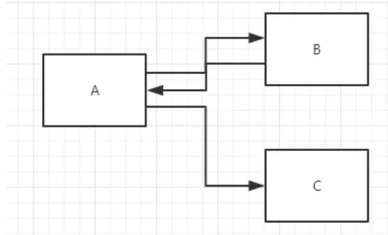
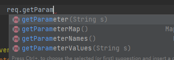
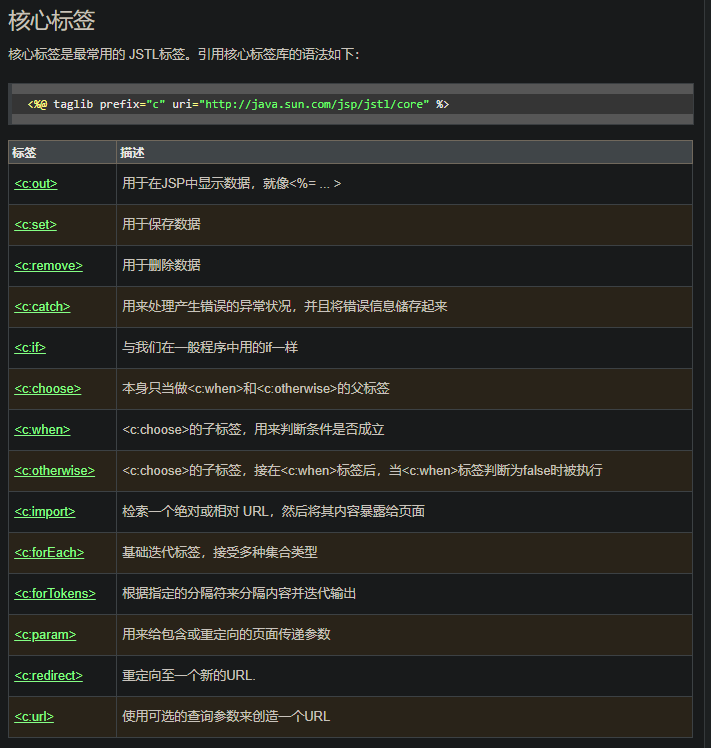
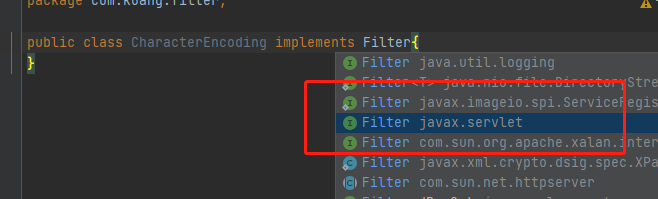
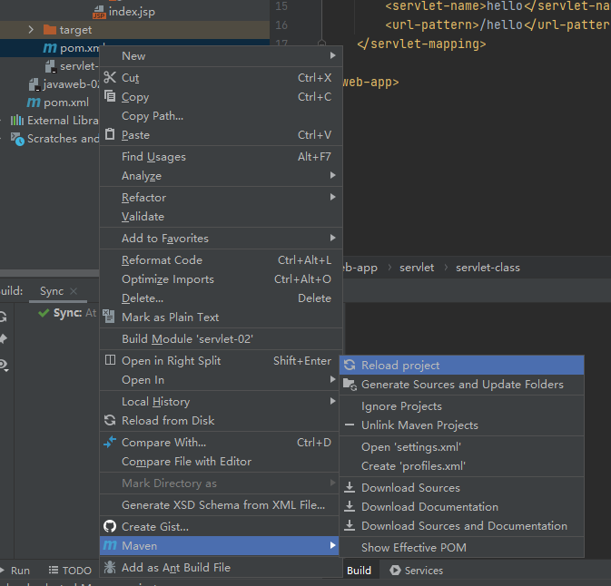
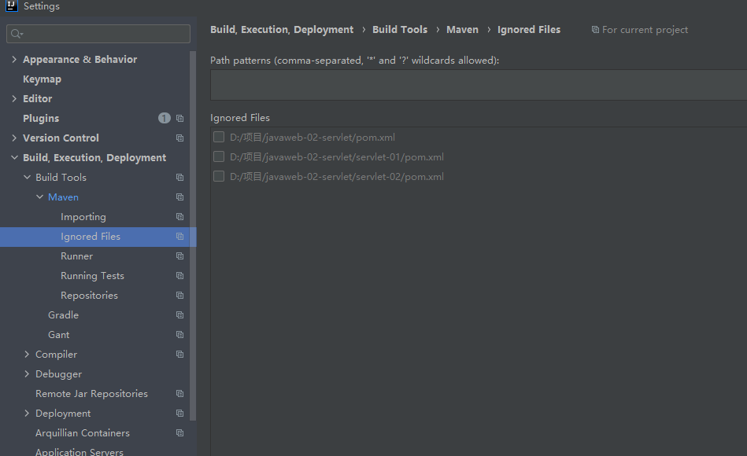

# JavaWeb课程笔记

## Servlet

### Servlet简介

两个小步骤

- 编写一个类，实现Servlet接口
- 把开发好的Java类部署到web服务器中

**把实现了Servlet接口的Java程序叫做Servlet**

### HelloServlet

1. 构建一个普通的maven项目，删掉里面的src目录，以后我们的学习就在这个项目里面简历Moudel；这个空的工程就是Maven主工程

   ~~~xml
   <?xml version="1.0" encoding="UTF-8"?>
   <web-app xmlns="http://xmlns.jcp.org/xml/ns/javaee"
            xmlns:xsi="http://www.w3.org/2001/XMLSchema-instance"
            xsi:schemaLocation="http://xmlns.jcp.org/xml/ns/javaee
                            http://xmlns.jcp.org/xml/ns/javaee/web-app_4_0.xsd"
            version="4.0"
            metadata-complete="true">、
   </web-app>
   ~~~

   

2. 关于maven父子工程的理解：
   父项目中会有

   ~~~xml
   <modules>
   	<module>servlet-01</module>
   </modules>
   ~~~

   子项目会有

   ~~~xml
     <groupId>com.kaung</groupId>
     <artifactId>servlet-01</artifactId>
     <version>1.0-SNAPSHOT</version>
   ~~~

   父项目中的Java子项目可以直接使用

   `son extends father`

3. maven环境优化

   1. 修改web.xml为最新的
   2. 将maven的结构搭建完成

4. 编写一个Servlet程序

   1. 编写一个普通类

   2. 实现Servlet接口，这里我们直接继承HttpServlet

      ~~~java
      public class HelloServlet extends HttpServlet {
          
          // 由于get或post只是请求实现不同的方式，可以相互调用，因为逻辑都一样
          @Override
          protected void doGet(HttpServletRequest req, HttpServletResponse resp) throws ServletException, IOException {
              
              //ServletOutputStream outputStream = resp.getOutputStream();
              PrintWriter writer = resp.getWriter(); // 响应流
              writer.print("Hello, Servlet!");
              
          }
      
          @Override
          protected void doPost(HttpServletRequest req, HttpServletResponse resp) throws ServletException, IOException {
              super.doPost(req, resp);
          }
      }
      ~~~

   3. 编写Servlet的映射
      为什么需要映射：我们写的是Java程序，但是要通过浏览器访问，而浏览器需要连接web服务器，所以我们需要在web服务器中

      ~~~xml
      	<!--注册Servlet-->
      	<servlet>
      		<servlet-name>hello</servlet-name>
      		<servlet-class>com.kuang.servlet.HelloServlet</servlet-class>
      	</servlet>
      	<!--Servlet的请求路径-->
      	<servlet-mapping>
      		<servlet-name>hello</servlet-name>
      		<url-pattern>/hello</url-pattern>
      	</servlet-mapping>
      ~~~

   4. 配置Tomcat
      注意：配置项目发布的路径
      
   5. 启动测试

### Servlet原理
Servlet是有Web服务器调用，web服务起在收到浏览器请求只会，会：


### Mapping问题
1. 一个Servlet可以指定一个映射路径
   ~~~xml
   <servlet-mapping>
		<servlet-name>hello</servlet-name>
		<url-pattern>/hello</url-pattern>
	</servlet-mapping>
   ~~~
2. 一个Servlet可以指定多个映射路径
   ~~~xml
   <servlet-mapping>
		<servlet-name>hello</servlet-name>
		<url-pattern>/hello1</url-pattern>
	</servlet-mapping>
   <servlet-mapping>
		<servlet-name>hello</servlet-name>
		<url-pattern>/hello2</url-pattern>
	</servlet-mapping>
   <servlet-mapping>
		<servlet-name>hello</servlet-name>
		<url-pattern>/hello3</url-pattern>
	</servlet-mapping>
   ~~~
3. 一个Servlet可以指定通用映射路径
   ~~~xml
   <servlet-mapping>
		<servlet-name>hello</servlet-name>
		<url-pattern>/hello/*</url-pattern>
	</servlet-mapping>
   ~~~
   
4. 默认请求路径
   ~~~xml
   <servlet-mapping>
		<servlet-name>hello</servlet-name>
		<url-pattern>/*</url-pattern>
	</servlet-mapping>
   ~~~
   
5. 指定一些后缀或者前缀等待……
   ~~~xml
   <servlet-mapping>
		<servlet-name>hello</servlet-name>
		<url-pattern>*.do</url-pattern>
	</servlet-mapping>
   ~~~
   

6.优先级问题
   指定了固有的映射路径优先级最高，如果找不到就会走默认的处理请求
   精确匹配 → 拓展匹配 → 模糊匹配 → 通配匹配
   ~~~xml
    <servlet>
        <servlet-name>error</servlet-name>
        <servlet-class>com.kuang.servlet.ErrorServlet</servlet-class>
    </servlet>
    <servlet-mapping>
        <servlet-name>error</servlet-name>
        <url-pattern>/*</url-pattern>
    </servlet-mapping>
   ~~~

### ServletContext

web容器在启动的时候，它会为每个web程序都创建一个对应的ServletContext对象，它代表了当前的web应用

- 共享数据
  我在这个Servlet中保存的数据，可以在另外一个servlet中拿到

  ~~~java
  public class HelloServlet extends HttpServlet {
  
      @Override
      protected void doGet(HttpServletRequest req, HttpServletResponse resp) throws ServletException, IOException {
  
          //this.getInitParameter() 初始化参数
          //this.getServletConfig() Servlet配置
          //this.getServletContext() Servlet上下文
          ServletContext servletContext = this.getServletContext();
  
          String username = "秦将"; // 数据
          servletContext.setAttribute("username", username); // 将一个数据保存在ServletContext中
  
      }
  }
  ~~~

  ~~~java
  public class GetServlet extends HttpServlet {
      @Override
      protected void doGet(HttpServletRequest req, HttpServletResponse resp) throws ServletException, IOException {
  
          ServletContext servletContext = this.getServletContext();
  
          String username = (String) servletContext.getAttribute("username");
  
          resp.setContentType("text/html");
          resp.setCharacterEncoding("utf-8");
  
          resp.getWriter().print("名字：" + username);
      }
  
      @Override
      protected void doPost(HttpServletRequest req, HttpServletResponse resp) throws ServletException, IOException {
          super.doPost(req, resp);
      }
  }
  ~~~

  ~~~xml
  	<servlet>
  		<servlet-name>getc</servlet-name>
  		<servlet-class>com.kuang.servlet.GetServlet</servlet-class>
  	</servlet>
  	<servlet-mapping>
  		<servlet-name>getc</servlet-name>
  		<url-pattern>/getc</url-pattern>
  	</servlet-mapping>
  ~~~

测试访问结果

### HttpServletRequest

响应：web服务器接受到客户端的http请求，针对这个请求，分别创建一个代表请求的HttpServletRequest对象，代表响应一个HttpServletResponse

- 如果要获取客户端请求过来的参数：找HttpServletRequest
- 如果要给客户端响应一些信息：找HttpServletResponse

1. 简单分类
   负责向浏览器发送数据的方法

 ~~~Java
ServletOutputStream getOutputStream() throws IOException;
PrintWriter getWriter() throw IOException;
 ~~~

2. 下载文件
   1. 向浏览器输出消息
   2. 下载文件
      1. 要获取下载文件的路径
      2. 下载的文件名是啥？
      3. 设置想办法让浏览器能够支持下载我们需要的东西
      4. 获取下载文件的输入流
      5. 创建缓冲区
      6. 获取OutputStream对象
      7. 将FileOutputStream流写入到buffer缓冲区
      8. 使用OutputStream将缓冲区中的数据输出到客户端

~~~java
    @Override
    protected void doGet(HttpServletRequest req, HttpServletResponse resp) throws ServletException, IOException {
        //1. 要获取下载文件的路径
        String realPath = "D:\\项目\\javaweb-02-servlet\\response\\src\\main\\java\\resources\\1.png";
        System.out.println("下载文件的路径" + realPath);
        //2. 下载的文件名是啥
        String fileName = realPath.substring(realPath.lastIndexOf("\\") + 1);
        //3. 设置想办法让浏览器能够支持下载我们需要的东西，中文文件名URLEncoder.encode编码，否则有可能乱码
        resp.setHeader("Content-Disposition","attachment;filename" + URLEncoder.encode(fileName, "UTF-8"));
        //4. 获取下载文件的输入流
        FileInputStream in = new FileInputStream(realPath);
        //5. 创建缓冲区
        int len = 0;
        byte[] bytes = new byte[1024];
        //6. 获取OutputStream对象
        ServletOutputStream out = resp.getOutputStream();
        //7. 将FileOutputStream流写入到buffer缓冲区,使用OutputStream将缓冲区中的数据输出到客户端
        while ((len = in.read(bytes)) > 0) {
            out.write(bytes, 0 ,len);
        }
        //8. 关流
        in.close();
        out.close();
    }
~~~

3. 验证码功能

验证怎么来的？

- 前端实现
- 后端实现

~~~java
    @Override
    protected void doGet(HttpServletRequest req, HttpServletResponse resp) throws ServletException, IOException {

        // 如何让浏览器5秒自动刷新一次
        resp.setHeader("refresh","3");

        // 在内存中创建一个图片
        BufferedImage image = new BufferedImage(80, 20, BufferedImage.TYPE_INT_RGB);
        //得到图片
        Graphics2D graphics = (Graphics2D) image.getGraphics(); // 笔
        // 设置图片的背景颜色
        graphics.setColor(Color.white);
        graphics.fillRect(0,0,80,20);
        // 给图片写数据
        graphics.setColor(Color.BLUE);
        graphics.setFont(new Font(null, Font.BOLD, 20));
        graphics.drawString(makeNum(), 0 ,20);

        // 告诉浏览器，这个请求用图片的方式打开
        resp.setContentType("image/jpeg");
        // 网站存在缓存
        resp.setDateHeader("expires",-1);
        resp.setHeader("Cache-Control", "no-cache");
        resp.setHeader("Pragma","no-cache");

        // 把图片写给浏览器
        ImageIO.write(image,"jpg",resp.getOutputStream());
    }

    // 生成随机数
    private String makeNum() {
        Random random = new Random();
        java.lang.String num = random.nextInt(9999999) + "";
        StringBuffer sb = new StringBuffer();
        for (int i = 0; i < 7-num.length(); i++) {
            sb.append("0");
        }
        java.lang.String s = sb.toString() + num;
        return num;
    }
~~~

4. 实现重定向



B一个web资源收到客户端请求后，B它会通知A客户端去访问另外一个web资源C，这个过程叫重定向

常见场景：

- 用户登陆

  ~~~java
  void sendRedirect(String var1) throws IOExecption;
  ~~~

测试

~~~java
    @Override
    protected void doGet(HttpServletRequest req, HttpServletResponse resp) throws ServletException, IOException {


        //resp.setHeader("Location","/r/img");
        //resp.setStatus(302);

        resp.sendRedirect("/r/img"); // 重定向
    }
~~~

面试题：重定向和转发的区别？

相同点

- 页面都会实现跳转

不同点

- 请求转发的时候，url不会发送变化
- 重定向时候，url地址栏会发送变化

~~~jsp
<html>
<body>
<h2>Hello World!</h2>

<%--这里提交的路径，需要寻找到项目的路径--%>
<%--${pageContext.request.contextPath} 代表当前的项目--%>
<%@ page pageEncoding="utf-8" %>
<form action="${pageContext.request.contextPath}/login" method="get" >
    <%--如果出现地址解析错误，但是又没发现什么问题，那么问题可能是web.xml的版本太低，不支持el表达式--%>
    用户名：<input type="text" name="username"> <br>
    密码：<input type="password" name="password"> <br>
    <input type="submit">
</form>


</body>
</html>
~~~

~~~java
    @Override
    protected void doGet(HttpServletRequest req, HttpServletResponse resp) throws ServletException, IOException {
        // 处理请求
        String username = req.getParameter("username");
        String password = req.getParameter("password");

        System.out.println(username + " : " + password);

        // 重定向时候一定要注意，路径问题，否则就是404
        resp.sendRedirect("success.jsp");


    }
~~~

~~~xml
  <servlet>
    <servlet-name>request</servlet-name>
    <servlet-class>com.kuang.servlet.RequestTest</servlet-class>
  </servlet>
  <servlet-mapping>
    <servlet-name>request</servlet-name>
    <url-pattern>/login</url-pattern>
  </servlet-mapping>
~~~

### HttpServletRequest

HttpServletRequest代表客户端的请求，用户通过Http协议访问服务器，HTTP请求中的所有信息会被封装到HttpServletRequest，通过这个HttpServletRequest的方法，获得客户端的所有信息

1. 获取前端传递的参数

   

2. 请求转发

   ~~~java
       @Override
       protected void doGet(HttpServletRequest req, HttpServletResponse resp) throws ServletException, IOException {
   
           req.setCharacterEncoding("utf-8");
   
           String username = req.getParameter("username");
           String password = req.getParameter("password");
           String[] hobbys = req.getParameterValues("hobby");
           System.out.println("================");
           // 后台中文乱码问题
           System.out.println(username);
           System.out.println(password);
           System.out.println(Arrays.toString(hobbys));
           System.out.println("=================");
   
           // 通过请求转发
           req.getRequestDispatcher( "success.jsp").forward(req,resp);
   
       }
   ~~~

## Cookie、Session

### 会话

**会话**：用户打开一个浏览器，点击了很多超链接，访问多个web资源，关闭浏览器，这个过程可以称之为会话

**有状态会话**：一个同学来过教师，下次再来教师，我们就知道这个同学，曾经来过，称之为有状态会话；

一个网站怎么证明你来过？
客户端		服务端

1. 服务端给客户端一个信件，客户端下次访问服务端带上信件就可以了；cookie
2. 服务器等级你来过了，下次你来的时候我来匹配你；session

### 保存会话的两种技术

cookie

- 客户端技术（响应，请求）

session

- 服务器技术，利用这个技术，可以保存用户的会话信息，我们可以把信息或者数据放在Session中

### Cookie

1. 从请求中拿到cookie信息
2. 服务器响应给客户端cookie

~~~java
Cookie[] cookies = req.getCookies(); // 这里返回数组，说明Cookie可能存在多个
cookie.getName() // 获得cookie中的key
cookie.getValue() // 获得cookie中的value
new Cookie("lastLoginTime", System.currentTimeMillis()+""); // 新建一个cookie
cookie.setMaxAge(24*60*60); // 设置cookie的有效期
resp.addCookie(cookie); // 响应给客户端一个cookie
~~~

**cookie：一般会保存再本地的用户目录下 appdata**

一个网站cookie是否存再上限？

- 一个cookie只能保存一个信息
- 一个web站点可以给浏览器发送多个cookie，最多存放20个cookie
- cookie大小有限制4kb
- 300个cookie浏览器上限

**删除cookie**

- 不设置有效期，关闭浏览器，自动失效
- 设置有效期时间为0

编码解码：

~~~java
URLEncoder.encode("秦将", "utf-8")
URLDecoder.decode(cookie.getValue(),"utf-8")
~~~

### Session（重点）

什么是Session：

- 服务器会给每一个用户（浏览器）创建一个Session对象
- 一个Session独占一个浏览器，只要浏览器没有关闭，这个Session就存在
- 用户登陆之后，整个网站它都可以访问！保存用户的信息，保存购物车信息


Session和Cookie的区别：

- Cookie是把用户的数据写给用户的浏览器，浏览器保存（可以保存多个）
- Session把用户的数据写道用户独占Session中，服务器端保存（保存重要的信息，减少服务器资源的浪费）
- Session对象由服务器创建

使用场景：

- 保存一个登陆用户的信息
- 购物车信息
- 再整个网站中经常会使用的数据，我们将它保存再Session中

使用Session：

~~~java
package com.kuang.servlet;

import com.kuang.pojo.Person;

import javax.servlet.ServletException;
import javax.servlet.http.*;
import java.io.IOException;

public class SessionDemo01 extends HttpServlet {
    @Override
    protected void doGet(HttpServletRequest req, HttpServletResponse resp) throws ServletException, IOException {
        // 解决乱码问题
        req.setCharacterEncoding("utf-16");
        resp.setCharacterEncoding("utf-16");
        resp.setContentType("text/html;charset=utf-8");

        // 得到Session
        HttpSession session = req.getSession();

        // 给Session中存东西
        session.setAttribute("name",new Person("秦将",1));

        // 获取Session的ID
        String sessionId = session.getId();

        // 判断session是不是新创建的
        if (session.isNew()) {
            resp.getWriter().write("session创建成功，ID：" + sessionId);
        } else {
            resp.getWriter().write("session已经再服务器中创建了，ID：" + sessionId);
        }

        // Session创建的时候做了什么事情
        //Cookie cookie = new Cookie("JSESSIONID", sessionId);
        //resp.addCookie(cookie);
    }

    @Override
    protected void doPost(HttpServletRequest req, HttpServletResponse resp) throws ServletException, IOException {
        doGet(req, resp);
    }
}
~~~

~~~java
        //得到Session
        HttpSession session = req.getSession();

        Person person = (Person) session.getAttribute("name");

        System.out.println(person.toString());
~~~

~~~java
        HttpSession session = req.getSession();
        session.removeAttribute("name");
        // 手动注销Session
        session.invalidate();
~~~

~~~xml
	<!--设置Session默认的失效时间-->
	<session-config>
		<!--1分钟后session自动失效-->
		<session-timeout>1</session-timeout>
	</session-config>
~~~

## JSP

### 什么是JSP

Java Server Pages：Java服务器端页面，也和Servlet一样，用于动态Web计数

最大的特点

- 写JSP就像在写HTML
- 区别：
  - HTML只给用户提供静态的数据
  - JSP页面中嵌入Java代码，为用户提供动态数据

### JSP原理

思路：JSP到底怎么执行的？

- 代码层面没有任何问题

- 服务器内部工作

  tomcat中有个work目录

  IDEA中使用tmocat的会在IDEA的tomcat中产生一个work目录

  发现页面转变了java程序

  浏览器向服务器发送请求，不管访问什么资源，其实都是在访问Servlet

  JSP最终也会转换成为一个Java类

  JSP本质上就是一个Servlet

  ~~~java
  //初始化
  public void _jspInit() {
      
  }
  //销毁
  public void _jspDestory() {
  }
  //JSPService
  public void  _jspService(.HttpServletRequest request, HttpServletResponse response)
  ~~~

  1. 判断请求
  2. 内置一些对象
  3. 输出页面前增加的代码

在JSP页面中：

只要是Java代码就会原封不动的输出

如果是HTML代码，就会被转换为

~~~java
out.write("")
~~~

这样的格式，输出到前端？

### JSP基础语法

任何语言都有增加的语法，JSP作为Java的一种应用，它拥有一些自己扩充的语法，Java所有语法都支持！

JSP表达式

~~~jsp
  <%--JSP表达式
  作用：用来将程序的输出，输出到客户端
  <%= 变量或者表达式%>
  --%>
  <%= new java.util.Date()%>
~~~

```jsp
<%--JSP脚本片段--%>
<%
  int sum = 0;
  for (int i = 1; i <= 100; i++) {
    sum += i;
  }
  out.println("<h1>Sum = " + sum + "</h1>");
%>
```

```jsp
<%--脚本片段的再实现--%>
<%
  int x = 10;
  out.println(x);
%>
<p>这是一个JSP文档</p>
<%
  int y = 20;
  out.println(y);
%>
<hr>

<%
  for (int i = 0; i < 5; i++) {

%>
<h1>Hello,World! <%= i%> </h1>
<%
  }
%>
```

```jsp
<%--JSP声明--%>
<%!
  static {
    System.out.println("Loadint Servlet!");
  }

  private int globalVar = 0;

  public void kuang() {
    System.out.println("进入了方法！");
  }
%>
```

JSP声明：会被编译到JSP生成Java的类中，其他的，就会被生成到_jspService方法中！
在

JSP指令

~~~jsp
<%@ page contentType="text/html;charset=UTF-8" language="java" %>
<html>
<head>
    <title>Title</title>
</head>
<body>

<%--@include会将两个页面合二为一--%>
<%@include file="common/header.jsp"%>
<h1>网页主体</h1>
<%@include file="common/footer.jsp"%>

<hr>

<%--jsp:include：拼接页面，本质还是三个--%>
<%--jsp标签--%>
<jsp:include page="common/header.jsp"/>
</body>
</html>
~~~

### 9大内置对象

- PageContext 存东西
- Request 存东西
- Response
- Session 存东西
- Application【ServletContext】存东西
- config【ServletConfig】
- out
- page
- exception

```java
pageContext.setAttribute("name1","秦将1号"); //保存的数据旨在一个页面中有效
request.setAttribute("name2","秦将2号"); //保存的数据旨在一次请求中有效，请求转发会携带这个数据
session.setAttribute("name3","秦将3号"); //保存的数据旨在一次会话中有效，从打开浏览器到关闭浏览器
application.setAttribute("name4","秦将4号"); //保存的数据只在服务器中有效，从打开服务器到关闭服务器
```

request：客户端向服务器发送请求，产生的数据，用户看完就没用了，比如：新闻

session：客户端向服务器发送请求，产生的数据，用户用完一会还有用，比如：购物车

application：客户端向服务器发送请求，产生的数据，一个用户用完了，其他用户还可能使用，比如：聊天数据

### JSP标签、JSTL标签、EL表达式

~~~xml
<dependency>
    <groupId>javax.servlet.jsp.jstl</groupId>
    <artifactId>jstl-api</artifactId>
    <version>1.2</version>
</dependency>

<!-- https://mvnrepository.com/artifact/taglibs/standard -->
<dependency>
    <groupId>taglibs</groupId>
    <artifactId>standard</artifactId>
    <version>1.1.2</version>
</dependency>
~~~


EL表达式：${}

- 获取数据
- 执行运算
- 获取web开发的常用对象

JSP标签

~~~jsp
<jsp:forward page="/jsptag2.jsp">
    <jsp:param name="name" value="kuangshen"/>
    <jsp:param name="age" value="18"/>
</jsp:forward>
~~~

JSTL表达式

JSTL标签库的使用就是为了弥补HTML标签的不足；它自定义许多标签，可以供我们使用，标签的功能和Java代码一样！

核心标签（掌握部分）



JSTL标签库使用步骤

- 引入对应的taglib
- 使用其中的方法
- 在Tomcat也需要引入jstl的包，否则会报错：JSTL解析错误

~~~jsp
<%@ page contentType="text/html;charset=UTF-8" language="java" %>
<%@ taglib prefix="c" uri="http://java.sun.com/jsp/jstl/core" %>
<html>
<head>
    <title>Title</title>
</head>
<body>

<h4>if测试</h4>

<hr>

<form action="coreif.jsp" method="get">
    <%--
    EL表达式获取表单中的数据
    ${param.参数名}
    --%>
    <input type="text" name="username" value="${param.username}">
    <input type="submit" value="登陆">
</form>

<%--判断如果提交的用户名是管理员，则操作成功--%>
<c:if test="${param.username == 'admin'}" var = "isAdmin">
    <c:out value="管理员欢迎你"/>
</c:if>

<c:out value="${isAdmin}"/>

</body>
</html>
~~~

```jsp
<%
    ArrayList<String> people = new ArrayList<>();
    people.add(0,"张三1");
    people.add(1,"张三2");
    people.add(2,"张三3");
    people.add(3,"张三4");
    people.add(4,"张三5");
    people.add(5,"张三6");
    people.add(6,"张三7");
    request.setAttribute("list",people);
%>
<%--
var，每一次遍历出来的变量
items，要遍历的变量
--%>
<c:forEach var="people" items="${list}">
    <c:out value="${people}"/> <br>
</c:forEach>

<hr>

<c:forEach var="people" items="${list}" begin="1" end="3" step="2">
    <c:out value = "${people}"/><br>
</c:forEach>
```

## JavaBean

实体类

JavaBean又特定的写法：

- 必须要有一个无参构造
- 属性必须私有化
- 必须有对应的get/set

一般用来和数据库的字段做映射 ORM

ORM：对象关系映射

- 表→类
- 字段→属性
- 行记录→对象

| id   | name    | age  | address |
| ---- | ------- | ---- | ------- |
| 1    | 秦将1号 | 3    | 西安    |
| 2    | 秦将2号 | 18   | 西安    |
| 3    | 秦将3号 | 100  | 西安    |

~~~java
class People {
    private int id;
    private String name;
    private int age;
    private String address;
}

class A {
    new People(1, "秦将1号", 3, "西安");
    new People(1, "秦将1号", 3, "西安");
    new People(1, "秦将1号", 3, "西安");
}
~~~

## MVC三层架构

什么是MVC：Model view Controller 模型、视图、控制器

### 早些年

用户直接访问控制层，控制层就可以直接操作数据库

~~~java
servlet--CRUD-->数据库
弊端：程序十分囊肿，不利于维护
servlet的代码中：处理请求、响应、视图跳转、处理JDBC、处理业务代码、处理逻辑代码
    
架构：没有什么是加一层解决不了的！
程序员调用
|
JDBC
|
MySQL Oracle SqlServer
~~~

### 三层架构

Model

- 业务处理：业务逻辑（Service）
- 数据持久层：CRUD（Dao）

View

- 展示数据
- 提供链接发起Servlet请求（a，form，img……）

Cotroller（Servlet）

- 接受用户的请求（req：请求参数、Session信息）
- 交给业务层处理对应的代码
- 控制视图的跳转

~~~
登陆--->接受用户的登陆请求--->处理用户的请求（获取用户登陆的参数，username，password）--->交给业务层处理登陆业务（判断用户名密码是否正确：事物）--->Dao层查询用户名和密码是否正确--->数据库
~~~


## Filter

Filter：过滤器，用来过滤网站的数据

- 处理中文乱码
- 登陆验证…

Filter开发步骤

1. 导包

   ~~~xml
   <dependencies>
   		<dependency>
   			<groupId>javax.servlet</groupId>
   			<artifactId>servlet-api</artifactId>
   			<version>2.5</version>
   		</dependency>
   		<dependency>
   			<groupId>javax.servlet.jsp</groupId>
   			<artifactId>javax.servlet.jsp-api</artifactId>
   			<version>2.3.3</version>
   		</dependency>
   		<dependency>
   			<groupId>javax.servlet.jsp.jstl</groupId>
   			<artifactId>jstl-api</artifactId>
   			<version>1.2</version>
   		</dependency>
   		<dependency>
   			<groupId>taglibs</groupId>
   			<artifactId>standard</artifactId>
   			<version>1.1.2</version>
   		</dependency>
   		<dependency>
   			<groupId>mysql</groupId>
   			<artifactId>mysql-connector-java</artifactId>
   			<version>5.1.47</version>
   		</dependency>
   	</dependencies>
   ~~~

2. 编写过滤器

   1. 导包不要错
      

   2. ```java
      public class CharacterEncodingFilter implements Filter {
      
          //初始化
          @Override
          public void init(FilterConfig filterConfig) throws ServletException {
              System.out.println("CharacterEncodingFilter初始化");
          }
      
          //链
          /*
          * 1、过滤器中的所有代码，在过滤特定请求的时候都会执行
          * 2、必须要让过滤器继续同行
          * filterChain.doFilter(servletRequest, servletResponse);
          * */
          @Override
          public void doFilter(ServletRequest servletRequest, ServletResponse servletResponse, FilterChain filterChain) throws IOException, ServletException {
              servletRequest.setCharacterEncoding("utf-8");
              servletResponse.setCharacterEncoding("utf-8");
              servletResponse.setContentType("text/html;charset=UTF-8");
      
              System.out.println("CharacterEncodingFilter执行前");
              filterChain.doFilter(servletRequest, servletResponse); //让我们的请求继续走，如果不写，程序到这里就被拦截停止
              System.out.println("CharacterEncodingFilter执行后");
          }
      
          //销毁
          @Override
          public void destroy() {
              System.out.println("CharacterEncodingFilter销毁");
          }
      }
      ```

##  过滤器、监听器常见应用

用户登陆之后才能进入主页！用户注销后就不能进入主页了

1. 用户登陆之后，向session中放入用户的数据

2. 进入主页的时候要判断用户是否已经登陆了；要求：在过滤器中实现

   ~~~java
   HttpServletRequest request = (HttpServletRequest) req;
   HttpServletResponse response = (HttpServletResponse) resp;
   
   if (request.getSession().getAttribute(Constant.USER_SESSION) == null) {
       response.sendRedirect("/error.jsp");
   }
   
   chain.doFilter(request, response);
   ~~~

   


pom.xml变灰划线解决办法

1. 重载
   
2. 取消选中忽略
   

3. 请求转发

   ~~~java
   
       protected void doGet(HttpServletRequest req, HttpServletResponse resp) throws ServletException, IOException {
   
           ServletContext context = this.getServletContext();
           System.out.println("进入demo04");
           context.getRequestDispatcher("/gp").forward(req,resp);
   
   	}
   ~~~

4. 读取资源文件
   Properties

   - 在Java目录下新建properties
   - 在resources目录下新建properties

   发现：都被打包到了同一个路径下：classes，我们俗称这个路径为classpath：

   思路：需要一个文件流

   ~~~java
       @Override
       protected void doGet(HttpServletRequest req, HttpServletResponse resp) throws ServletException, IOException {
           InputStream is = this.getServletContext().getResourceAsStream("/WEB-INF/classes/db.properties");
           Properties properties = new Properties();
   
           properties.load(is);
           String user = properties.getProperty("username");
           String pwd = properties.getProperty("password");
   
           resp.getWriter().print(user + "" + pwd);
   
       }
   ~~~

   #

