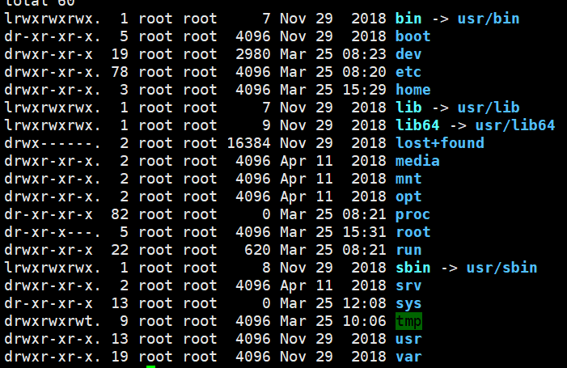
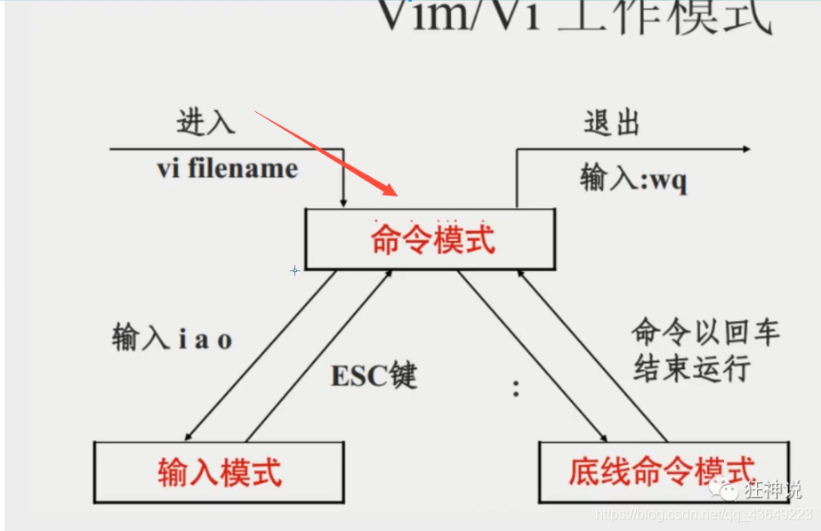
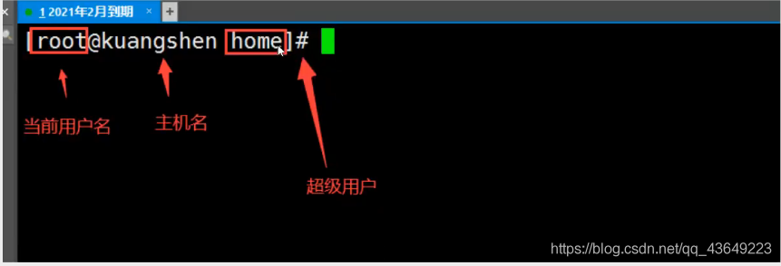
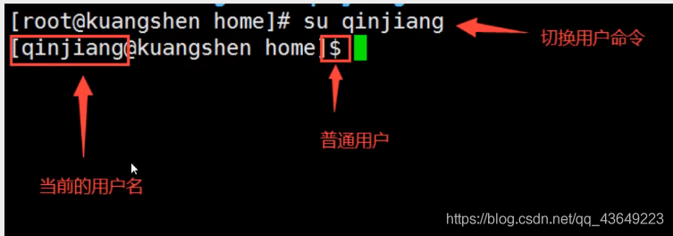
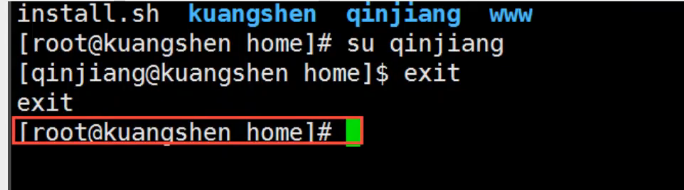
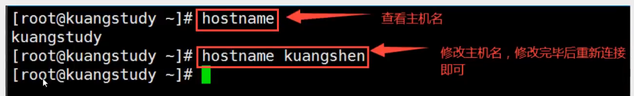
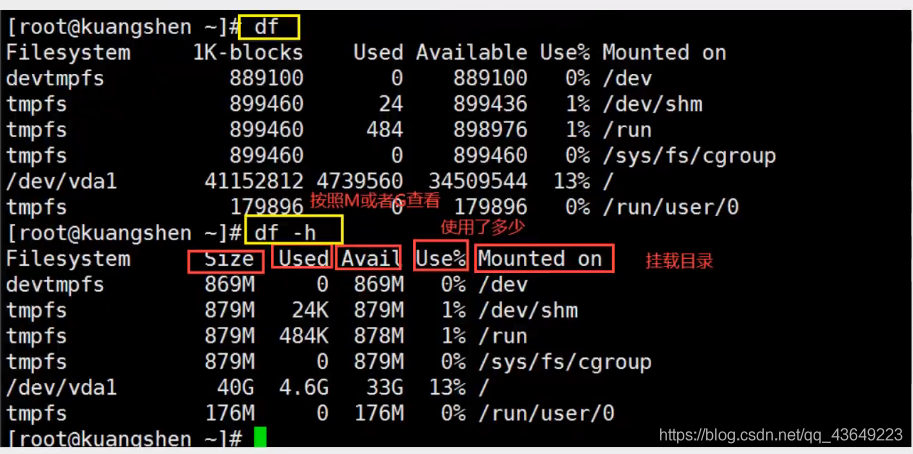
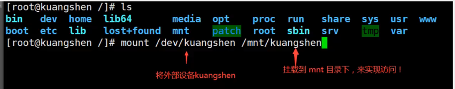
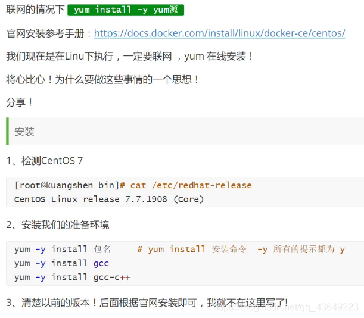

# Linux课程笔记

## 走进Linux系统

==Linux中没有错误就代表成功==

==一切皆文件==

> 目录解释

- /bin：bin是Binary的缩写，这个目录存放着最经常使用的命令
- /boot：这里存放的是启动Linux时使用的一些核心文件，包括一些连接文件以及摄像文件（不要动）
- /dev：dev是Device（设备）的缩写，存放的是Linux的外部设备，在Linux中访问的方式和访问文件时相同的
- ==/etc：这个目录用来存放所有的系统管理所需要的配置文件和子目录==
- ==/lib：这个目录里存放着系统最基本的动态连接共享库，其作用类是于Windows里的DLL文件（不要动）==
- /lost + found：这个目录一般情况下时空的，当系统非法关机后，这里就存放了一些文件（存放突然关机的一些文件）
- /media：Linux系统会自动识别一些设备，例如U盘、光驱等待，当识别后，Linux就会把识别的设备挂载到这个目录下
- /mnt：系统提供该目录时为了让用户临时挂载别的文件系统，我们可以把光驱挂载在/mnt上，然后进入该目录就可以查看光驱里的内容（我们后面会把一些本地文件挂载在这个目录下）
- ==/opt：这是给主机额外安装软件所摆放的目录，比如你安装一个数据库则就可以放在这个目录下。默认时空的==
- /proc：这个目录时一个虚拟的目录，它时系统内存的映射，我们可以通过直接访问这个目录来获取系统信息（不用管）
- ==/root：该目录为系统管理员，也称作超级权限者的用户主目录==

## 常用基本命令

### 目录管理

**cd（切换目录）**

~~~bash
cd：切换目录命令
./：当前目录
cd ..：返回上一级目录
~~~

**ls（列出目录）**

~~~bash
ls -a：查看全部文件，包括隐藏文件
ls -l：列出所有的文件，包括文件的属性和权限，没有隐藏文件
ls -al：显示全部文件兼属性，包括隐藏
~~~

**pwd（显示当前用户所在的目录）**

**mkdir（创建一个文件夹）**

~~~bash
mkdir filename
mkdir -p filename1/filename2/filename3
~~~

**rmdir（删除目录）**

`rmdir仅能删除空的目录，如果下面存在文件，需要先删除文件`

~~~bash
rmdir filename
rmdir -p filename1/filename2/filename3
~~~

**cp（复制文件或者目录）**

`同名文件会提示 是否覆盖 y&n`

~~~bash
cp filename path
~~~

**rm（移动文件或者目录）**

~~~bash
rm -f：强制删除！不会出现警告，忽略不存在的文件
rm -r：递归删除目录
rm -i：互动，删除询问是否删除！
~~~

**mv（移动文件或者目录）（重命名文件）**

~~~bash
mv -f：强制
mv -u：只替换已经更新过的文件

mv filename path #移动文件
mv filename filename1 #重命名文件
~~~

### 基本属性

在Linux中我们可以使用`ll`或者`ls -l`命令来显示一个文件的属性以及文件所属的用户和组

在Linux中第一个字符代表这个文件时目录，文件或链接文件

- d 是目录
- \- 是文件
- l 是链接文件
- b 是装置文件里面的可供存储的接口设备（可随机存取装置）
- c 是装置文件里面的串行端口设备，例如鼠标键盘（一次性读取装置）

**修改文件属性命令**

1. **chgrp（更改文件属组）**

   ~~~bash
   chgrp [-R] followGroupName filename 
   ~~~

   -R：递归修改文件属组，就是在更改某个目录文件的属组时，如果加上-R参数，那么该目录下的所有属组都会更改

2. **chown（更改文件属主，也可以同时更改文件属组）**

   ~~~bash
   chown [-R] mainGroupName filename
   chown [-R] mainGroupName:followGroupName filename
   ~~~

3. **chmod（更改文件9个属性）**

   ~~~ bash
   chmod [-R] xyz filename|directoryname
   r 可读-4	w 可写-2	x 可执行-1
   
   r：read；w：write；x：execute
   
   rwx --- 7（所有权限）
   r-x --- 5（不可写）
   rw- --- 6（不可执行）
   -wx --- 3（不可读）
   ~~~

   

## 文件内容查看

Linux系统中使用以下命令来查看文件的内容

1. **cat（由第一行开始显示文件内容）**
2. **tac（由最后一行开始显示）**
3. **nl（显示的时候，顺便输出行号）**
4. **more（一页一页的显示文件内容）**
5. **less（与more类似，他可以往前翻页）**
   - 空格翻页
   - 上下键，一行行查看
   - q 退出
   - / 向下查询，？向上查询
   - n 向下查找，N 向上查找
6. **head 只看头几行（-n 代表查看几行）**
7. **tail 只看尾部几行（-n 代表查看几行）**

man命令：查看查看帮助文档

ifconfig命令：查看网络配置

## 拓展：硬链接&软链接

硬链接：A → B，假设B是A的硬链接，那么他两个执行了同一个文件，它们俩的内容是相同的，相当于B是A的备份，如果A源文件没有了，B备份文件还是存在且内容相同。用户可以通过这种机制建立硬链接到一些重要文件上，防止误删！

软链接：相当于windows下的快捷方式，删除源文件，快捷方式也访问不了

**in命令：创建链接（不加参数创建硬链接，加 -s 参数创建软链接）**

touch命令：创建文件

echo命令：输入字符串

~~~bash
touch f1
in f1 f2
in -s f1 f3
~~~

## Vim编辑器

新建或者编辑文件`vim 文件名`，按 i 进入编辑模式，编写完成后按 esc 退出编辑模式，退出之后按 : 进入底线命令模式，按 w 保存，按 q 退出

**第一部分：一般模式**

可用光标移动，复制黏贴，搜索替换

**移动光标**

| 移动光标的方法 |                                                |
| -------------- | ---------------------------------------------- |
| h / ←          | 向左移动一个字符                               |
| j / ↓          | 向下移动一个字符                               |
| k / ↑          | 向上移动一个字符                               |
| l / →          | 向右移动一个字符                               |
| ctrl + f       | 屏幕向下移动一页                               |
| ctrl + b       | 屏幕向上移动一页                               |
| ctrl + d       | 屏幕向下移动半页                               |
| ctrl + u       | 屏幕向上移动半页                               |
| +              | 光标移动到非空格符的下一行                     |
| -              | 光标移动到非空格符的上一行，配置文件中空格较多 |
| 数字 space     | 横向快捷移动光标                               |
| 0 / home       | 移动到一行的开头                               |
| $ / end        | 移动到一行的结尾                               |
| H              | 移动到屏幕最上方那一行的第一个字符             |
| M              | 移动到屏幕的中央那一行的第一个字符             |
| L              | 移动到屏幕最下方那一行的第一个字符             |
| G              | 移动到这个文件的最后一行                       |
| 数字 G         | 移动到这个文件的第 n 行（可配合set nu）        |
| gg             | 移动到这个文档的第一行                         |
| 数字 enter     | 光标向下移动 n 行                              |

**搜索替换**

| 搜索替换 |                              |
| -------- | ---------------------------- |
| /word    | 向光标之下寻找 word 的字符串 |
| ?word    | 向光标之上寻找 word 的字符串 |
| n        | 重复前一个搜寻动作           |
| N        | 反向进行前一个搜寻动作       |

**删除，复制与黏贴**

| 删除，复制与黏贴 |                                            |
| ---------------- | ------------------------------------------ |
| x X              | x 为向后删除一个字符，X 为向前删除一个字符 |
| 数字x            | 连续向后删除 n 个字符                      |
| dd               | 删除游标所在的一整行                       |
| 数字dd           | 删除光标所在的向下 n 行                    |
| d1G              | 删除光标所在到第一行的所有数据             |
| dG               | 删除光标所在到最后一行的所有数据           |
| d$               | 删除游标所在处，到该行的最后一个字符       |
| d0               | 删除游标所在处，到该行的最前一个字符       |
| yy               | 复制游标所在的那一行                       |
| 数字 yy          | 复制光标所在的向下n行                      |
| y1G              | 复制光标所在到第一行的所有数据             |
| yG               | 复制光标所在到最后一行的所有数据           |
| y0               | 复制游标所在处，到该行的最前一个字符       |
| y$               | 复制游标所在处，到该行的最后一个字符       |
| p P              | p 将数据贴在下一行，P 则贴在上一行         |
| J                | 将光标所在行与下一行的数据结合成同一行     |
| c                | 重复删除多个数据。例如向下删除10行 [10cj]  |
| u                | 重复前一个动作                             |
| ctrl + r         | 重做上一个动作                             |

**第二部分：编辑模式**

| 进入输入或取代的编辑模式 |                                                              |
| ------------------------ | ------------------------------------------------------------ |
| i I                      | 进入输入模式， i 为从目标光标处输入，I 为在目前所在行的第一个非空格符处输入 |
| a A                      | 进入输入模式：a 为目标光标所在的下一个字符处开始输入，A 为光标所在处的最后一个字符处开始输入 |
| o O                      | 进入输入模式：o 为在目前光标所在的下一行处输入新的一行，O 为在目前光标所在处的上一行输入新的一行 |
| r R                      | 进入取代模式：r 只会取代光标所在的那一个字符一次，R 会一直取代光标所在的文字，知道按下esc为止 |
| esc                      | 退出编辑模式，回到一般模式                                   |

**第三部分：命令行模式**

存储，离开命令

| 指令行的存储、离开等指令           |                                                          |
| ---------------------------------- | -------------------------------------------------------- |
| :w                                 | 将编辑的数据写入硬盘档案中                               |
| :w!                                | 若文件属性为 只读 时，强制写入该文档                     |
| :q                                 | 离开vim                                                  |
| :q!                                | 若曾修改过文件，又不想存储，使用 ! 为强制离开不存储文件  |
| 惊叹号（!）在vim中，具有强制的意思 |                                                          |
| :wq                                | 存储后离开                                               |
| ZZ                                 | 若文件么有改动，则不存储离开；若文件改动过，则存储后离开 |
| :w filename                        | 将编辑的数据存储成另一个文档                             |
| :r filename                        | 在编辑的数据中，读入另一个档案的数据                     |
| :数字1, 数字2 w filename           | 将 数字1 到 数字2 的内容存储成 filename这个档案          |
| :! command                         | 暂时离开vim到命令行模式下执行command的显示结果           |
| :set nu                            | 显示行号                                                 |
| :set nonu                          | 取消行号                                                 |

## 账号管理

**useradd命令（添加用户）**

~~~bash
useradd -选项 用户名
useradd -m username #自动创建这个用户的主目录/home/username
~~~

理解一下本质：Linux中一切皆文件，这里的添加用户说白了就是往一个文件中写入用户的信息
`/etc/passwd`

**userdel命令（删除用户）**

~~~bash
userdel -r username #删除用户的时候将他的目录页一并删掉
~~~

**usermod命令（修改用户）**

~~~bash
usermod -d /home/xxx username #修改用户usermod对应修改的内容
~~~

**su（切换用户）**

**passwd（用户密码设置）**

我们一般通过root创建用户的时候，要配置密码

如果是超级用户修改用户密码

~~~bash
passwd username(username)
new password:
re password:
~~~

如果是普通用户：

~~~bash
passwd
(current) UNIX psssword:
new password:
re password:
~~~

**锁定账户**

~~~bash
passwd -l username #锁定
passwd -d username #密码删除 也是锁定
~~~

## 用户组管理

属主，属组

每一个用户都有一个用户组，系统可一对一个用户组汇总的所有用户进行集中管理，（开发，测试，运维，root）

不同Linux系统对用户组的规定有所不同，如Linux下的用户属于与他同名的用户组，这个用户组在创建用户时同时创建了

用户组的管理涉及用户组的添加，删除和修改。==组的添加，删除和修改实际上就是对 /etc/group 文件的更新==

**groupadd（创建一个用户组）**

~~~bash
groupadd username
cat /etc/group
~~~

**groupdel（删除用户组）**

~~~bash
groupdel username
~~~

**groupmod（修改用户组的权限信息和名字）**

~~~bash
group -g 666 -n newkuangshen kuangshen
~~~

用户切换用户组

~~~bash
newgrp root
~~~

## 磁盘管理

**df（列出文件系统整体的磁盘使用量）**

**du（检查磁盘空间使用量）**

~~~bash
du
du -a
du -sm/* #检查根目录下每个目录所占有的容量
~~~

**mount（挂载）**

~~~bash
mount path1 path2
~~~

**umount（卸载）**

~~~bash
umount -f path #强制卸载
~~~

## 进程管理

Linux中一切皆文件

==（文件：读写执行（查看，创建，删除，移动，复制，编辑），权限（用户，用户组），系统（磁盘，进程））==

**基本概念**

1. 在Linux中，每一个程序都是有自己的一个进程，每一个进程都有一个id号
2. 每一个进程，都会有一个父进程
3. 进程可以有两种存在方式：前台运行，后台运行
4. 一般的服务都是后台运行的，基本的程序都是前台运行的

**命令**

ps：查看当前系统中正在执行的各种进程的信息

~~~bash
ps -a #显示当前终端运行的所有进程信息
ps -u #以用户的信息显示进程
ps -x #显示后台运行进程的参数
ps -aux #查看所有的进程

ps -aux|grep mysql # | 管道符，grep 查找文件中符合条件的字符串
~~~

对于我们来说，这里只需记住一个命令即可`ps -xx|grep 进程名字`，过滤进程信息

ps -ef：可以查看到父进程的信息

~~~bash
ps -ef|grep mysql
~~~

查看父进程我们一般可以通过目录树机构来查看

进程树：

`pstree -pu`

- -p：显示父id
- -u：显示用户组

**kill -9 进程id（结束进程）**

## 环境安装

### JDK安装

1. 下载jdk rpm 去oralce官网下载
2. 安装Java环境

~~~
#检查当前系统是否存在Java环境 java -version
#如果有的话就卸载
#rpm -qa|grep jdk #检查jdk版本信息
#rpm -e --nodeps jdk_

#卸载完毕后即可安装jdk
#rpm -ivh rpm 包
~~~

3. 配置环境变量：`/etc/profile`在文件的最后面增加Java的配置和window安装环境一样

   `vim/etc/profile`进入配置文件

   末尾添加

   ~~~bash
   export JAVA_HOME=/usr/java/jdk1.8.0_211-amd64
   export PTAH=$JAVA_HOME/bin:$PATH
   export CLASSPATH=.:$JAVA_HOME/lib/dt.jar:$JAVA_HOME/lib/tools.jar
   ~~~

   保存退出即可

   刷新配置

   `source/etc/profile`

   发布一个项目

     ~~~bash
   #开启防火墙
   Firewalls-cmd --zone=public --add-port=9000/tcp -permanent
   #重启防火墙
   systemctl restart firewalld.service
   #查看所有开启的端口，如果时阿里云，需要配置安全组规则
   firewall-cmd --list-ports
     ~~~

### Tomcat安装

ssm war就需要放到tomcat中运行

1. 下载tomcat 官网下载`apache -tomcat-9.0.30.tat.gz`

2. 解压这个文件

   ~~~bash
   tar -zxvf apache-tomcat-9.0.39.tar.gz
   ~~~

3. 启动tomcat测试，`./xxx.sh`脚本即可运行

   进入Tomcat文件bin文件

   ~~~bash
   #执行 ./startup.sh 
   #停止 ./shutdown.sh
   ~~~

   如果防火墙8080端口开了并且阿里云安全组也开放了，这个时候就可以直接访问远程了！

   ~~~bash
   # 查看firewall服务状态
   systemctl status firewalld
   
   # 开启.重启.关闭,firewalld.service服务
   # 开启
   service firewalld start
   # 重启
   service firewalld restart
   # 关闭
   service firewalld stop
   
   # 查看防火墙规则
   firewall-cmd --list-all # 查看全部信息
   firewall-cmd --list-ports # 只看端口信息
   
   # 开启端口
   开端口命令 : firewall-cmd --zone=public --add-port=8080/tcp --permanent
   重启防火墙 : systemctl restart firewalld.service
   
   命令含义
   --zone #作用域
   --add -port-80/tcp #添加端口,格式为:端口/通讯协议
   --permanent #永久生效,没有此参数重启后失效
   ~~~

### Docker（yun安装）

`yun install -y yum源`

