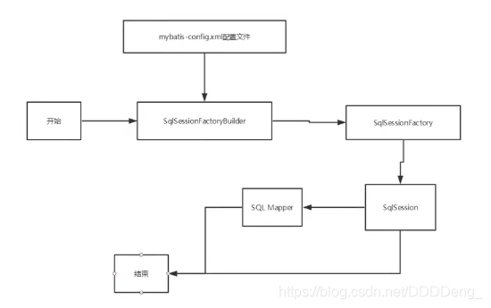
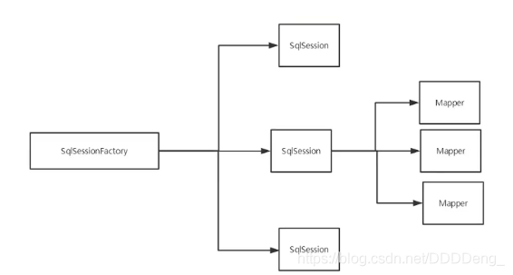
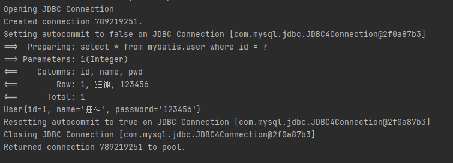
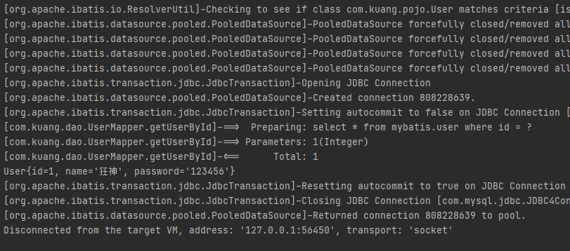
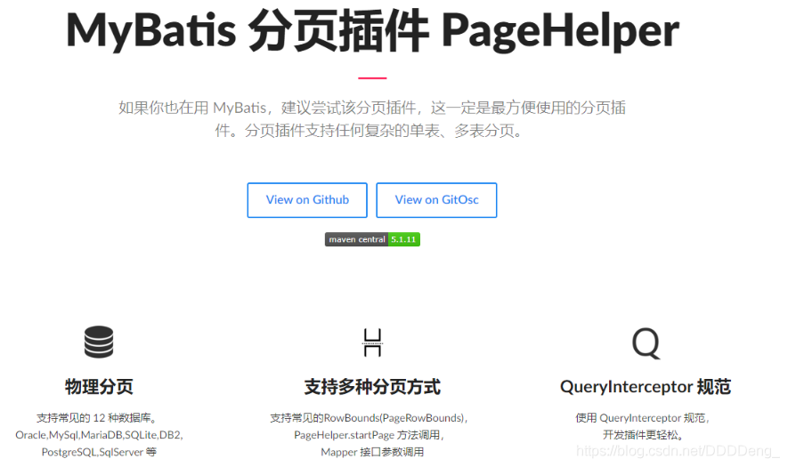
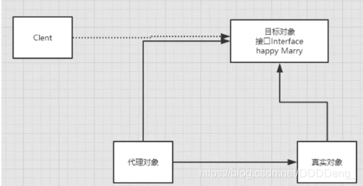
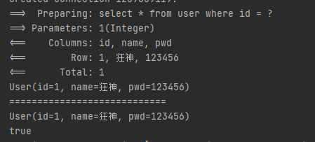
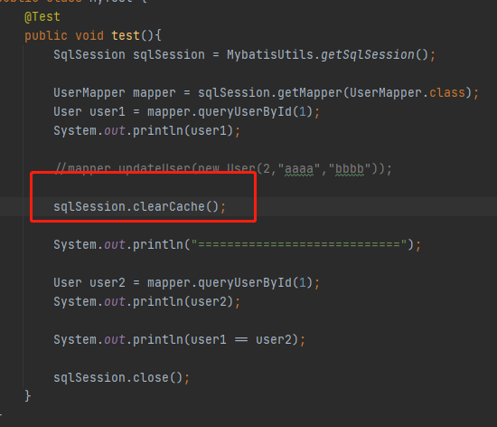

# MyBatis课程笔记

## 简介

### 什么是Mybatis？

- MyBatis 是一款优秀的持久层框架

- 它支持自定义 SQL、存储过程以及高级映射
- MyBatis 免除了几乎所有的 JDBC 代码以及设置参数和获取结果集的工作
- MyBatis 可以通过简单的 XML 或注解来配置和映射原始类型、接口和 Java POJO（Plain Old Java Objects，普通老式 Java 对象）为数据库中的记录。

如何获得MyBatis？

maven仓库：
~~~xml
<!-- https://mvnrepository.com/artifact/org.mybatis/mybatis -->
        <dependency>
            <groupId>org.mybatis</groupId>
            <artifactId>mybatis</artifactId>
            <version>3.5.6</version>
        </dependency>
~~~
- 中文文档：https://mybatis.org/mybatis-3/zh/index.html
- Github:https://github.com/mybatis/mybatis-3

### 持久化

数据持久化

- 持久化就是将程序的数据在持久状态和瞬时状态转化的过程
- 内存：**断电即失**
- 数据库（jdbc），io文件持久化。io特别浪费资源
- 生活方面的例子：冷藏，罐头

**为什么需要持久化**

- 有一些对象，不能让他丢掉

- 内存太贵了

### 持久层

Dao层，Servlet层，Controller层...

- 完成持久化工作的代码块
- 层界限十分明显

### 为什么需要MyBatis？

- 帮助程序员将数据存入到数据库中
- 方便
- 传统的JDBC代码太复杂了。简化，框架。自动化
- 不用MyBatis也可以。更容易上手。技术没有高低之分
- 优点：
  - 简单易学
  - 灵活
  - sql和代码的分离，提高了可维护性
  - 提供映射标签，支持对象与数据库的orm字段关系映射
  - 提供对象关系映射标签，支持对象关系组建维护
  - 提供xml标签，支持编写动态sql

最重要的一点：使用的人多

Spring SpringMVC SpringBoot

## 第一个MyBatis程序

思路：搭建环境-->导入MyBatis-->编写代码-->测试！

### 搭建环境

搭建数据库

~~~mysql
CREATE DATABASE `mybatis`;

USE `mybatis`

CREATE TABLE `user` (
    `id` INT(20) NOT NULL PRIMARY KEY,
    `name` VARCHAR(30) DEFAULT NULL,
    `pwd` VARCHAR(30) DEFAULT NULL
)ENGINE=INNODB DEFAULT CHARSET=utf8

INSERT INTO `user`(id,`name`,pwd) VALUES
(1,'狂神','123456'),
(2,'张三','123456'),
(3,'李四','123456')

DESC `user`
~~~

（ps：数据库连不上，可能是时区出现了问题。解决方法`serverTimezone=Asia/Shanghai`）

新建项目

- 新建一个普通的maven项目

- 删除src目录

- 导入maven依赖

  ~~~xml
  	<dependencies>
  		<!--mysql驱动-->
  		<dependency>
  			<groupId>mysql</groupId>
  			<artifactId>mysql-connector-java</artifactId>
  			<version>5.1.47</version>
  		</dependency>
  		<!--mybatis-->
  		<dependency>
  			<groupId>org.mybatis</groupId>
  			<artifactId>mybatis</artifactId>
  			<version>3.5.2</version>
  		</dependency>
  		<!--junit-->
  		<dependency>
  			<groupId>junit</groupId>
  			<artifactId>junit</artifactId>
  			<version>4.12</version>
  		</dependency>
  	</dependencies>
  ~~~

### 创建一个模块

- 编写mybatis的核心配置文件

  ~~~xml
  <!--configuration核心配置文件-->
  <configuration>
  	
  	<environments default="development">
  		<environment id="development">
  			<transactionManager type="JDBC"/>
  			<dataSource type="POOLED">
  				<property name="driver" value="com.mysql.jdbc.Driver"/>
  				<property name="url" value="jdbc:mysql://localhost:3306/mybatis?useSSL=true&amp;useUnicode=true&amp;characterEncoding=UTF-8"/>
  				<property name="username" value="root"/>
  				<property name="password" value="123456"/>
  			</dataSource>
  		</environment>
  	</environments>
  
  </configuration>
  ~~~

- 编写mybatis工具类

  ~~~java
  //从 XML 中构建 SqlSessionFactory （建议）
  //工厂模式 --> 产品
  //sqlSessionFactory --> sqlSession
  public class MybatisUtils {
      
      //因为静态代码块和下面的方法都要用，所以提升该处作用域
      private static SqlSessionFactory sqlSessionFactory;
      //加个静态代码块，初始就加载了
      static{
          //这三句话是死的，工具类
          //使用Mybatis的第一步：获取sqlSessionFactory对象
          try {
              String resource = "mybatis-config.xml";
              InputStream inputStream = Resources.getResourceAsStream(resource);
              sqlSessionFactory = new SqlSessionFactoryBuilder().build(inputStream);
          } catch (IOException e) {
              e.printStackTrace();
          }
      }
      
      //既然有了SqlSessionFactory，顾名思义，我们就可以从中获得SqlSession的实例了
      //SqlSession完全包含了面向数据库执行SQL命令所需的所有方法
      public static SqlSession getSqlSession() {
          return sqlSessionFactory.openSession();
      }
  }
  ~~~

### 编写代码

- 实体类

  ~~~java
  package com.kuang.pojo;
  
  //实体类
  public class User {
      private int id;
      private String name;
      private String pwd;
  
      public User() {
      }
  
      public User(int id, String name, String pwd) {
          this.id = id;
          this.name = name;
          this.pwd = pwd;
      }
  
      public int getId() {
          return id;
      }
  
      public void setId(int id) {
          this.id = id;
      }
  
      public String getName() {
          return name;
      }
  
      public void setName(String name) {
          this.name = name;
      }
  
      public String getPwd() {
          return pwd;
      }
  
      public void setPwd(String pwd) {
          this.pwd = pwd;
      }
  
      @Override
      public String toString() {
          return "User{" +
                  "id=" + id +
                  ", name='" + name + '\'' +
                  ", pwd='" + pwd + '\'' +
                  '}';
      }
  }
  ~~~

- Dao接口

  ~~~java
  public interface UserDao {
      List<User> getUserList();
  }
  ~~~

- 接口实现类由原来的UserDaoImpl转变为一个Mapper配置文件

  ~~~xml
  <?xml version="1.0" encoding="UTF-8" ?>
  <!DOCTYPE mapper
  		PUBLIC "-//mybatis.org//DTD Mapper 3.0//EN"
  		"http://mybatis.org/dtd/mybatis-3-mapper.dtd">
  <!--相当于UserDaoImpl，UserDao的实现类-->
  <!--namespace=绑定一个对应的Dao/Mapper接口-->
  <mapper namespace="com.kuang.dao.UserDao">
  
  	<!--select查询语句，id是方法名-->
  	<select id="getUserList" resultType="com.kuang.pojo.User">
  		select * from mybatis.user
  	</select>
  	
  </mapper>
  ~~~

### 测试

注意点：

org.apache.ibatis.binding.BindingException: Type interface com.kuang.dao.UserDao is not known to the MapperRegistry.

**MapperRegistry是什么？**

~~~xml
	<!--在mybatis-config.xml下-->
	<!--每一个Mapper.xml都需要在Mybatis核心配置文件中注册-->
	<mappers>
		<mapper resource="com/kuang/dao/UserMapper.xml"/>
	</mappers>
~~~

**如果绑定不了资源，需要加过滤，在pom.xml下**

~~~xml
<!--在build中配置resources，来防止我们资源导出失败的问题-->
	<build>
		<resources>
			<resource>
				<directory>src/main/resources</directory>
				<includes>
					<include>**/*.properties</include>
					<include>**/*.xml</include>
				</includes>
				<filtering>true</filtering>
			</resource>
			<resource>
				<directory>src/main/java</directory>
				<includes>
					<include>**/*.properties</include>
					<include>**/*.xml</include>
				</includes>
				<filtering>true</filtering>
			</resource>
		</resources>
	</build>
~~~

- junit测试

  ~~~java
  package com.kuang.dao;
  
  import com.kuang.pojo.User;
  import com.kuang.utils.MybatisUtils;
  import org.apache.ibatis.session.SqlSession;
  import org.junit.Test;
  
  import java.util.List;
  
  public class UserDaoTest {
  
      @Test
      public void test() {
  
          //第一步：获得SqlSession对象
          SqlSession sqlSession = MybatisUtils.getSqlSession();
  
          //方式一：getMapper
          UserDao userDao = sqlSession.getMapper(UserDao.class);
          List<User> userList = userDao.getUserList();
  
          for (User user : userList) {
              System.out.println(user);
          }
  
          //关闭SqlSession
          sqlSession.close();
  
      }
  }
  ~~~

  你们可能遇到的问题：

  1. 配置文件没有注册
  2. 绑定接口错误
  3. 方法名不对
  4. 返回类型不对
  5. Maven导出资源错误

步骤

## CRUD

### namespace

namespace中的包名要和Dao/mapper接口的包名一致

### select

选择，查询语句

- id：就是对应的namespace中的方法名
- resultType：Sql语句执行的返回值！
- parameterType：参数类型！

1. 编写接口

   ~~~java
       //根据ID查询用户
       User getUserById(int id);
   
       //insert一个用户
       int addUser(User user);
   
       //修改用户
       int updateUser(User user);
   
       //删除用户
       int deleteUser(int user);
   ~~~

2. 编写对应的mapper中的sql语句

   ~~~xml
   	<select id="getUserById" parameterType="int" resultType="com.kuang.pojo.User">
   		select * from mybatis.user where id = #{id}
   	</select>
   	
   	<!--对象中的属性,可以直接取出来-->
   	<insert id="addUser" parameterType="com.kuang.pojo.User">
   		insert into mybatis.user (id, name, pwd) values (#{id},#{name},#{pwd})
   	</insert>
   	
   	<update id="updateUser" parameterType="com.kuang.pojo.User">
   		update mybatis.user
   		set name = #{name}, pwd = #{pwd}
   		where id = #{id};
   	</update>
   	
   	<delete id="deleteUser" parameterType="int">
   		delete from mybatis.user where id = #{id};
   	</delete>
   ~~~

3. 测试

   ~~~Java
       @Test
       //一个方法对应一个sql语句
       public void getUserById() {
           //这句是固定的
           SqlSession sqlSession = MybatisUtils.getSqlSession();
   
           //在中间实现查询
           //在配置文件中得到要查询的信息
           UserMapper mapper = sqlSession.getMapper(UserMapper.class);
           //给id赋值
           User user = mapper.getUserById(1);
           System.out.println(user);
   
           //这句也是固定的
           sqlSession.close();
       }
   
       //增删改需要提交事务
       @Test
       public void addUser() {
           SqlSession sqlSession = MybatisUtils.getSqlSession();
   
           UserMapper mapper = sqlSession.getMapper(UserMapper.class);
           int addUser = mapper.addUser(new User(4, "哈哈", "123333"));
   
           if (addUser > 0) {
               System.out.println("插入成功!");
           }
   
           //提交事务
           sqlSession.commit();
   
           sqlSession.close();
       }
   
       @Test
       public void updateUser() {
           SqlSession sqlSession = MybatisUtils.getSqlSession();
   
           UserMapper mapper = sqlSession.getMapper(UserMapper.class);
           int updateUser = mapper.updateUser(new User(4,"呵呵","13455688"));
           if (updateUser > 0) {
               System.out.println("更新成功!");
           }
           sqlSession.commit();
   
           sqlSession.close();
       }
   
       @Test
       public void deleteUser() {
           SqlSession sqlSession = MybatisUtils.getSqlSession();
   
           UserMapper mapper = sqlSession.getMapper(UserMapper.class);
           int deleteUser = mapper.deleteUser(4);
           if (deleteUser > 0) {
               System.out.println("删除成功!");
           }
           sqlSession.commit();
   
           sqlSession.close();
       }
   ~~~

### Insert

### update

### delete

注意点

- 增删改需要提交事务！

### 分析错误

- 便签不要匹配错
- resource绑定mapper，需要使用路径
- 程序配置文件必须符合规范
- NullPointException，没有注册到资源
- 输出的xml文件中存在中文乱码问题
- maven资源没有导出问题

### 万能Map

假设，我们的实体类，或者数据库中的表，字段或者参数过多，我们应当考虑使用Map！

~~~java
    //万能的map
    int addUser2(Map map);
~~~

~~~xml
	<!--传递map中的key-->
	<insert id="addUser2" parameterType="map">
		insert into mybatis.user (id, name, pwd) values (#{userid},#{userName},#{passWord})
	</insert>
~~~

~~~java
    @Test
    public void insertUser() {
        SqlSession sqlSession = MybatisUtils.getSqlSession();

        UserMapper mapper = sqlSession.getMapper(UserMapper.class);
        HashMap<String, Object> map = new HashMap<>();

        map.put("userid",5);
        map.put("userName","哈哈");
        map.put("passWord",233333);
        int addUser2 = mapper.addUser2(map);
        if (addUser2 > 0) {
            System.out.println("插入成功!");
            sqlSession.commit();
        }

        sqlSession.close();
    }
~~~

Map传递参数，直接在sql中取出key即可！

对象传递参数，直接在sql中去对象的属性即可！

只有一个基本类型参数的情况下，可以直接在sql中取到！

多个参数用Map，或者注解！

### 思考题

模糊查询怎么写？

1. Java代码执行的时候，传递通配符% %

   ~~~java
   List<User> userLike = mapper.getUserLike("%李%");
   ~~~

2. 在sql拼接中使用通配符

   ~~~xml
   select * from mybatis.user where name like "%"#{value}"%"
   ~~~

## 配置解析

### 核心配置文件

- mybatis-config.xml
- MyBatis 的配置文件包含了会深深影响 MyBatis 行为的设置和属性信息。 配置文档的顶层结构如下：
  - configuration（配置）
    - [properties（属性）](https://mybatis.org/mybatis-3/zh/configuration.html#properties)
    - [settings（设置）](https://mybatis.org/mybatis-3/zh/configuration.html#settings)
    - [typeAliases（类型别名）](https://mybatis.org/mybatis-3/zh/configuration.html#typeAliases)
    - [typeHandlers（类型处理器）](https://mybatis.org/mybatis-3/zh/configuration.html#typeHandlers)
    - [objectFactory（对象工厂）](https://mybatis.org/mybatis-3/zh/configuration.html#objectFactory)
    - [plugins（插件）](https://mybatis.org/mybatis-3/zh/configuration.html#plugins)
    - environments（环境配置）
      - environment（环境变量）
        - transactionManager（事务管理器）
        - dataSource（数据源）
    - [databaseIdProvider（数据库厂商标识）](https://mybatis.org/mybatis-3/zh/configuration.html#databaseIdProvider)
    - [mappers（映射器）](https://mybatis.org/mybatis-3/zh/configuration.html#mappers)

### 环境配置（environments）

MyBatis 可以配置成适应多种环境

**不过要记住：尽管可以配置多个环境，但每个 SqlSessionFactory 实例只能选择一种环境。**

学会使用配置多套运行环境！

MyBatis默认的事务管理器就是JDBC，连接池：POOLED

### 属性（properties）

我们可以通过properties属性类实现引用配置文件

这些属性可以在外部进行配置，并可以进行动态替换。你既可以在典型的 Java 属性文件中配置这些属性，也可以在 properties 元素的子元素中设置

编写一个配置文件

db.properties

~~~properties
driver=com.mysql.jdbc.Driver
url=jdbc:mysql://localhost:3306/mybatis?useSSL=true&useUnicode=true&characterEncoding=UTF-8
username=root
password=123456
~~~

在核心配置文件中映入

~~~xml
<!--引入外部配置文件-->
<properties resource="db.properties"/>
~~~

- 可以直接引入外部文件
- 可以在其中增加一些属性配置
- 如果两个文件有同一个字段，优先使用外部配置文件的！

### 别名

- 类型别名可为 Java 类型设置一个缩写名字

- 它仅用于 XML 配置，意在降低冗余的全限定类名书写

~~~xml
<typeAliases>
    <typeAlias type="com.kuang.pojo.User" alias="User"/>
</typeAliases>
~~~

也可以指定一个包名，MyBatis 会在包名下面搜索需要的 Java Bean

扫描实体类的包，它的默认别名久为这个类的类名，首字母小写

~~~xml
<typeAliases>
    <package name="com.kuang.pojo"/>
</typeAliases>
~~~

在实体类比较少的时候，使用第一种方式

在实体类十分多的时候，使用第二种方式

第一种可以DIY别名，第二种则不行，如果非要改，需要在实体上增加注解

~~~java
@Alias("User")
public class User {
~~~

### 设置

这是MyBatis中极为重要的调整设置，它们会改变MyBatis的运行时行为

### 其他设置

- typeHandlers（类型处理器）
- objectFactory（对象工厂）
- plugins插件
  - mybatis-generator-core
  - mybatis-plus
  - 通用mapper

### 映射器（mappers）

MapperRegistry：注册绑定我们的Mapper文件

方式一：

~~~xml
<mappers>
    <mapper resource="com/kuang/dao/UserMapper.xml"/>
</mappers>
~~~

方式二：使用class文件绑定注册

~~~xml
<mappers>
    <mapper class="com.kuang.dao.UserMapper"/>
</mappers>
~~~

注意点：

- 接口和他的Mapper配置文件必须同名
- 接口和他的Mapper配置文件必须在同一个包下

方式三：使用扫描包进行注入绑定

~~~xml
<mappers>
    <mapper package ="com.kuang.dao"/>
</mappers>
~~~

注意点：

- 接口和他的Mapper配置文件必须同名
- 接口和他的Mapper配置文件必须在同一个包下

### 生命周期和作用域

生命周期和作用域，是至关重要的，因为错误的使用会导致非常严重的**并发问题**

**SqlSessionFactoryBuilder：**（建造者模式）

- 一旦创建了SqlSessionFactory，就不再需要它了
- 局部变量

**SqlSessionFactory：**（工厂模式）

- 说白了就是可以想象为：数据库连接池
- SqlSessionFactory一旦被创建就应该在应用的运行期间一直存在，**没有任何理由丢弃它或重新创建另一个实例**
- 因此SqlSessionFactory的最佳作用域是应用作用域
- 最简单的就是使用单例模式或者静态单例模式

**SqlSession：**

- 连接到连接池的一个请求
- SqlSession的实例不是线程安全的，因此是不能被共享的，所以它的最佳的作用域是请求或方法作用域
- 用完之后需要赶紧关闭，否则资源被占用

这里的每一个Mapper，就代表一个具体的业务！

## 解决属性名和字段名不一致的问题

### 问题

数据库中的字段

新建一个项目，拷贝之前的，测试实体类字段不一致的情况

~~~java
public class User {
    private int id;
    private String name;
    private String password;
}
~~~

测试出现问题

~~~sql
// select * from mybatis.user where id = #{id}
// 类处理器
// select id,name,pwd from mybatis.user where id = #{id}
~~~

解决方法：

- 起别名

  ~~~xml
  <select id="getUserById" parameterType="int" resultType="com.kuang.pojo.User">
      select id,name,pwd as password from mybatis.user where id = #{id}
  </select>
  ~~~

### resultMap

结果集映射

~~~
id name pwd
id name password
~~~

~~~xml
<!--结果集映射-->
<resultMap id="UserMap" type="User">
    <result column="id" property="id"/>
    <result column="name" property="name"/>
    <result column="pwd" property="password"/>
</resultMap>

<select id="getUserById" resultMap="UserMap">
    select * from mybatis.user where id = #{id}
</select>
~~~

- `resultMap`元素是MyBatis中最强大的元素
- ResultMap的实际思想是，对于简单的语句根本不需要配置显式的结果映射，二对于复杂一点的语句只需要描述它们的关系就行了

- `ResultMap`最优秀的地方在于，虽然你依旧对它相当了解了，但是根本就不需要显示地用到它们
- 如果世界总是这么简单就好了

## 日志

### 日志工厂

如果一个数据库操作，出现了异常，我们需要排错。日志就是我们最好的帮手

曾经：sout、debug

现在：日志工厂！

- SLF4J
- LOG4J 【掌握】
- LOG4J2
- JDK_LOGGING
- COMMONS_LOGGING
- STDOUT_LOGGING【掌握】
- NO_LOGGING

在MyBatis中具体使用哪个日志实现，在设置中设定

**STDOUT_LOGGING标准日志输出**

在mybatis核心配置文件中，配置我们的日志

### Log4j

什么是Log4j？

- Log4j是Apache的一个开源项目，通过使用Log4j，我们开源控制日志信息输送到目的地是控制台、文件、GUI组件
- 我们也可以控制每一条日志的输出格式
- 通过定义每一条日志信息的级别，我们能够更加细致地控制日志的生成过程
- 通过一个配置文件来灵活地进行配置，二不需要修改应用的代码

1. 先导入log4j的包

   ~~~xml
   <!-- https://mvnrepository.com/artifact/log4j/log4j -->
   <dependency>
       <groupId>log4j</groupId>
       <artifactId>log4j</artifactId>
       <version>1.2.17</version>
   </dependency>
   ~~~

2. log4j.properties

   ~~~properties
   #将等级为DEBUG的日志信息输出到console和file这两个目的地，console和file的定义在下面的代码
   log4j.rootLogger=DEBUG,console,file
   
   #控制台输出的相关设置
   log4j.appender.console = org.apache.log4j.ConsoleAppender
   log4j.appender.console.Target = System.out
   log4j.appender.console.Threshold=DEBUG
   log4j.appender.console.layout = org.apache.log4j.PatternLayout
   log4j.appender.console.layout.ConversionPattern=[%c]-%m%n
   #文件输出的相关设置
   log4j.appender.file = org.apache.log4j.RollingFileAppender
   log4j.appender.file.File=./log/rzp.log
   log4j.appender.file.MaxFileSize=10mb
   log4j.appender.file.Threshold=DEBUG
   log4j.appender.file.layout=org.apache.log4j.PatternLayout
   log4j.appender.file.layout.ConversionPattern=[%p][%d{yy-MM-dd}][%c]%m%n
   #日志输出级别
   log4j.logger.org.mybatis=DEBUG
   log4j.logger.java.sql=DEBUG
   log4j.logger.java.sql.Statement=DEBUG
   log4j.logger.java.sql.ResultSet=DEBUG
   log4j.logger.java.sq1.PreparedStatement=DEBUG
   ~~~

3. 配置log4j为日志的实现

   ~~~xml
   <settings>
       <!--标准的日志工厂实现-->
       <!--<setting name="logImpl" value="STDOUT_LOGGING"/>-->
       <setting name="logImpl" value="LOG4J"/>
   </settings>
   ~~~

4. Log4j的使用，直接测试运行刚才的查询
   

**简单使用**

1. 在要使用Log4j的类中，导入包import org.apache.log4j.Logger

2. 日志对象，参数为当前类的class

   ~~~java
   SqlSession sqlSession = MybatisUtils.getSqlSession();
   ~~~

3. 日志级别

   ~~~java
   logger.info("info: 进入了testLog4j");
   logger.debug("debug: 进入了testLog4j");
   logger.error("error: 进入了testLog4j";
   ~~~

## 分页

思考：为什么要分页？

- 减少数据的处理量

### 使用Limit分页

~~~mysql
语法：select * from user limit startIndex, pageSize;
select * from user limit 3; #[0,n]
~~~

使用Mybatis实现分页，核心SQL

1. 接口

   ~~~java
   //分页
   List<User> getUserByLimit(Map<String, Integer> map);
   ~~~

2. Mapper.xml

   ~~~XML
   <!--分页-->
   	<select id="getUserByLimit" parameterType="map" resultMap="UserMap">
   		select * from mybatis.user limit #{startIndex},#{pageSize};
   	</select>
   ~~~

3. 测试

   ~~~JAVA
   @Test
       public void getUserByLimit() {
           SqlSession sqlSession = MybatisUtils.getSqlSession();
   
           UserMapper mapper = sqlSession.getMapper(UserMapper.class);
   
           HashMap<String, Integer> map = new HashMap<>();
           map.put("startIndex", 0);
           map.put("pageSize", 2);
   
           List<User> userList = mapper.getUserByLimit(map);
   
           for (User user : userList) {
               System.out.println(user);
           }
   
           sqlSession.close();
       }
   ~~~

### RowBounds分页

不再使用SQL实现分页

1. 接口

   ~~~java
   //分页2
   List<User> getUserByRowBounds();
   ~~~

2. mapper.xml

   ~~~xml
   <!--分页2-->
   	<select id="getUserByRowBounds" resultMap="UserMap">
   		select * from mybatis.user;
   	</select>
   ~~~

3. 测试

   ~~~java
   @Test
       public void getUserByRowBounds() {
           SqlSession sqlSession = MybatisUtils.getSqlSession();
   
           //RowBounds实现
           RowBounds rowBounds = new RowBounds(1, 2);
   
           //通过java代码层面实现分页
           List<User> userList = sqlSession.selectList("com.kuang.dao.UserMapper.getUserByRowBounds", null, rowBounds);
   
           for (User user : userList) {
               System.out.println(user);
           }
   
           sqlSession.close();
       }
   ~~~

### 分页插件

了解即可

## 使用注解开发

### 面向接口编程

- 大家之前都学过面向对象编程，也学过接口，但在真正的开发中，很多时候我们会选择面向接口编程
- **根本原因：==解耦==，可拓展性，提高复用，分层开发中，上层不用管具体的实现，大家都遵守共同的标准，使得开发变得容易，规范性更好**
- 在一个面向对象的系统中，系统的各种功能是由许许多多的不同对象协作完成的。在这种情况下，各个对象内部是如何实现注解的，对系统设计人员来说就不那么重要了
- 而各个对象之间的协作关系则成为系统设计的主要工作内容。面向接口编程就是指按照这个思想来编程

**关于接口的理解**

- 接口从更深层次的理解，应是对定义（规范，约束）与实现（名实分离的原则）的分离
- 接口的本身反映了系统设计人员对系统的抽象理解
- 接口应由两类：
  - 第一类是对一个个体的抽象，它可对应一个抽象类（abstract class）
  - 第二类是对一个个体某一方面的抽象，即形成一个抽象面（interface）
- 一个个体由可能有多个抽象面。抽象体与抽象面是有区别的

**三个面向的区别**

- 面向对象是指，我们考虑问题时，以对象为单位，考虑它的属性及方法
- 面向对象是指，我们考虑问题时，以一个具体的流程（事务过程）为单位，考虑它的实现
- 接口设计与非接口设计是针对复用技术而言的，与面向对象（过程）不是一个问题。更多的体现就是对系统整体的架构

### 使用注解开发

1. 注解在接口上实现

   ~~~java
       @Select("select * from user")
       List<User> getUsers();
   ~~~

2. 需要在核心配置文件中绑定接口！

   ~~~xml
   <mappers>
   		<mapper class="com.kuang.dao.UserMapper"/>
   	</mappers>
   ~~~

3. 测试

   ~~~java
   public void test() {
           SqlSession sqlSession = MybatisUtils.getSqlSession();
   
           //利用注解实现
           UserMapper mapper = sqlSession.getMapper(UserMapper.class);
           List<User> users = mapper.getUsers();
           for (User user : users) {
               System.out.println(user);
           }
   
           sqlSession.close();
       }
   ~~~

本质：反射机制实现

底层：动态代理！

MyBatis详细执行流程

~~~mermaid
graph TD
A[Resources获取加载全局配置文件] --> B[实例化SqlSessionFactoryBuild构造器]
B --> C[解析配置文件流XMLConfigBuilder]
C --> D[Configuration所有的配置信息]
D --> E[SqlSessionFactory实例化]
E --> F[transaction事务管理]
F --> G[创建executor执行器]
G --> H[创建sqlSession]
H --> I[实现CRUD]
I --> F
I --> J[查看是否执行成功]
J --> F
J --> K[提交事务]
K --> L[关闭]
~~~

### CRUD

我们可以在工具类创建的时候实现自动提交事务！

~~~java
    public static SqlSession getSqlSession() {
        return sqlSessionFactory.openSession(true);
    }
~~~

编写接口，增加注解

~~~java
//方法存在多个参数，所有的参数前面必须加上@Param("id")注解
@Select("select * from user where id = #{id}")
User getUserByID(@Param("id") int id);

@Insert("insert into user(id,name,pwd) values(#{id},#{name},#{password})")
int addUser(User user);

@Update("update user set name=#{name},pwd=#{password} where id=#{id}")
int updateUser(User user);

@Delete("delete from user where id=#{id}")
int deleteUser(@Param("id") int id);
~~~

测试类

【注意：我们必须要将接口注册到我们的核心配置文件中】

关于@Param()注解

- 基本类型的参数或者String类型，需要加上
- 应用类型不需要加
- 如果只有一个基本类型的话，可以忽略，但是建议加上！
- 我们在SQL中引用的就是我们这里的@Param()中设定的属性名！

## Lombok

Lombok项目是一个Java库，它会自动插入编辑器和构建工具中，Lombok提供了一组有用的注释，用来消除Java类中的大量样板代码。仅五个字符(@Data)就可以替换数百行代码从而产生干净，简洁且易于维护的Java类。

~~~java
@Getter and @Setter
@FieldNameConstants
@ToString
@EqualsAndHashCode
@AllArgsConstructor, @RequiredArgsConstructor and @NoArgsConstructor
@Log, @Log4j, @Log4j2, @Slf4j, @XSlf4j, @CommonsLog, @JBossLog, @Flogger, @CustomLog
@Data
@Builder
@SuperBuilder
@Singular
@Delegate
@Value
@Accessors
@Wither
@With
@SneakyThrows
@val
~~~

使用步骤：

1. 在IDEA中安装Lombok插件

2. 在项目中导入lombok的jar包

   ~~~xml
   <dependency>
       <groupId>org.projectlombok</groupId>
       <artifactId>lombok</artifactId>
       <version>1.18.10</version>
       <scope>provided</scope>
   ~~~

3. 在程序上加注解

   ~~~java
   @Data
   @AllArgsConstructor
   @NoArgsConstructor
   ~~~

## 多对一处理

多个学生关联一个老师

### 测试环境搭建

1. 导入lombok
2. 新建实体类Teacher，Student
3. 建立Mapper接口
4. 建立Mapper.xml文件
5. 在核心配置文件中绑定注册我们的Mapper接口或者文件！
6. 测试查询是否能成功

### 按照查询嵌套处理

~~~xml
<!--按照查询嵌套处理——子查询-->
<!--
 思路：
  1. 查询所有的学生信息
  2. 根据查询出来的学生的tid，寻找对应的老师！
 -->

<select id="getStudent" resultMap="StudentTeacher">
    select * from student
</select>

<resultMap id="StudentTeacher" type="Student">
    <result property="id" column="id"/>
    <result property="name" column="name"/>
    <!--
       复杂的属性，我们需要单独处理
       对象：association
       集合：collection
       子查询
  	-->
    <association property="teacher" column="tid" javaType="Teacher" select="getTeacher"/>
</resultMap>

<select id="getTeacher" resultType="Teacher">
    select * from teacher where id = #{id}
</select>
~~~

### 按照结果嵌套处理

~~~xml
<!--按照结果嵌套处理-->
<select id="getStudent2" resultMap="StudentTeacher2">
    select s.id sid, s.name sname, t.name tname
    from student s, teacher t
    where s.id = t.id
</select>

<resultMap id="StudentTeacher2" type="Student">
    <result property="id" column="id"/>
    <result property="name" column="name"/>
    <association property="teacher" javaType="Teacher">
        <result property="name" column="tname"/>
    </association>
</resultMap>
~~~

回顾MySQL多对一查询方式

- 子查询
- 联表查询

## 一对多处理

比如：一个老师拥有多个学生！

对于老师而言，就是一对多的关系！

### 环境搭建

环境搭建，就和刚才一样
**实体类**

~~~java
@Data
@AllArgsConstructor
@NoArgsConstructor
public class Teacher {
    private int id;
    private String name;

    //一个老师拥有多个学生
    private List<Student> students;
}
~~~

~~~java
@Data
@AllArgsConstructor
@NoArgsConstructor
public class Student {
    private int id;
    private String name;
    private int tid;
}
~~~

### 按照结果嵌套处理

~~~xml
<!--按照结果嵌套查询-->
<select id="getTeacher" resultMap="TeacherStudent">
    select s.id sid, s.name sname, t.name tname, t.id tid
    from student s, teacher t
    where s.tid = t.id and t.id = #{tid};
</select>
<resultMap id="TeacherStudent" type="Teacher">
    <result property="id" column="tid"/>
    <result property="name" column="tname"/>
    <!--复杂的属性，我们需要单独处理 对象：association 集合：collection
  javaType="" 指定属性的类型！
  集合中的泛型信息，我们使用ofType获取
  -->
    <collection property="students" ofType="Student">
        <result property="id" column="sid"/>
        <result property="name" column="sname"/>
        <result property="tid" column="tid"/>
    </collection>
</resultMap>
~~~

### 按照查询嵌套处理

~~~xml
<!--按照查询嵌套处理-->
<select id="getTeacher2" resultMap="TeacherStudent2">
    select * from mybatis.teacher where id = #{tid}
</select>

<resultMap id="TeacherStudent2" type="Teacher">
    <collection property="students" javaType="ArrayList" ofType="Student" select="getStudentByTeacherId" column="id"/>
</resultMap>

<select id="getStudentByTeacherId" resultType="Student">
    select * from mybatis.student where tid = #{tid}
</select>
~~~

### 小结

1. 关联 - association 【多对一】
2. 集合 - collection 【一对多】
3. javaType & ofType
   1. javaType 用来指定实体类中属性的类型
   2. ofType 用来指定映射到List或者集合汇总的pojo类型，泛型中的约束类型！

注意点：

- 保证SQL的可读性，尽量保证通俗易懂
- 注意一对多和多对一中，属性名和字段的问题
- 如果问题不好排查错误，可以使用日志，建议log4j

面试高频

- MySQL引擎
- InnoDB底层原理
- 索引
- 索引优化！

## 动态SQL

==**什么是动态SQL：动态SQL就是根据不同的条件生成不同的SQL语句**==

**所谓的动态SQL，本质上还是SQL语句，只是我们可以在SQL层面，去执行一个逻辑代码**

动态 SQL 是 MyBatis 的强大特性之一。如果你使用过 JDBC 或其它类似的框架，你应该能理解根据不同条件拼接 SQL 语句有多痛苦，例如拼接时要确保不能忘记添加必要的空格，还要注意去掉列表最后一个列名的逗号。利用动态 SQL，可以彻底摆脱这种痛苦。

~~~
if
choose (when, otherwise)
trim (where, set)
foreach
~~~

### 搭建环境

~~~mysql
CREATE TABLE `blog`(
`id` VARCHAR(50) NOT NULL COMMENT '博客id',
`title` VARCHAR(100) NOT NULL COMMENT '博客标题',
`author` VARCHAR(30) NOT NULL COMMENT '博客作者',
`create_time` DATETIME NOT NULL COMMENT '创建时间',
`views` INT(30) NOT NULL COMMENT '浏览量'
)ENGINE=INNODB DEFAULT CHARSET=utf8
~~~

创建一个基础过程

1. 导包

2. 编写配置类文件

3. 编写实体类

   ~~~java
   @Data
   @AllArgsConstructor
   @NoArgsConstructor
   public class Blog {
       private int id;
       private String title;
       private String author;
       private Date createTime;
       private int views;
   }
   ~~~

4. 编写实体类对于Mapper接口和Mapper.xml文件

### IF

~~~xml
<select id="queryBlogIF" parameterType="map" resultType="blog">
    select * from mybatis.blog
    <where>
        <if test="title != null">
            title = #{title}
        </if>
        <if test="author != null">
            and author = #{author}
        </if>
    </where>	
</select>
~~~

~~~java
public void queryBlogIF() {
    SqlSession sqlSession = MybatisUtils.getSqlSession();

    BlogMapper mapper = sqlSession.getMapper(BlogMapper.class);

    HashMap<Object, Object> map = new HashMap<>();
    map.put("title","Java如此简单");
    map.put("author", "狂神说");

    List<Blog> blogs = mapper.queryBlogIF(map);
    for (Blog blog : blogs) {
        System.out.println(blog);
    }

    sqlSession.close();
}
~~~

### Choose（when、otherwise）

~~~xml
<select id="queryBlogChoose" parameterType="map" resultType="blog">
    select * from mybatis.blog
    <where>
        <choose>
            <when test="title != null">
                title = #{title}
            </when>
            <when test="author != null">
                and author = #{author}
            </when>
            <otherwise>
                and views = #{views}
            </otherwise>
        </choose>
    </where>
</select>
~~~

### Trim（where、set）

~~~xml
select * from mybatis.blog
<where>
    <if test="title != null">
        title = #{title}
    </if>
    <if test="author != null">
        and author = #{author}
    </if>
</where>
~~~

~~~xml
<update id="updateBlog" parameterType="map">
    update mybatis.blog
    <set>
        <if test="title != null">
            title = #{title},
        </if>
        <if test="author != null">
            author = #{author}
        </if>
    </set>
    where id = #{id}
</update>
~~~

==所谓的动态SQL，本质还是SQL语句，只是我们可以在SQL层面，去执行一个逻辑代码==

### Foreach

~~~xml
select * from user where 1=1 and (id=1 or id=2 or id=3)
<foreach item="id" collection="ids"
         open="(" sparator="or" close=")">
	#{id}
</foreach>
~~~

案例：

1. 接口

   ~~~java
   //查询1-2-3号事务
   List<Blog> queryBlogForeach(Map map);
   ~~~

2. 配置文件

   ~~~xml
   <!--
    select * from mybatis.blog where 1=1 and (id=1 or id=2 or id=3)
    -->
   <select id="queryBlogForeach" parameterType="map" resultType="blog">
       select * from mybatis.blog
       <where>
           <foreach collection="ids" item="id" open="and (" close=")" separator="or">
               id = #{id}
           </foreach>
       </where>
   </select>
   ~~~

3. 测试

   ~~~java
   @Test
   public void queryBlogForEach() {
       SqlSession sqlSession = MybatisUtils.getSqlSession();
   
       BlogMapper mapper = sqlSession.getMapper(BlogMapper.class);
       HashMap<Object, Object> map = new HashMap<>();
   
       ArrayList<Integer> ids = new ArrayList<>();
   
       map.put("ids",ids);
       ids.add(1);
       ids.add(2);
       ids.add(3);
   
       List<Blog> blogs = mapper.queryBlogForeach(map);
       for (Blog blog : blogs) {
           System.out.println(blog);
       }
       sqlSession.close();
   }
   ~~~

==动态SQL就是在拼接SQL语句，我们只要保证SQL的正确性，按照SQL的格式，去排列组合就可以了==

建议：

- 先在MySQL中写出完整的SQL，再对应的去修改成为我们的动态SQL实现通用即可！

### SQL片段

有的时候，我们可能会将一些功能的部分抽取出来，方便复用

1. 使用SQL标签抽取公共部分

    ~~~xml
    <sql id="if-title-author">
        <if test="title != null">
            title = #{title}
        </if>
        <if test="author != null">
            and author = #{author}
        </if>
    </sql>
    ~~~

2. 在需要使用的地方使用include标签即可

   ~~~xml
   <select id="queryBlogIF" parameterType="map" resultType="blog">
       select * from mybatis.blog
       <where>
           <include refid="if-title-author"></include>
       </where>
   </select>
   ~~~

注意事项：

- 最好基于单表来定义SQL字段！
- 不要存在where标签

## 缓存

### 简介

查询：连接数据库，耗资源！
一次查询的结果，给它暂存再一个可以直接取到的地方！-->内存：缓存

我们再次查询相同数据的时候，直接走缓存，就不用走数据库了

1. 什么是缓存[Cache]？
   - 存在内存中的临时数据
   - 将用户经常查询的数据放在缓存（内存）中，用户去查询数据就不用从磁盘上（关系型数据库数据文件）查询，从缓存中查询，从而提高查询效率，解决了高并发系统的性能问题
2. 为什么使用缓存？
   - 减少和数据库的交互次数，减少系统开销，提高系统效率
3. 什么样的数据能使用缓存？
   - 经常查询并且不经常改变的数据

### MyBatis缓存

- MyBatis包括一个非常强大的查询缓存特性，它可以非常方便地定制和配置缓存。缓存可以极大地提升查询效率
- MyBatis系统默认定义了两级缓存：一级缓存和二级缓存
  - 默认情况下，只有一级缓存开启（SqlSession级别地缓存，也称为本地缓存）
  - 耳机缓存需要手动开启和配置，他是基于namespace级别地缓存
  - 为了提高扩展性，MyBatis定义了缓存接口Cache。我们可以通过实现Cache接口来自定义二级缓存

### 一级缓存

- 一级缓存也叫本地缓存：
  - 与数据库同义词会话期间查询到地数据会放在本地缓存中
  - 以后如果需要获取相同地数据，直接从缓存中拿，没必要再去查询数据库

测试步骤：

1. 开启日志
2. 测试再一个Session中查询两次相同的记录
3. 查看日志输出
   

缓存失效的情况：

1. 查询不同的东西
2. 增删改操作，可能会改变原来的数据，所以必定会刷新缓存！
3. 查询不同的Mapper.xml
4. 手动清理缓存！
   

小结：一级缓存默认是开启的，旨在一次SqlSession中有效，也就是拿到连接到关闭连接这个区间段！

### 二级缓存

- 二级缓存也叫全局缓存，一级缓存作用域太低了，所以诞生了二级缓存
- 基于namespace级别地缓存，一个名称空间，对应一个二级缓存
- 工作机制
  - 一个会话查询一条数据，这个数据就会被放在当前会话的一级缓存中
  - 如果当前会话关闭了，这个会话对应的一级缓存就没了；但是我们想要的是，会话关闭了，一级缓存中的数据被保存到二级缓存中
  - 新的会话查询信息，就可以从二级缓存中获取内容

步骤：

1. 开启全局缓存

   ~~~XML
   <!--显式的开启全局缓存-->
   <setting name="cacheEnabled" value="true"/>
   ~~~

2. 在要使用二级缓存的mapper中开启

   ~~~xml
   <cache eviction="FIFO" flushInterval="60000" size="512" readOnly="true"/>
   ~~~

3. 测试

小结：

- 只要开启了二级缓存，在同一个Mapper下就有效
- 所有的数据都会先放在一级缓存中
- 只有当会话提交，或者关闭的时候，才会提交到二级缓存中！

### 缓存原理

