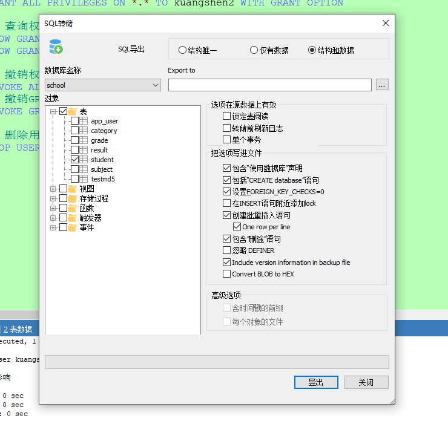

# MySQL笔记

## 操作数据库

### 创建数据库表

~~~mysql
CREATE TABLE IF NOT EXISTS `student` (
    `id` INT(4) NOT NULL AUTO_INCREMENT COMMENT '学号',
    `name` VARCHAR(30) NOT NULL DEFAULT '匿名' COMMENT '姓名',
    `pwd` VARCHAR(20) NOT NULL DEFAULT '123456' COMMENT '密码',
    `sex` VARCHAR(2) NOT NULL DEFAULT '男' COMMENT '性别',
    `birthday` DATETIME DEFAULT NULL COMMENT '出生日期',
    `address` VARCHAR(100) DEFAULT NULL COMMENT '家庭住址',
    `eamil` VARCHAR(50) DEFAULT NULL COMMENT '邮箱',
    PRIMARY KEY(`id`)
)ENGINE=INNODB DEFAULT CHARSET=utf8
~~~

格式

~~~mysql
CREATE TABLE [IF NOT EXISTS] `表名` (
	`字段名` 列类型 [属性] [索引] [注释],
    `字段名` 列类型 [属性] [索引] [注释],
    `字段名` 列类型 [属性] [索引] [注释]
)[表类型][字符集设置][注释]
~~~

==**逆向操作看代码（常用命令）**==

~~~mysql
SHOW CREATE DATABASE new_student -- 查看创建数据库的语句
SHOW CREATE TABLE student -- 查看创建表的语句
DESC student -- 显示表的结构
~~~

### 数据表的类型

~~~mysql
-- 关于数据库引擎
/*
INNODB 默认使用
MYISAM 早些年使用
*/
~~~

|              | MYISAM | INNODB        |
| ------------ | ------ | ------------- |
| 事务支持     | 不支持 | 支持          |
| 数据行锁定   | 不支持 | 支持          |
| 外键约束     | 不支持 | 支持          |
| 全文索引     | 支持   | 不支持        |
| 表空间的大小 | 较小   | 较大，约为2倍 |

常规使用

- MYISAM 节约空间，速度较快
- INNODB 安全性搞，事务的处理，多表多用户操作

> 在物理空间存在的位置

所有的数据库文件都存在data目录下，一个文件夹对应一个数据库
本质还是文件的存储！

MySQL引擎在物理文件上的区别

- INNODB 在数据库表中只有一个*.frm文件，以及上级目录下的ibdata1文件
- MYISAM 对应文件
  - *.frm -表结构的定义文件
  - *.MYD 数据文件（data）
  - *.MYI 索引文件（index）

> 设置数据库的字符集编码

~~~mysql
CHARSET=utf8
~~~

不设置的话会不支持中文

可以在my.ini中配置默认的编码，但是不建议这样写，别人的电脑可能没有配置

~~~mysql
character-set-server=utf8
~~~

### 修改和删除表

> 修改

~~~mysql
-- 修改表：ALTER TABLE 旧表名 RENAME AS 新表名
ALTER TABLE teacher RENAME AS teacher1
-- 增加表的字段：ALTER TABLE 表名 ADD 字段名 列属性[]
ALTER TABLE teacher1 ADD age INT(11)

-- 修改表的字段（重命名，修改约束！） 要注意区别
-- 修改约束：ALTER TABLE 表名 MODIFY 字段名 列属性[] 
ALTER TABLE teacher1 MODIFY age VARCHAR(11) 
-- 字段重命名：ALTER TABLE 表名 CHANGE 旧字段 新字段 列属性[] 
ALTER TABLE teacher1 CHANGE age age1 INT(1) 

-- 删除表的字段：ALTER TABLE 表名 DROP 字段名
ALTER TABLE teacher1 DROP age1
~~~

> 删除

~~~mysql
-- 删除表
DROP TABLE IF EXISTS teacher1
~~~

==所有的创建的删除操作尽量加上判断，以免报错==

注意点：

- ·· 字段名，使用这个包裹
- 注释 -- /**/
- sql关键字大小写不敏感，建议写小写
- 所有的符号全部用英文格式

## MySQL数据管理

### 外键（了解即可）

> 方式一 在创建表的时候，添加约束（麻烦，比较复杂）

~~~mysql
-- 学生表的gradeid字段 要去引用年级表的gradeid（两句话）
-- 定义外键key
-- 给这个外键添加约束（执行引用）references 引用
CREATE TABLE IF NOT EXISTS `student` (
    `id` INT(4) NOT NULL AUTO_INCREMENT COMMENT '学号',
    `name` VARCHAR(30) NOT NULL DEFAULT '匿名' COMMENT '姓名',
    `pwd` VARCHAR(20) NOT NULL DEFAULT '123456' COMMENT '密码',
    `sex` VARCHAR(2) NOT NULL DEFAULT '男' COMMENT '性别',
    `gradeid` INT(10) NOT NULL COMMENT '学生的年级',
    `birthday` DATETIME DEFAULT NULL COMMENT '出生日期',
    `address` VARCHAR(100) DEFAULT NULL COMMENT '家庭住址',
    `eamil` VARCHAR(50) DEFAULT NULL COMMENT '邮箱',
    PRIMARY KEY(`id`),
    -- 设置外键
    KEY `FK_gradeid` (`gradeid`),
    CONSTRAINT `FK_gradeid` FOREIGN KEY (`gradeid`) REFERENCES `grade` (`gradeid`)
    
)ENGINE=INNODB DEFAULT CHARSET=utf8
~~~

删除有外键关系的表的时候，必须要先删除引用别人的表（从表），再删除被应用的表（主表）

> 方式二 创建表成功之后，添加约束关系

~~~ mysql
-- 创建表的时候没有外键关系
-- ALTER TABLE 表 ADD CONSTRAINT 约束名 FOREIGN KEY (作为外键的列) REFERENCES 哪个表 (哪个字段)
ALTER TABLE `student` ADD CONSTRAINT `FK_gradeid` FOREIGN KEY (`gradeid`) REFERENCES `grade` (`gradeid`)
~~~

以上操作都是物理外键，数据库级别的外键，不建议使用！（避免数据库过多造成困扰，只需要了解即可）**否则每次做DELETE或者UPDATE都必须考虑外键约束，会导致开发的时候很痛苦，测试数据极为不方便**

==最佳实践==

- 数据库就是单纯的表，只用来存数据，只有行（数据）和列（字段）
- 我们想使用多张表的数据，想使用外键（用程序去实现）

### DML语言（全部记住）

数据库意义：数据存储，数据管理

DML语言：数据操作语言

- INSERT
- UPDATE
- DELETE

#### 添加

> 插入

~~~ mysql
-- 插入语句（添加）
-- insert into 表名([字段1,字段2,字段3]) values ('值1'),('值2'),('值3')
INSERT INTO `grade`(`gradename`) VALUES('大四')

-- 由于主键自增我们可以省略（如果不写表的字段，他就会一一匹配）
INSERT INTO `grade`(`gradename`) VALUES('大三')
-- 一般写插入语句，我们一定要数据和字段一一对应！

-- 插入多个字段
INSERT INTO `grade`(`gradename`) VALUES('大二'),('大一')

INSERT INTO `student`(`name`) VALUES('张三')

INSERT INTO `student`(`name`,`pwd`,`sex`) VALUES('张三','aaaaaa','男')
~~~

注意事项：

1. 字段和字段之间使用英文逗号隔开
2. 字段是可以省略的，但是后面的值必须一一对应
3. 可以同时插入多条数据，values后面的值，需要使用，隔开即可`VALUES(),()`

#### 修改

> update 修改谁 （条件） set 原来的值 = 新值

~~~mysql
-- 修改学员的名字，不指定条件的话，会改变所有的表
-- update 表名 set colnum_nam=value where 条件
UPDATE `student` SET `name`='狂神' WHERE id = 1

-- 修改多个属性，逗号隔开
UPDATE `student` SET `name`='狂神',`email`='123@11.com' WHERE id = 1
~~~

条件：where子句 运算符 id等于某个值，大于某个值，在某个区间内修改

操作符会返回布尔值

| 操作符              | 含义         | 范围        | 结果  |
| ------------------- | ------------ | ----------- | ----- |
| =                   | 等于         | 5=6         | false |
| <> 或者 !=          | 不等于       | 5<>6        | true  |
| >                   | 大于         |             |       |
| <                   | 小于         |             |       |
| >=                  | 大于等于     |             |       |
| <=                  | 小于等于     |             |       |
| BETWEEN ... and ... | 在某个范围内 |             | [2,5] |
| AND                 | 我和你 &&    | 5>1 and 1>2 | false |
| OR                  | 我或你 \|\|  | 5>1 or 1>2  | true  |

注意：

- colnum_name 是数据库的列，尽量带上``
- 条件，筛选的条件，如果没有指定，则会修改所有的列
- value，是一个具体的值，也可以是一个变量
- 多个设置的属性之间，使用英文逗号隔开

#### 删除

> delete 命令

语法：`delete from 表名 [where 条件]`

~~~mysql
-- 删除数据（避免这样写，会全部删除）
DELETE FROM `student`

-- 删除指定数据
DELETE FROM `student` WHERE id=1
~~~

> TRUNCATE 命令

作用：完全清空一个数据库

~~~mysql
-- 清空student表
TRUNCATE TABLE `student`
~~~

> delete 和 truncate 区别

- 相同点：都能删除数据，都不会删除表结构
- 不同点：
  - TRUNCATE 重新设置 自增列 计数器会归零
  - TRUNCATE 不会影响事务

了解即可：`DELETE删除的问题`，重启数据库，现象

- INNODB 自增列会重1开始（存在内存当中，断电即失）
- MYISAM 继续从上一个自增量开始（存在文件中的，不会丢失）

## DQL查询数据（最重点）

### DQL

（Date Query Language：数据查询语言）

- 所有的查询操作都有它 Select
- 简单的查询，复杂的查询都能做
- ==数据库最核心的语言==
- 使用频率最高的语言

==SELECT完整的语法==

> SELECT语法

~~~mysql
SELECT [ALL | DISTINCT]
{* | table.* | [table.fileld[AS alias1][,table.field2[AS alias2]][,...]}
FROM table_name [AS table_alias]
    [LEFT | RIGHT | INNER | JOIN table_name2] -- 联合查询
    [WHERE ...] -- 指定结果需满足的条件
    [GROUP BY ...] -- 指定结果按照哪几个字段来分组
    [HAVING] -- 过滤分组的记录必须满足的次要条件
    [ORDER BY ...] -- 指定查询记录按一个或多个条件排序
    [LIMIT {[OFFSET,]ROW_COUNT | row_countOFFSET OFFSET}];
    -- 指定查询的记录从哪条至哪条
~~~

**注意：[ ]括号代表课选的，{ }括号代表必选的**

### 指定查询字段

~~~mysql
-- 查询全部的学生  SELECT 字段 FROM 表
SELECT * FROM student

-- 查询指定字段
SELECT `StudentNo`,`StudentName` FROM student

-- 别名，给结果起一个名字 AS  可以给字段起别名，也可以给表起别名
SELECT `StudentNo` AS 学号, `StudentName` AS 学生姓名 FROM student AS s

-- 函数 Concat(a,b)
SELECT CONCAT('姓名：',StudentName) AS 新名字 FROM student
~~~

语法：`SELECT 字段 ... FROM 表`

> 有的时候，列名字不是那么见名知意。我们起别名 AS   字段名 AS 别名  表名 AS 别名

> 去重 distinct

作用：去除SELECT查询出来的结果中重复的数据，重复的数据值只显示一条

~~~mysql
-- 查询一下有那些同学参加了考试，成绩
SELECT * FROM result -- 查询全部的考试成绩
-- 查询有那些同学参加了考试
SELECT `StudentNo` FROM result
-- 发现了重复数据，去重
SELECT DISTINCT `StudentNo` FROM result
~~~

> 数据库的列（表达式）

~~~mysql
SELECT VERSION() -- 查询系统版本（函数）
SELECT 100*3-1 AS 计算结果 -- 用来计算（表达式）
SELECT @@auto_increment_increment -- 查询自增的步长（变量）

-- 学员考试成绩+1分 查看
SELECT `StudentNo`,`StudentResult`+1 AS 提分后 FROM result
~~~

数据库中的表达式：文本值，列，Null，函数，计算表达式，系统变量

select `表达式` from 表

### where条件子句

作用：检索数据中`符合条件`的值

| 运算符  | 语法                | 描述   |
| ------- | ------------------- | ------ |
| and &&  | a and b  a && b     | 逻辑与 |
| or \|\| | a or b     a \|\| b | 逻辑或 |
| not !   | not a       !a      | 逻辑非 |

==尽量使用英文字母==

~~~mysql
-- where
SELECT `studentno`,`studentresult` FROM result
WHERE studentresult >= 90 AND studentresult < 100

-- 模糊查询(区间)
SELECT studentno, studentresult FROM result
WHERE studentresult BETWEEN 80 AND 100

-- not !
SELECT studentno, studentresult FROM result
WHERE NOT studentno = 1000
~~~

> 模糊查询：比较运算符

| 运算符      | 语法              | 描述                                         |
| ----------- | ----------------- | -------------------------------------------- |
| IS NULL     | a is null         | 如果操作符为null，结果为真                   |
| IS NOT NULL | a is not null     | 如果操作符不为null，结果为真                 |
| BETWEEN     | a between b and c | 若a在b和c之间，则结果为真                    |
| LIKE        | a like b          | SQL匹配，如果a匹配b，则结果为真              |
| IN          | a in (a1,a2,a3)   | 假设a在a1，或者a2…其中的某一个值中，结果为真 |

~~~mysql
-- ================模糊查询==============
-- =====like======
-- 查询姓张的同学
-- like结合 %(代表0到任意个字符) _(一个字符)
SELECT studentno,studentname FROM student
WHERE studentname LIKE '张%'
-- 查询名字后面只有一个字的
SELECT studentno,studentname FROM student
WHERE studentname LIKE '张__'
-- 查询名字中间有伟字的同学
SELECT studentno,studentname FROM student
WHERE studentname LIKE '%伟%'

-- ======in（具体的一个或多个值）=======
-- 查询1001，1002，1003号学员
SELECT studentno,studentname FROM student
WHERE studentno IN (1001,1002,1003)

-- 查询在北京的学生
SELECT studentno,studentname FROM student
WHERE address IN ('北京')

-- === null  not null ''=====
-- 查询地址为空的学生 null
SELECT studentno,studentname FROM student
WHERE address='' OR address IS NULL

-- 查询有出生日期的同学 不为空
SELECT studentno,studentname FROM student
WHERE borndate IS NOT NULL
~~~

### 联表查询

> JOIN 对比

~~~mysql
-- =========联表查询 join ==========
-- 查询参加了考试的同学（学号，姓名，科目编号，分数）
SELECT * FROM student
SELECT * FROM result

/*
1、分析需求，分析查询的字段来自哪些表（连接查询）
2、确定使用哪种连接查询（7种）
确定交叉点（这两个表中哪些数据是相同的）
判断的条件：学生表中的studentNO = 成绩表的studentNO
*/

-- join (连接的表) on (判断的的条件) 连接查询
-- where 等值查询

SELECT s.studentNO,studentName,SubjectNo,studentresult
FROM student AS s
INNER JOIN result AS r
WHERE s.studentno=r.studentno

-- right join
SELECT s.studentNO,studentName,SubjectNo,studentresult
FROM student s
RIGHT JOIN result r
ON s.studentno=r.studentno

-- left join
SELECT s.studentNO,studentName,SubjectNo,studentresult
FROM student s
LEFT JOIN result r
ON s.studentno=r.studentno

-- 查询缺考的同学
SELECT s.studentNO,studentName,SubjectNo,studentresult
FROM student s
LEFT JOIN result r
ON s.studentno=r.studentno
WHERE studentresult IS NULL
~~~

| 操作       | 描述                                       |
| ---------- | ------------------------------------------ |
| inner join | 如果表中至少有一个匹配，就返回行           |
| left join  | 即使右表中没有匹配，也会返回左表中所有的值 |
| right join | 即使左表中没有匹配，也会返回右表中所有的值 |

~~~mysql
-- 思考题（查询了参加考试的同学信息：学号，学生姓名，科目名，分数）
/*
1、分析需求，分析查询的字段来自哪些表，student、result、subject（连接查询）
2、确定使用哪种连接查询（7种）
确定交叉点（这两个表中哪些数据是相同的）
判断的条件：学生表中的studentNO = 成绩表的studentNO  成绩表的subjectNo = 科目表的subjectNo
*/
SELECT s.studentno,studentname,subjectname,studentresult
FROM student s
RIGHT JOIN result r
ON s.studentno = r.studentno
INNER JOIN `subject` sub
ON r.subjectno = sub.subjectno
~~~

> 连接

自己的表和自己表连接 核心：==一张表拆为两张一样的表即可==

| categoryid | categoryName |
| ---------- | ------------ |
| 2          | 信息技术     |
| 3          | 软件开发     |
| 5          | 美术设计     |

子类

| pid  | categoryid | categoryName |
| ---- | ---------- | ------------ |
| 3    | 4          | 数据库       |
| 2    | 8          | 办公信息     |
| 3    | 6          | web开发      |
| 5    | 7          | ps技术       |

操作：查询弗雷对应的子类关系

| 父类     | 子类     |
| -------- | -------- |
| 信息技术 | 办公信息 |
| 软件开发 | 数据库   |
| 软件开发 | web开发  |
| 美术设计 | ps技术   |

~~~ mysql
-- =========自连接=========
CREATE TABLE category (
	categoryid INT(10) UNSIGNED NOT NULL AUTO_INCREMENT COMMENT '主题ID',
	pid INT(10) NOT NULL COMMENT '父ID',
	categoryName VARCHAR(50) NOT NULL COMMENT '主题名字',
	PRIMARY KEY(categoryid)
) ENGINE=INNODB AUTO_INCREMENT=9 DEFAULT CHARSET = utf8;

INSERT INTO category(categoryid,pid,categoryName)
VALUES('2','1','信息技术'),('3','1','软件开发'),('4','3','数据库'),
('5','1','美术设计'),('6','3','web开发'),('7','5','PS技术'),('8','2','办公信息');

-- 查询父子信息：把一张表看成两个一模一样的表
SELECT a.categoryname AS '父栏目',b.categoryname AS '子栏目'
FROM category AS a,category AS b
WHERE a.categoryid=b.pid
~~~

结果

### 排序和分页

> 排序

~~~mysql
-- 排序：升序ASC，降序DECS
-- 语法：ORDER BY 字段名 ASC/DECS
SELECT s.studentno,studentname,subjectname,studentresult
FROM student s 
RIGHT JOIN result r
ON s.studentno = r.studentno
INNER JOIN `subject` sub
ON r.subjectno = sub.subjectno
WHERE subjectname != '数据库结构考试-1'
ORDER BY studentresult ASC
~~~

> 分页：

~~~mysql
-- 为什么要分页
-- 缓解数据库压力，给人体验更好
-- 分页，每页只显示2条数据、
-- 语法：LIMIT 起始值,页面大小
-- LIMIT 0,3
SELECT s.studentno,studentname,subjectname,studentresult
FROM student s 
RIGHT JOIN result r
ON s.studentno = r.studentno
INNER JOIN `subject` sub
ON r.subjectno = sub.subjectno
WHERE subjectname != '数据库结构考试-1'
ORDER BY studentresult ASC
LIMIT 0,3

-- 第一页 limit 0,3
-- 第二页 limit 3,3
-- 第三页 limit 6,3
-- 第n页 limit 3*(n-1),3
~~~

> 思考题

~~~mysql
-- 查询Java第一学年 课程成绩排名前10的学生，并且分数要大于80的学生信息（学号，姓名，课程，成绩）
SELECT s.studentno,studentname,subjectname,studentresult
FROM student s
INNER JOIN result r
ON s.studentno = r.studentno
INNER JOIN `subject` sub
ON r.subjectno = sub.subjectno
WHERE subjectname = "Java程序设计-1" AND r.studentresult > 80
ORDER BY r.studentresult DESC
LIMIT 0,10
~~~

### 子查询

~~~mysql
-- 1、查询 C语言-1 的所有考试结果（学号，科目编号，成绩），降序排列
-- 方式一：使用连接查询
SELECT studentno,r.subjectno,studentresult
FROM result r
INNER JOIN `subject` sub
ON r.subjectno = sub.subjectno
WHERE `subjectname` = 'C语言-1'
ORDER BY studentresult DESC

-- 方式二：使用子查询(由里及外)
SELECT studentno,subjectno,studentresult
FROM result
WHERE subjectno=(
    SELECT subjectno
    FROM `subject`
    WHERE subjectname='C语言-1'
)
ORDER BY studentresult DESC

-- 分数不小于80分的学生的学号和姓名
-- 连接查询
SELECT DISTINCT s.studentno,studentname
FROM student s
INNER JOIN result r
ON s.studentno = r.studentno
WHERE studentresult >= 80

-- 用子查询的方式在此基础上增加一个科目，高等数学-2
SELECT DISTINCT s.studentno,studentname
FROM student s
INNER JOIN result r
ON s.studentno = r.studentno
WHERE studentresult >= 80 AND subjectno = (
    SELECT subjectno
    FROM `subject`
    WHERE subjectname = '高等数学-2'
)

-- 子查询
-- 这里子查询结果中有两个重复的结果会影响父查询，所以必须去重distinct
SELECT studentno,studentname
FROM student 
WHERE studentno=(
    SELECT DISTINCT studentno
    FROM result 
    WHERE studentresult >= 80
)
~~~

### 分组和过滤

> 分组：GROUP BY
>
> 过滤：HANGING

~~~mysql
-- 查询不同课程的平均分，最高分，最低分
SELECT subjectname AS 课程名,AVG(studentresult) AS 平均分,MAX(studentresult) AS 最高分,MIN(studentresult) AS 最低分
FROM result r
INNER JOIN `subject` sub
ON r.subjectno = sub.subjectno 
GROUP BY r.subjectno -- 通过声明字段来分组
HAVING 平均分 >= 80

~~~

## MySQL函数

### 常用函数

~~~mysql
-- 数学运算
SELECT ABS(-8) -- 绝对值
SELECT CEILING(9.4) -- 向上取整
SELECT FLOOR(9.4) -- 向下取整
SELECT RAND() -- 返回一个0~1之间的随机数
SELECT SIGN(0) -- 判断一个数的符号 0-0 负数返回-1，整数返回1

-- 字符串函数
SELECT CHAR_LENGTH('即使再小的帆也能远航') -- 字符串长度
SELECT CONCAT('我','爱','Java') -- 拼接字符串
SELECT INSERT('我爱编程helloworld',1,2,'超级热爱') -- 插入，从某个位置开始替换某个长度
SELECT LOWER('KUANGSHEN') -- 转小写
SELECT UPPER('kuangshen') -- 转大写
SELECT INSTR('kuangshen','h') -- 返回第一次出现的子串的索引
SELECT REPLACE('狂神说坚持就能成功','坚持','努力') -- 替换出现的指定字符串
SELECT SUBSTR('狂神说坚持就能成功',4,6) -- 返回指定的子字符串（源字符串，截取的位置，截取的长度）
SELECT REVERSE('狂神说坚持就能成功') -- 反转

-- 查询姓 张 的同学，名字 章 
SELECT REPLACE(studentname,'张','章')
FROM student
WHERE studentname LIKE '张%'

-- 时间和日期函数（记住）
SELECT CURRENT_DATE() -- 获取当前日期
SELECT CURDATE() -- 获取当前日期
SELECT NOW() -- 获取当前时间
SELECT LOCALTIME() -- 本地时间
SELECT SYSDATE() -- 系统时间

SELECT YEAR(NOW())
SELECT MONTH(NOW())
SELECT DAY(NOW())
SELECT HOUR(NOW())
SELECT MINUTE(NOW())
SELECT SECOND(NOW())

-- 系统
SELECT SYSTEM_USER()
SELECT USER()
SELECT VERSION()
~~~

### 聚合函数（常用）

| 函数名称 | 描述   |
| -------- | ------ |
| COUNT()  | 计数   |
| SUM()    | 求和   |
| AVG()    | 平均值 |
| MAX()    | 最大值 |
| MIN()    | 最小值 |

~~~mysql
SELECT COUNT(borndate) FROM student -- count(字段)，会忽略所有的null值
SELECT COUNT(*) FROM student -- 不会忽略null值
SELECT COUNT(1) FROM student -- 忽略所有的null值

SELECT SUM(studentresult) AS 总和 FROM result
SELECT AVG(studentresult) AS 平均分 FROM result
SELECT MAX(studentresult) AS 最高分 FROM result
SELECT MIN(studentresult) AS 最低分 FROM result
 
-- 查询不同课程的平均分，最高分，最低分
SELECT subjectname AS 课程名,AVG(studentresult) AS 平均分,MAX(studentresult) AS 最高分,MIN(studentresult) AS 最低分
FROM result r
INNER JOIN `subject` sub
ON r.subjectno = sub.subjectno 
GROUP BY r.subjectno -- 通过声明字段来分组
HAVING 平均分 >= 80
~~~

### 数据库级别的MD5加密（拓展）

主要增强算法复杂度和不可逆性

MD5不可你，具体的值的md5是一样的

MD5破解网站的原理，背后又一个字段，MD5加密后的值 ，加密的前值

~~~mysql
-- ======测试MD5 加密======
CREATE TABLE `testmd5` (
    `id` INT(4) NOT NULL,
    `name` VARCHAR(20) NOT NULL,
    `pwd` VARCHAR(50) NOT NULL,
    PRIMARY KEY(`id`)
)ENGINE=INNODB DEFAULT CHARSET=utf8

-- 铭文密码
INSERT INTO testmd5 VALUES(1,'张三','123456'),(2,'李四','123456'),(3,'王五','123456')

-- 加密
UPDATE testmd5 SET pwd=MD5(pwd)

-- 插入的时候加密
INSERT INTO testmd5 VALUES(4,'小明',MD5('123456'))
~~~

## 事务

### 什么是事务

要么都成功，要么都失败

> 1、SQL执行 A给B转账
>
> 2、SQL执行 B收到A的钱

将一组SQL放在一个批次中去执行

> 事务原则：ACID原则 （原子性，一致性，隔离性，持久性）

- **原子性（Atomicity）**

  针对同一个事务（要么同时成功，要么同时失败）

- **一致性（Consistency）**

  针对事务操作于操作后的状态一致

- **持久性（Isolation）**

  表示事务结束后的数据不随着外界原因导致数据丢失（事务没有提交，恢复到原状；事务已经提交，持久化到数据库的；事务一旦提交就不可逆）

- **隔离性（Durability）**

  针对多个用户同时操作，主要是排除其他事务对本次事务的影响

> 隔离导致的一些问题

- **脏读**

  指一个事务读取了另外一个事务未提交的数据

- **不可重复读**

  在一个事务内读取表中的某一行数据 ，多次读取结果不同（这个不一定是错误，只是某些场合不对）

- **幻读**

  是指在一个事务内读取到了别的事务插入的数据，导致前后读取不一致

> 基础知识

~~~mysql
-- 手动处理事务
SET autocommit = 0 -- 关闭自动提交

-- 事务开启
START TRANSACTION -- 标记一个事务的开始，从这个之后的sql都在同一个事务内

INSERT xx
INSERT xx

-- 提交：持久化（成功！）
COMMIT
-- 回滚：回到的原来的样子（失败！）
ROLLBACK

-- 事务结束
SET COMMIT = 1 -- 开启自动提交
~~~

> 案例

~~~mysql
-- 转帐
CREATE DATABASE shop CHARACTER SET utf8 COLLATE utf8_general_ci
USE shop

CREATE TABLE `account` (
    `id` INT(3) NOT NULL AUTO_INCREMENT,
    `name` VARCHAR(30) NOT NULL,
    `monye` DECIMAL(9,2) NOT NULL,
    PRIMARY KEY (`id`)
)ENGINE=INNODB DEFAULT CHARSET=utf8

INSERT INTO ACCOUNT(`name`,`monye`)
VALUES ('A',2000.00),('B',10000.00)

-- 模拟转账 （一行一行操作）
SET autocommit = 0 -- 关闭自动提交
START TRANSACTION -- 开启一个事务 (一组事务)

UPDATE ACCOUNT SET money=money-500 WHERE `name`='A' -- A减500
UPDATE ACCOUNT SET money=money+500 WHERE `name`='B' -- B加500

COMMIT -- 提交事务，数据持久化，无法回滚
ROLLBACK -- 没提交事务之前都可以回滚

SET autocommit=1 -- 恢复默认值
~~~

## 索引

> MySQL官方对索引的定义为：索引（Index）是帮助MySQL高效获取数据的数据结构
>
> 提取句子主干，就可以得到索引的本子：索引是数据结构

### 索引的分类

> 在一个表中，主键索引只能由一个，唯一索引可以有多个

- 主键索引（PRIMARY KEY）
  - 唯一的标识，主键不可重复，只能由一个列作为主键
- 唯一索引（UNIQUE KEY）
  - 避免重复的列出现，唯一索引可以重复，多个列都可以标识为唯一索引
- 常规索引（KEY/INDEX）
  - 默认的，index、key关键字来设置
- 全文索引（FullText）
  - 在特定的数据库引擎下才有，MYISAM
  - 快速定位全文

基础语法

~~~mysql
-- ==============索引的使用============
-- 1、在创建表的时候给字段增加索引
-- 2、创建完毕后，增加索引

-- 显示所有的索引信息
USE school
SHOW INDEX FROM student

-- 增加一个全文索引 注意：school.student
ALTER TABLE school.student ADD FULLTEXT INDEX `studentname`(`studentname`)

-- EXPLAIN 分析sql执行的状况
EXPLAIN SELECT * FROM student -- 非全文索引

SELECT * FROM student WHERE MATCH(studentname) AGAINST('张')
~~~

### 测试索引

==索引在小数据量的时候，用户不大，但是在大数据的时候，区别十分明显==

~~~mysql
-- 插入100万数据
DELIMITER $$ -- 写函数之前必须要写，标志
CREATE FUNCTION mock_data()
RETURNS INT
BEGIN
    DECLARE num INT DEFAULT 1000000;
    DECLARE i INT DEFAULT 0;    
    
    WHILE i < num DO
        -- 插入语句
        INSERT INTO app_user(`name`,`email`,`phone`,`gender`,`password`,`age`) VALUES(CONCAT('用户',i),'123456@qq.com',CONCAT('18',FLOOR(RAND()*((999999999-100000000)+100000000))),FLOOR(RAND()*2),UUID(),FLOOR(RAND()*100));
        SET i = i + 1;
    END WHILE;
    RETURN i;
END;

SELECT mock_data();

SELECT * FROM app_user WHERE `name` = '用户9999'

-- 建立索引之后唯一定位了，不需要去遍历了
EXPLAIN SELECT * FROM app_user WHERE `name` = '用户9999'

-- id_表名_字段名
-- CREATE INDEX 索引名 ON 表(字段)
CREATE INDEX id_app_user_name ON app_user(`name`) -- 全文索引
~~~

### 索引原则

- 索引不是越多越好
- 不要对经常变动数据加索引
- 小数据量的表不需要加索引
- 索引一般加在常用来查询的字段

> 索引的数据结构

Hash类型的索引

Btree：InnoDB默认的底层数据结构

阅读：http://blog.codinglabs.org/articles/theory-of-mysql-index.html （认真读半小时）

## 权限管理和备份

### 用户管理

> SQLyog可视化管理

> SQL命令操作

用户表：mysql.user

本质：对这张表进行增删改查

~~~mysql
-- 创建用户 CREATE USER 用户 IDENTIFIED BY '密码'
CREATE USER kuangshen IDENTIFIED BY '123456'

-- 修改密码（修改当前用户密码）
SET PASSWORD = PASSWORD('123456')

-- 修改密码（修改指定用户密码）
SET PASSWORD FOR kuangshen = PASSWORD('123456')

-- 重命名 RENAME USER 旧名字 TO 新名字
RENAME USER kuangshen TO kuangshen2

-- 用户授权 ALL PRIVILEGES 全部的权限，库，表
-- ALL PRIVILEGES 除了给别人授权，其他都能够赶
GRANT ALL PRIVILEGES ON *.* TO kuangshen2 WITH GRANT OPTION

-- 查询权限
SHOW GRANTS FOR kuangshen2 -- 查看指定用户的权限
SHOW GRANTS FOR root@localhost

-- 撤销权限
REVOKE ALL PRIVILEGES ON *.* FROM kuangshen2
-- 撤销GRANT权限
REVOKE GRANT OPTION ON *.* FROM 'kuangshen2'@'%';

-- 删除用户
DROP USER kuangshen2
~~~

### MySQL备份

为什么要备份

- 保证重要的数据不丢失
- 数据转移

MySQL数据库备份的方式

- 直接拷贝物理文件（复制文件夹）

  

- 在SQLyog这种可视化工具中手动导出

  

- 使用命令行导出 mysqldump 命令行使用

  ~~~bash
  # 导出
  # mysqldump -h 主机 -u 用户名 -p 密码 数据库 表名 > 物理磁盘位置/文件名
  mysqldump -hlocalhost -uroot -p123456 school student >D:/a.sql
  
  # mysqldump -h 主机 -u 用户名 -p 密码 数据库 表名 > 物理磁盘位置/文件名
  mysqldump -hlocalhost -uroot -p123456 school student >D:/b.sql
  
  # mysqldump -h 主机 -u 用户名 -p 密码 数据库 > 物理磁盘位置/文件名
  mysqldump -hlocalhost -uroot -p123456 school >D:/c.sql
  
  # 导入
  # 先登陆数据库
  mysql -uroot -p123456
  use school
  source D:/c.sql
  ~~~

## 规范数据库设计

### 为什么需要设计

==当数据库比较复杂的时候，我们就需要设计了==

**糟糕的数据库设计**

- 数据冗余，浪费空间
- 数据库插入和删除都会麻烦、异常【屏蔽使用物理外键】
- 程序的性能差

**良好的数据库设计**

- 节省内存空间
- 保证数据库的完整性
- 方便我们开发系统

**软件开发中，关于数据库的设计**

- 分析需求：分析业务和需要处理的数据库的需求
- 概要设计：设计关系图 E-R图

**设计数据库的步子：（个人博客）**

- 收集信息，分析需求
  - 用户表（用户登陆注销，用户的个人信息，写博客，创建分类）
  - 分类表（文章分类，谁创建的）
  - 文章表（文章的信息）
  - 友链表（友链信息）
  - 自定义表（系统信息，某个关键的字，或者一些主字段）key : value
- 标识实体（把需求落地到每个字段）

### 三大范式

#### 为什么需要数据规范化

- 信息重复
- 更新异常
- 插入异常
  - 无法显示正常信息
- 删除异常
  - 丢失有效的信息

> 三大范式

>  **第一范式（1NF）**
>
> > 原子性：保证每一列不可再分
>
> **第二范式（2NF）**
> 
> > 前提：满足第一范式
> > 每张表只描述一件事情
> 
> **第三范式（3NF）**
> 
> > 前提：满足第一范式和第二范式
> > 第三范式需要确保数据表汇总的每一列数据都和主键直接相关，而不能间接相关

**规范性和性能的问题**

关联查询的表不得超过三张表

- 考虑商业化的需求和目标（成本，用户体验）
- 在规范性能的问题的时候，需要适当的考虑一下规范性
- 故意给某些表增加一些冗余的字段（从多表查询变为单表查询）
- 故意增加一些计算列（从大数据量降低位小数据量的查询：索引）

## JDBC（最重点）

### 数据库驱动

驱动：声卡、显卡、数据库

我们的程序会通过数据库驱动，和数据库打交道

### JDBC

为了简化开发人员的（对数据库的统一）操作，提供了一个（Java操作数据库的）规范，俗称JDBC

对于开发人员来说，我们只需要掌握JDBC接口的操作即可！

java.sql
javax.sql
还需要导入一个数据库驱动包

### 第一个JDBC程序

> 导入数据库

~~~mysql
CREATE DATABASE jdbcStudy CHARACTER SET utf8 COLLATE utf8_general_ci;

USE jdbcStudy;

CREATE TABLE users(
	id INT PRIMARY KEY,
	NAME VARCHAR(40),
	PASSWORD VARCHAR(40),
	email VARCHAR(60),
	birthday DATE
);

INSERT INTO users(id,NAME,PASSWORD,email,birthday)
VALUES(1,'zhansan','123456','zs@sina.com','1980-12-04'),
(2,'lisi','123456','lisi@sina.com','1981-12-04'),
(3,'wangwu','123456','wangwu@sina.com','1979-12-04')
~~~

导入数据库驱动

代码

~~~java
import java.sql.*;

// 我的第一个JDBC程序
public class JdbcFirstDemo {
    public static void main(String[] args) throws ClassNotFoundException, SQLException {
        //1、加载驱动
        Class.forName("com.mysql.jdbc.Driver"); // 固定写法，加载驱动

        //2. 用户信息和url
        String url = "jdbc:mysql://localhost:3306/jdbcstudy?useUnicode=true&characterEncoding=utf8&useSSL=true";
        String username = "root";
        String password = "123456";

        //3. 连接成功，数据库对象
        Connection connection = DriverManager.getConnection(url, username, password);

        //4、执行SQL对象
        Statement statement = connection.createStatement();

        //5、执行SQL的对象去执行SQL，可能存在结果，查看返回结果
        String sql = "SELECT * FROM users";

        ResultSet resultSet = statement.executeQuery(sql); // 返回的结果集,结果集中封装了我们全部的查询出来的结果集

        while (resultSet.next()) {
            System.out.println("id=" + resultSet.getObject("id"));
            System.out.println("name=" + resultSet.getObject("NAME"));
            System.out.println("pwd=" + resultSet.getObject("PASSWORD"));
            System.out.println("email=" + resultSet.getObject("email"));
            System.out.println("birth" + resultSet.getObject("birthday"));
            System.out.println("=======================");
        }

        //6、释放连接
        resultSet.close();
        statement.close();
        connection.close();

    }
}
~~~

步骤总结：

1. 加载驱动
2. 连接数据库 DriverManager
3. 获得执行sql的对象 Statement
4. 获得返回的结果集
5. 释放连接

### Statment对象

**jdbc中的statment对象用于向数据库发送sql语句，想完成对数据库的增删改查，只需要通过向数据库发送增删改查语句即可。**

> CRUD操作-create

使用executeUpdate(String sql)方法完成数据添加操作，示例操作

~~~java
Statement st = conn.createStatement();
String sql = "insert into user(....) value(....)";
int num = st.executeUpdate(sql);
if (num > 0) {
    System.out.println("插入成功！！！");
}
~~~

> CRUD操作-delete

使用executeUpdate(String sql)方法旺财数据删除操作,示例操作:

~~~java
Statement st = conn.createStatement();
String sql = "delete from user where id = 1";
int num = st.executeUpdate(sql);
if (num > 0) {
	System.out.println("删除成功！！！");
}
~~~

> CRUD操作-read

使用executeQuery(String sql)方法完成数据查询操作，示例操作：

~~~mysql
Statement st = conn.createStatement();
String sql = "select * from user where id = 1";
ResultSet rs = st.executeUpdate(sql);
while (rs.next()) {
	//根据获取列的数据类型，分别调用rs的相应方法映射到java对象中
}
~~~

> 代码实现

1、提取工具类

~~~java
import java.io.InputStream;
import java.sql.*;
import java.util.Properties;

public class JdbcUtils {

    private static String driver = null;
    private static String url = null;
    private static String username = null;
    private static String password = null;

    static {

        try {
            InputStream in = JdbcUtils.class.getClassLoader().getResourceAsStream("db.properties");
            Properties properties = new Properties();
            properties.load(in);

            driver = properties.getProperty("driver");
            url = properties.getProperty("url");
            username = properties.getProperty("username");
            password = properties.getProperty("password");

            //1、驱动只用加载一次
            Class.forName(driver);

        } catch (Exception e) {
            e.printStackTrace();
        }
    }

    // 获取连接
    public static Connection getConnection() throws SQLException {
        return DriverManager.getConnection(url, username, password);
    }

    //释放连接资源
    public static void release(Connection conn, Statement st, ResultSet rs) {
        if (rs != null) {
            try {
                rs.close();
            } catch (SQLException throwables) {
                throwables.printStackTrace();
            }
        }

        if (st != null) {
            try {
                st.close();
            } catch (SQLException throwables) {
                throwables.printStackTrace();
            }
        }

        if (conn != null) {
            try {
                conn.close();
            } catch (SQLException throwables) {
                throwables.printStackTrace();
            }
        }
    }
}

~~~

2、编写增删改的方法，`executeUpdate`

~~~java
// 增
import java.sql.Connection;
import java.sql.ResultSet;
import java.sql.SQLException;
import java.sql.Statement;

public class TestInsert {
    public static void main(String[] args) {

        Connection conn = null;
        Statement st = null;
        ResultSet rs = null;

        try {
            conn = JdbcUtils.getConnection(); // 获取数据库连接
            st = conn.createStatement(); // 获得SQL的执行对象
            String sql = "INSERT INTO users(id,`NAME`,`PASSWORD`,`email`,`birthday`)" +
                    "VALUES(4,'kuangshen','123456','123456@qq.com','2021-03-13')";

            int i = st.executeUpdate(sql);

            if (i > 0) {
                System.out.println("插入成功！");
            }

        } catch (SQLException throwables) {
            throwables.printStackTrace();
        } finally {
            JdbcUtils.release(conn, st, rs);
        }

    }
}
~~~

~~~java
// 删
import java.sql.Connection;
import java.sql.ResultSet;
import java.sql.SQLException;
import java.sql.Statement;

public class TestDelete {
    public static void main(String[] args) {

        Connection conn = null;
        Statement st = null;
        ResultSet rs = null;

        try {
            conn = JdbcUtils.getConnection(); // 获取数据库连接
            st = conn.createStatement(); // 获得SQL的执行对象
            String sql = "DELETE FROM users WHERE id=4";

            int i = st.executeUpdate(sql);

            if (i > 0) {
                System.out.println("删除成功！");
            }

        } catch (SQLException throwables) {
            throwables.printStackTrace();
        } finally {
            JdbcUtils.release(conn, st, rs);
        }

    }
}
~~~

~~~java
//改
import java.sql.Connection;
import java.sql.ResultSet;
import java.sql.SQLException;
import java.sql.Statement;

public class TestUpdate {
    public static void main(String[] args) {

        Connection conn = null;
        Statement st = null;
        ResultSet rs = null;

        try {
            conn = JdbcUtils.getConnection(); // 获取数据库连接
            st = conn.createStatement(); // 获得SQL的执行对象
            String sql = "UPDATE users SET `NAME` = 'kaungshen',`email` = '123456@qq.com' WHERE id = 2";

            int i = st.executeUpdate(sql);

            if (i > 0) {
                System.out.println("更新成功！");
            }

        } catch (SQLException throwables) {
            throwables.printStackTrace();
        } finally {
            JdbcUtils.release(conn, st, rs);
        }

    }
}
~~~

3、查询

~~~java
import java.sql.Connection;
import java.sql.ResultSet;
import java.sql.SQLException;
import java.sql.Statement;

public class TestSelect {

    public static void main(String[] args) {

        Connection conn = null;
        Statement st = null;
        ResultSet rs = null;

        try {
            conn = JdbcUtils.getConnection();
            st = conn.createStatement();

            // SQL
            String sql = "select * from users where id = 1";

            rs = st.executeQuery(sql);// 查询完毕会返回一个结果集

            while (rs.next()) {
                System.out.println(rs.getString("NAME"));
            }

        } catch (SQLException throwables) {
            throwables.printStackTrace();
        } finally {
            JdbcUtils.release(conn, st, rs);
        }
    }
}
~~~

> SQL注入的问题

SQL存在漏洞

### PrepareStatement对象

PrepareStatement可以防止SQL注入，效率更好！

1、新增

~~~java
package com.kuang.lesson03;

import com.kuang.lesson02.utils.JdbcUtils;

import java.sql.Connection;
import java.sql.PreparedStatement;
import java.sql.SQLException;
import java.util.Date;

public class TestInsert {
    public static void main(String[] args) {
        Connection conn = null;
        PreparedStatement st = null;

        try {
            conn = JdbcUtils.getConnection();

            String sql = "INSERT INTO users(id,`NAME`,`PASSWORD`,`email`,`birthday`)" +
                    "VALUES(?,?,?,?,?)";
            // 区别
            st = conn.prepareStatement(sql); //预编译SQL，先写sql，然后不执行

            // 手动给参数赋值
            st.setObject(1,5); //id
            st.setObject(2,"qinjiang"); //名字
            st.setObject(3,"123456"); //密码
            st.setObject(4,"123456@qq.com"); //邮箱
            // 注意点，sql.Date 数据库     java.sql.Date()
            //       util.Date Java     new Date().getTime() 获得时间戳
            st.setObject(5,new java.sql.Date(new Date().getTime())); //生日

            // 执行
            int i = st.executeUpdate();

            if (i > 0) {
                System.out.println("插入成功！");
            }

        } catch (SQLException throwables) {
            throwables.printStackTrace();
        } finally {
            JdbcUtils.release(conn, st, null);
        }
    }
}

~~~

2、删除

~~~java
package com.kuang.lesson03;

import com.kuang.lesson02.utils.JdbcUtils;

import java.sql.Connection;
import java.sql.PreparedStatement;
import java.sql.SQLException;
import java.util.Date;

public class TestDelete {
    public static void main(String[] args) {
        Connection conn = null;
        PreparedStatement st = null;

        try {
            conn = JdbcUtils.getConnection();

            String sql = "delete from users where id = ?";
            // 区别
            st = conn.prepareStatement(sql); //预编译SQL，先写sql，然后不执行

            // 手动给参数赋值
            st.setObject(1, 5);

            // 执行
            int i = st.executeUpdate();

            if (i > 0) {
                System.out.println("删除成功！");
            }

        } catch (SQLException throwables) {
            throwables.printStackTrace();
        } finally {
            JdbcUtils.release(conn, st, null);
        }
    }
}

~~~

3、更新

~~~java
package com.kuang.lesson03;

import com.kuang.lesson02.utils.JdbcUtils;

import java.sql.Connection;
import java.sql.PreparedStatement;
import java.sql.SQLException;
import java.util.Date;

public class TestUpdate {
    public static void main(String[] args) {
        Connection conn = null;
        PreparedStatement st = null;

        try {
            conn = JdbcUtils.getConnection();

            String sql = "update users set `name` = ? where id = ?";
            // 区别
            st = conn.prepareStatement(sql); //预编译SQL，先写sql，然后不执行

            // 手动给参数赋值
            st.setObject(1, "狂神");
            st.setObject(2, 1);

            // 执行
            int i = st.executeUpdate();

            if (i > 0) {
                System.out.println("更新成功！");
            }

        } catch (SQLException throwables) {
            throwables.printStackTrace();
        } finally {
            JdbcUtils.release(conn, st, null);
        }
    }
}
~~~

4、查询

~~~java
package com.kuang.lesson03;

import com.kuang.lesson02.utils.JdbcUtils;

import java.sql.Connection;
import java.sql.PreparedStatement;
import java.sql.ResultSet;
import java.sql.SQLException;

public class TestSelect {
    public static void main(String[] args) {

        Connection conn = null;
        PreparedStatement st = null;
        ResultSet rs = null;

        try {
            conn = JdbcUtils.getConnection();

            String sql = "select * from users where id = ?";

            st = conn.prepareStatement(sql);

            st.setObject(1,1);

            rs = st.executeQuery();

            if (rs.next()) {
                System.out.println(rs.getString("NAME"));
            }

        } catch (SQLException throwables) {
            throwables.printStackTrace();
        } finally {
            JdbcUtils.release(conn, st, rs);
        }

    }

}
~~~

### 使用IDEA连接数据库

如果在IDEA中连接不上数据库，则在这里修改位数据库对应的版本SQL

### 事务

==要么都成功，要么都失败==

> ACID原则

原子性：要么全部完成，要么都不完成
一致性：总数不变
隔离性：多个进程互不干扰
持久性：一旦提交不可逆，持久化到数据库了

隔离性的问题
脏读：一个事务读取了另一个没有提交的事务
不可重复读：在同一个事务内，重复读取表中的数据，表数据发生了改变
幻读：在一个事务内，读取到了别人插入的数据，导致前后读出来结果不一致

> 代码实现

1、开启事务`conn.setAutoCommit(false)`

2、一组业务执行完毕

3、可以在catch语句中显式的定义回滚语句，但默认失败就会回滚

~~~java
package com.kuang.lesson04;

import com.kuang.lesson02.utils.JdbcUtils;

import java.sql.Connection;
import java.sql.PreparedStatement;
import java.sql.ResultSet;
import java.sql.SQLException;

public class TestTransaction1 {

    public static void main(String[] args) {
        Connection conn = null;
        PreparedStatement st = null;
        ResultSet rs = null;

        try {
            conn = JdbcUtils.getConnection();

            // 关闭数据库的自动提交功能，自动会开启事务
            conn.setAutoCommit(false);

            String sql1 = "update account set money = money-100 where name = 'A'";
            st = conn.prepareStatement(sql1);
            st.executeUpdate();

            String sql2 = "update account set money = money+100 where name = 'B'";
            st = conn.prepareStatement(sql2);
            st.executeUpdate();

            conn.commit();
            System.out.println("成功！");

                conn.prepareStatement(sql1);

        } catch (SQLException throwables) {
            try {
                conn.rollback();
            } catch (SQLException e1) {
                e1.printStackTrace();
            }
            throwables.printStackTrace();
        } finally {
            JdbcUtils.release(conn, st, rs);
        }
    }
}
~~~

### 数据库连接池

数据库连接---执行---释放
连接---释放 十分浪费系统资源

池化技术：准备一些预先的资源，过来就连接预先准备好的

---开门---业务员：等待---服务---

最小连接数：10

最大连接数：15

等待超时：100ms

编写连接池，实现一个接口 DataSource

> 开源数据源实现

DBCP

C3P0

Druid：阿里巴巴

使用了这些数据库连接池之后，我们在项目开发中就不需要编写连接数据库的代码了！

> DBCP

需要用到 jar 包

## SQLyog重复使用30天的方法

Sqlyog作为一款可视化的数据库管理工具，各种方便我就不说了，但是未经汉化或者绿色过的软件存在30天的生命期，到期后我们就不可以使用了，要摸卸载重装，我们还可以去修改注册表，来延长它的生命期，具体步骤如下：

1. 开始-运行-regedit ，进入注册表，在 \HEYK_CURRENT_USER\Software\{FCE28CE8-D8CE-4637-9BC7-93E4C0D407FA}（后面这个东西每个电脑可能不太一样，但是我们仍然可以找到这个16进制的数字串）。

   

   

2. 双击，InD保存着SQLyog的使用天数，十进制值2455140～2455131表示30～1天，该区间外的数值应该均为0天，所以每次可以更改该数值便可一直试用。

   

   

3. 删除该项，在重启SQLyog后注册表中会重新生成，使用期为30天。

   

