# Redis学习笔记

## 事务

Redis事务本质：一组命令的集合！一个事务中的所有命令都会被序列化，在事务执行过程中，回安卓顺序执行！

一次性、顺序性、排他性！执行一些列的命令！

~~~
----- 队列 set set set 执行 -------
~~~

==Redis事务中没有隔离级别的概念==

所有的命令在事务中，并没有直接被执行！只有发起执行命令的适合才会执行！exec

==Redis单条命令是保存原子性的，但是事务不保证原子性==

redis的事务

- 开启事务（multi）
- 命令入队（...）
- 执行事务（exec）

> 正常执行事务！

~~~bash
127.0.0.1:6379> multi #执行事务
OK
# 命令入队
127.0.0.1:6379(TX)> set k1 v1
QUEUED
127.0.0.1:6379(TX)> set k2 v2
QUEUED
127.0.0.1:6379(TX)> get k2
QUEUED
127.0.0.1:6379(TX)> set k3 v3
QUEUED
127.0.0.1:6379(TX)> exec #执行事务
1) OK
2) OK
3) "v2"
4) OK
~~~

> 放弃事务

~~~bash
127.0.0.1:6379> multi #开启事务
OK
127.0.0.1:6379(TX)> set k1 v1
QUEUED
127.0.0.1:6379(TX)> set k2 v2
QUEUED
127.0.0.1:6379(TX)> set k4 v4
QUEUED
127.0.0.1:6379(TX)> DISCARD #取消事务
OK
127.0.0.1:6379> get k4 #事务队列中命令都不会被执行
(nil)
~~~

> 编译型异常（代码有问题！命令有错！），事务中所有的命令都不会被执行！

~~~bash
127.0.0.1:6379> multi
OK
127.0.0.1:6379(TX)> set k1 v1
QUEUED
127.0.0.1:6379(TX)> set k2 v2
QUEUED
127.0.0.1:6379(TX)> getset k2 #错误的命令
(error) ERR wrong number of arguments for 'getset' command
127.0.0.1:6379(TX)> set k3 v3
QUEUED
127.0.0.1:6379(TX)> exec #执行命令报错
(error) EXECABORT Transaction discarded because of previous errors.
127.0.0.1:6379> get k3 #所有的命令都不会被执行
(nil)
~~~

> 运行时异常（1/0），如果事务队列中存在语法性，那么执行命令的适合，其他命令是可以正常执行的，错误命令抛出异常

~~~bash
127.0.0.1:6379> set k1 "v1"
OK
127.0.0.1:6379> multi
OK
127.0.0.1:6379(TX)> incr k1 #会执行的时候失败！
QUEUED
127.0.0.1:6379(TX)> set k2 v2
QUEUED
127.0.0.1:6379(TX)> set k3 v3
QUEUED
127.0.0.1:6379(TX)> get k3
QUEUED
127.0.0.1:6379(TX)> exec
1) (error) ERR value is not an integer or out of range #虽然第一条命令报错了，但是依旧正常执行成功了
2) OK
3) OK
4) "v3"
127.0.0.1:6379> get k2
"v2"
127.0.0.1:6379> get k1
"v1"
~~~

> 监控！Watch

**悲观锁：**

- 很悲观，认为什么时候都会出问题，无论做什么都会加锁！

**乐观锁：**

- 很乐观，认为什么时候都不会出现问题，所以不会加锁！更新数据的时候去判断以下，在此期间是否有人修改过这个数据，version！
- 获取version
- 更新的时候比较version

> Redis监视测试

正常执行成功！

~~~bash
127.0.0.1:6379> set money 100
OK
127.0.0.1:6379> set out 0
OK
127.0.0.1:6379> watch money #监视 money 对象
OK
127.0.0.1:6379> multi #事务正常结束，数据期间没有发生变动，这个时候就正常执行成功！
OK
127.0.0.1:6379(TX)> DECRBY money 20
QUEUED
127.0.0.1:6379(TX)> INCRBY out 20
QUEUED
127.0.0.1:6379(TX)> exec
1) (integer) 80
2) (integer) 20
~~~

测试多线程修改值，监视失败。使用 ==watch==，可以当作redis的 ==乐观锁== 操作

~~~bash
127.0.0.1:6379> watch money #监视money
OK
127.0.0.1:6379> multi
OK
127.0.0.1:6379(TX)> decrby money 10
QUEUED
127.0.0.1:6379(TX)> INCRBY out 10
QUEUED
127.0.0.1:6379(TX)> exec #执行之前，另外一个线程修改了我们的值，这个时候，就会导致事务执行失败
(nil)
~~~

如果修改失败，获取最新的值就好

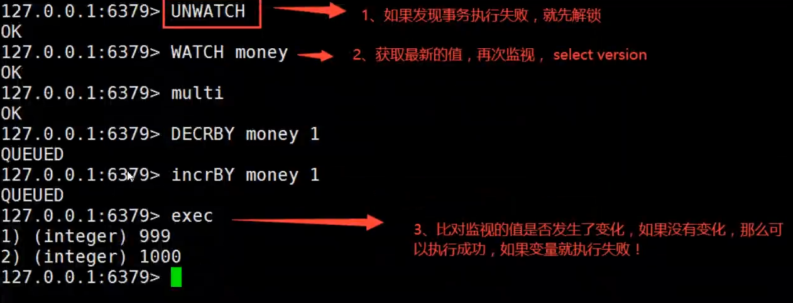

## Jedis

我们要使用Java来操作Redis

> 什么是Jedis 是 Redis 官方推荐的Java连接开发工具！使用Java操作Redis中间件！如果你要使用Java操作redis，那么一定要对Jedis十分的熟悉！

> 测试

1. 导入对应的依赖

   ~~~xml
   <dependencies>
       <!--导入Jedis的包-->
       <dependency>
           <groupId>redis.clients</groupId>
           <artifactId>jedis</artifactId>
           <version>3.2.0</version>
       </dependency>
       <!--fastjson-->
       <dependency>
           <groupId>com.alibaba</groupId>
           <artifactId>fastjson</artifactId>
           <version>1.2.75</version>
       </dependency>
   </dependencies>
   ~~~

2. 编码测试：

   - 连接数据库
   - 操作命令
   - 断开连接

   ~~~java
   import redis.clients.jedis.Jedis;
   
   public class TestPing {
       public static void main(String[] args) {
           //1.new Jedis 对象即可
           Jedis jedis = new Jedis("127.0.0.1",6379);
           //Jedis 所有的命令就是我们之前学习的所有指令
           System.out.println(jedis.ping());
       }
   }
   ~~~

   输出：

   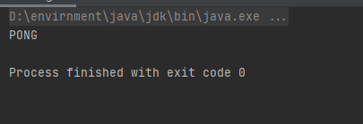

> 用Jedis连接阿里云等服务器上的redis
>
> 1. 配置redis.conf
>    1. 设置访问redis的密码：requirepass 要设置的密码
>    2. 注释bind 127.0.0.1
>
>  (重启redis-server服务,进入redis后要先验证密码,用这个命令：auth 密码 ,然后ping一下看有没有配置成功)
>
> 2. idea访问时添加auth密码
>    java  Jedis jedis = new Jedis("服务器的外网ip",6379);
>    jedis.auth("redis的密码");
>    System.out.println(jedis.ping());
>
> （输出PONG的话就成功了）
>
> 3. 首先要开启安全组策略6379
>    然后bind注释掉所有
>    受保护的也设置为no
>    防护墙也要关掉
>    且要重启才能生效

**常用的API**

String

List

Set

Hash

Zset

> 所有的api命令，就是在redis上面的学习的指令，一个都没有变化！

~~~java
import com.alibaba.fastjson.JSONObject;
import redis.clients.jedis.Jedis;
import redis.clients.jedis.Transaction;

public class TestTX {
    public static void main(String[] args) {
        Jedis jedis = new Jedis("127.0.0.1", 6379);

        jedis.flushDB();

        JSONObject jsonObject = new JSONObject();
        jsonObject.put("hello","world");
        jsonObject.put("name","kuangshen");

        //开启事务
        Transaction multi = jedis.multi();
        String result = jsonObject.toJSONString();

        try {
            multi.set("user1",result);
            multi.set("user2",result);
            multi.exec(); //执行事务
        } catch (Exception e) {
            multi.discard(); //放弃事务
            e.printStackTrace();
        } finally {
            System.out.println(jedis.get("user1"));
            System.out.println(jedis.get("user2"));
            jedis.close(); //关闭连接
        }
    }
}
~~~

## SpringBoot整合

> 整合测试

1. 导入依赖

   ~~~xml
   <dependency>
       <groupId>org.springframework.boot</groupId>
       <artifactId>spring-boot-starter-data-redis</artifactId>
   </dependency>
   ~~~

2. 配置连接

   ~~~properties
   //配置redis
   spring.redis.host=127.0.0.1
   spring.redis.port=6379
   ~~~

3. 测试

   ~~~java
   @SpringBootTest
   class Redis02SpringbootApplicationTests {
   
       @Autowired
       private RedisTemplate redisTemplate;
   
       @Test
       void contextLoads() {
   
           //redisTemplate
           //opsForValue
           //opsForSet
           //opsForHash
           //opsForList
           //opsForZSet
           //opsForGeo
           //除了基本的操作，我们常用的方法都可以直接通过redisTeplate操作，比如事务，和基本的CRUD
           //获取redis的连接对象
           //RedisConnection connection = redisTemplate.getConnectionFactory().getConnection();
           //connection.flushDb();
           //connection.flushAll();
           redisTemplate.opsForValue().set("mykey","kuangshen");
           System.out.println(redisTemplate.opsForValue().get("mykey"));
   
       }
   
   }
   ~~~

   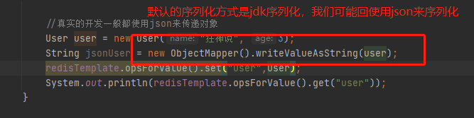
   关于对象的保存：
   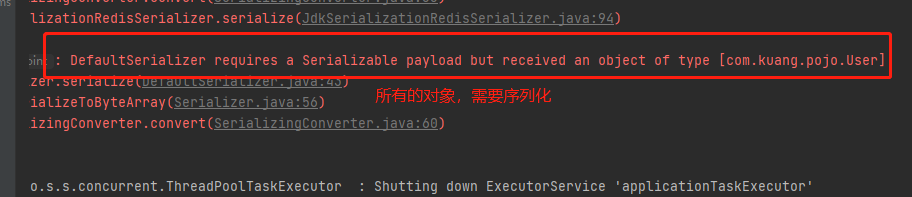

模板：（RedisConfig.class）

~~~java
import com.fasterxml.jackson.annotation.JsonAutoDetect;
import com.fasterxml.jackson.annotation.PropertyAccessor;
import com.fasterxml.jackson.databind.ObjectMapper;
import org.springframework.context.annotation.Bean;
import org.springframework.context.annotation.Configuration;
import org.springframework.data.redis.connection.RedisConnectionFactory;
import org.springframework.data.redis.core.RedisTemplate;
import org.springframework.data.redis.serializer.Jackson2JsonRedisSerializer;
import org.springframework.data.redis.serializer.StringRedisSerializer;

import java.net.UnknownHostException;

@Configuration
public class RedisConfig {
    //一个固定的模板
    //编写我们自己的redisTeplate
    @Bean
    @SuppressWarnings("all")
    public RedisTemplate<String, Object> redisTemplate(RedisConnectionFactory factory) throws UnknownHostException {
        //我们为了自己开发方便，一般直接使用<String, Object>
        RedisTemplate<String, Object> template = new RedisTemplate();
        template.setConnectionFactory(factory);

        //Json序列化配置
        Jackson2JsonRedisSerializer<Object> jackson2JsonRedisSerializer = new Jackson2JsonRedisSerializer<Object>(Object.class);
        ObjectMapper om = new ObjectMapper();
        om.setVisibility(PropertyAccessor.ALL, JsonAutoDetect.Visibility.ANY);
        om.activateDefaultTyping(om.getPolymorphicTypeValidator(),ObjectMapper.DefaultTyping.NON_FINAL);
        jackson2JsonRedisSerializer.setObjectMapper(om);
        //String的序列化
        StringRedisSerializer stringRedisSerializer = new StringRedisSerializer();

        //key采用String的序列化方式
        template.setKeySerializer(stringRedisSerializer);
        //hash的key采用String的序列化方式
        template.setHashKeySerializer(stringRedisSerializer);
        //value采用Jackson的序列化方式
        template.setValueSerializer(jackson2JsonRedisSerializer);
        //hash的value采用Jsckson的序列化方式
        template.setHashValueSerializer(jackson2JsonRedisSerializer);
        template.afterPropertiesSet();


        return template;
    }

}
~~~

自定义RedisUtil工具类（代码比较多，最好去网上找）

## Redis.conf详解

1. 配置文件 units单位 对大小写不敏感|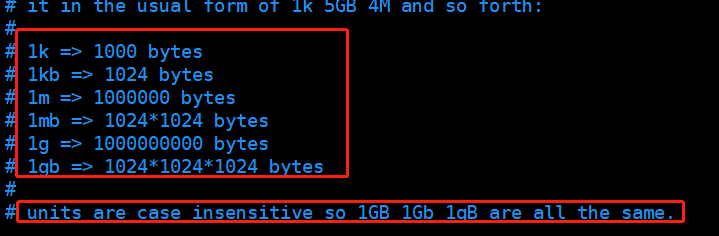

>  包含

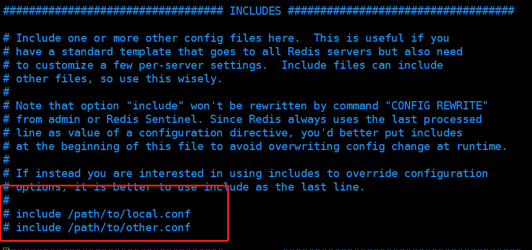

> 网络

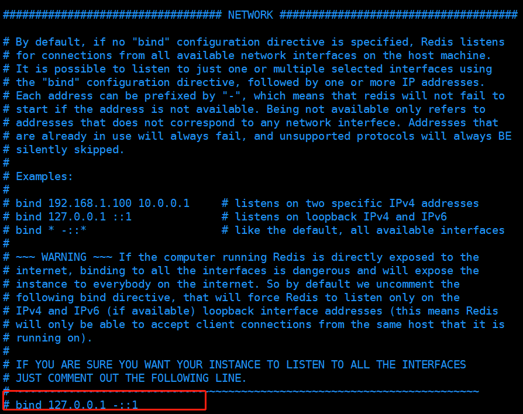

~~~bash
bind 127.0.0.1 #绑定的ip
protected-mode yes #保护模式
port 6379 #端口

~~~

> 通用

~~~bash
daemonize yes #以守护进程的方式运行，默认是no，我们要自己开启为yes

pidfile /var/run/redis_6379.pid #如果以后台的方式运行，我们就需要指定一个pid文件

#日志
# Specify the server verbosity level.
# This can be one of:
# debug (a lot of information, useful for development/testing)
# verbose (many rarely useful info, but not a mess like the debug level)
# notice (moderately verbose, what you want in production probably) 生产环境
# warning (only very important / critical messages are logged)
loglevel notice

logfile "" #日志的文件位置名

databases 16 #数据库的数量，默认是16个数据库

always-show-logo no #是否总是显示LOGO
~~~

> 快照

持久化，在规定的时间内，执行了多少次操作，则会持久化到文件 .rdb .aof

redis是内存数据库，如果没有持久化，那么数据断电即失

~~~bash
#如果900s内，如果至少有1个key进行了修改，我们就进行持久化操作
save 3600 1
#如果300s内，如果至少有100个key进行了修改，我们就进行持久化操作
save 300 100
#如果60s内，如果至少有10000个key进行了修改，我们就进行持久化操作
save 60 10000

stop-writes-on-bgsave-error yes #持久化如果出错，是否还会继续工作

rdbcompression yes #是否压缩rdb文件，需要消耗一些cpu的资源

rdbchecksum yes #保存rdb文件的时候，进行错误的检查校验

dir ./ # rdb 文件保存的目录
~~~

> REPLICATION 复制

> SECURITY 

~~~bash
requirepass 123456 #设置密码
~~~

> 限制 CLIENTS

~~~bash
maxclients 10000 #设置能连接上redis的最大客户端的数量
maxmemory <bytes> #redis设置最大的内存容量
maxmemory-policy noeviction #内存到达上限之后的处理策略
    1.volatile-lru: 只对设置了过期时间的key进程LRU（默认值）
    2.allkeys-lru: 删除LRU算法的key
    3.volatile-random: 随机删除即将过期的key
    4.allkeys-random: 随机删除
    5.volatile-ttl: 删除即将过期的
    6.noeviction: 永不过期，返回错误
~~~

> APPEND ONLY MODE 模式 aof配置

~~~bash
appendonly no #默认是不开启aof模式的，默认是使用rdb方式持久化的，在大部分所有的情况下，rdb完全够用
appendfilename "appendonly.aof" #持久化的文件的名字 .rdb

# appendfsync always #每次修改都会sync，消耗性能
appendfsync everysec #每秒执行一次，可能会丢失这1s的数据
# appendfsync no #不执行sync，这个时候操作系统自己同步数据，速度最快！
~~~

## Redis持久化

Redis是内存数据库，如果不将内存中的数据库状态保存到磁盘，那么一旦服务器进程退出，服务器中的数据库状态也会消失，所以Redis提供了持久化功能

**RDB（Redis DataBase）**

> 什么是RDB

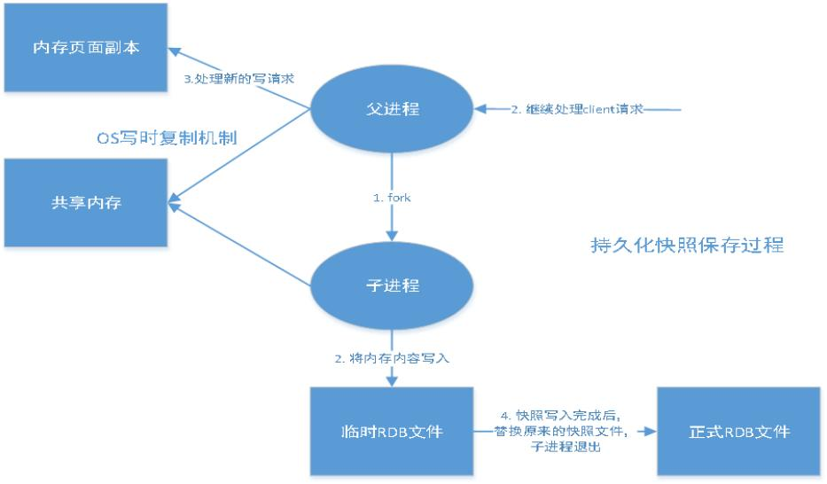

在指定的时间间隔内将内存中的数据集写入磁盘，也就是行话将的Snapshot快照，它恢复时是将快照文件直接读到内存里

在Redis会单独创建（fork）一个子进程来进行持久化，会先将数据写入到一个临时文件中，待持久化过程都结束了，再用这个临时文件替换上次持久化好的文件。整个过程中，主进程是不进行任何我IO操作的。这就确保了极高的性能。如果需要进行大规模数据的恢复，且对于数据恢复的完整性不说非常敏感，那RDB方式要比AOF方式更加的高效。RDB的缺点是最后一次持久化后的数据可能丢失。我们默认的就是RDB，一般情况下不需要修改这个配置！

有时候在生产环境，我们需要对这个文件进行备份

==rdb保存的文件是dump.rdb==

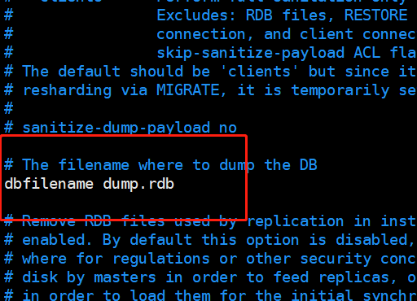

> 触发机制

1. save的规则满足的情况下，会自动触发rdb规则
2. 执行flushall命令，也会触发我们的rdb规则
3. 退出redis，也会产生rdb文件

备份就自动生成一个dump.rdb

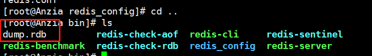

> 如何恢复rdb文件

1. 只需要将rdb文件放在我们redis启动目录就考研，redis启动的时候会自动检查dump.rdb恢复其中的数据

2. 查看存在的位置

   ~~~bash
   127.0.0.1:6379> config get dir
   1) "dir"
   2) "/usr/local/bin" #如果在这个目录下存在dump.rdb文件，启动就会自动恢复其中的数据
   ~~~

   > 几乎就他自己默认的配置就够用了

   优点：

   1. 适合大规模的数据恢复
   2. 对数据的完整性要求不高

   缺点：

   1. 需要一定的时间间隔进行操作。如果redis意外宕机了，这个最后一次修改数据就没有了
   2. fork进程的时候，会占用一定的内存空间

## AOF（Append Only File）

将我们的所有命令都记录下来，history，恢复的时候就把这个文件再执行一遍

> 是什么

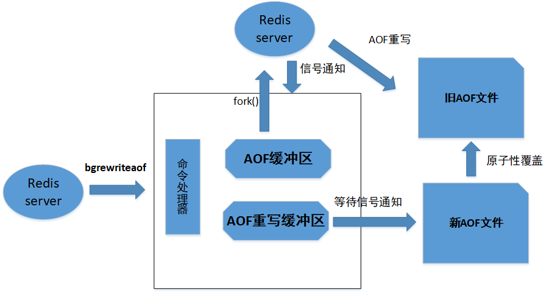

以日志的形式来记录每个写操作，将redis执行过的所有指令记录下来（读操作不记录），只许追加为文件但不可以改写文件，redis启动之初会读取改文件重新构建数据，换言之，redis重启的话就根据日志文件的内容将写指令从前到后执行一次以完成数据的恢复工作

==aof保存的是 appendonly.aof文件==

> append

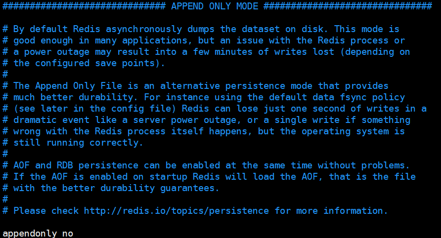

默认是不开启的，我们需要手动进行配置。我们只需要将appendonly改为yes就开启了aof

重启，redis就可以生效了

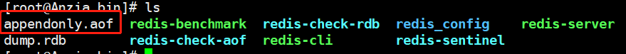

如果这个aof文件有错位，这时候redis是启动不起来的，我们需要修复这个aof文件

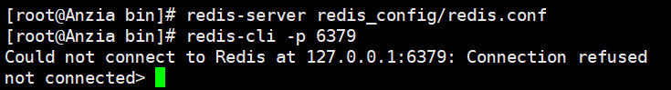

redis给我们提供了一个工具`redis-check-aof --fix`

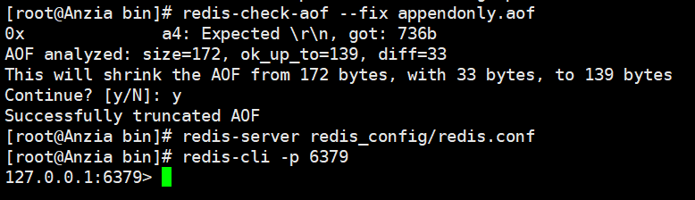

> 重写规则说明

aof默认就是文件的无限追加，文件会越来越大

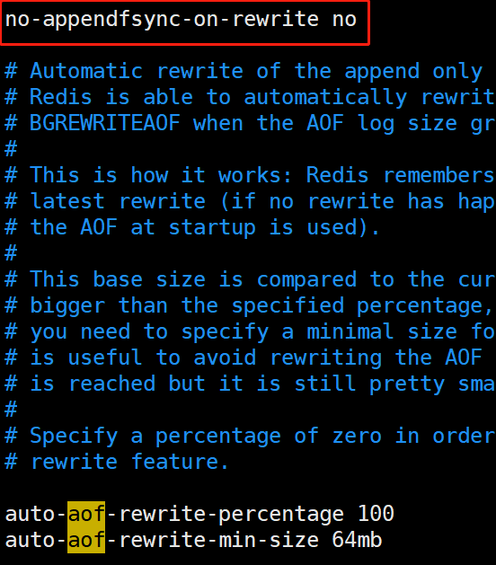

如果aof文件大于64m，太大了，fork一个新的进程来将我们的文件进行重写！

> 优点和缺点

~~~bash
appendonly no #默认是不开启aof模式的，默认是使用rdb方式持久化的，在大部分所有的情况下，rdb完全够用
appendfilename "appendonly.aof" #持久化的文件的名字 .rdb

# appendfsync always #每次修改都会sync，消耗性能
appendfsync everysec #每秒执行一次，可能会丢失这1s的数据
# appendfsync no #不执行sync，这个时候操作系统自己同步数据，速度最快！
~~~

优点：

1. 每一次修改都同步，文件的完整会更加好
2. 每秒同步一次，可能会丢失一秒的数据
3. 从不同步，效率最高的

缺点：

1. 相对于数据文件来说，aof远远大于rdb，修复的速度也比rdb慢
2. aof运行效率也要比rdb慢，所有我们redis默认的配置就是rdb持久化

**拓展：**

1. RDB持久化方式能够在指定的时间间隔内对你的数据进行快照存储
2. AOF持久化方式记录每次对服务器写的操作，但服务器重启的时候会重写执行这些命令来恢复原始的数据，AOF命令以redis协议追加保存每次写的操作到文件末尾，redis还能对aof文件进行后台重写，是的AOF文件的体积不至于过大
3. 只做缓存，如果里希望你的数据在服务器运行的时候存在，里也可以不使用任何持久化
4. 同时开启两种持久化方式
   - 在这种情况下，当redis重启的时候会优先载入AOF文件来恢复原始的数据，以为在通常情况下AOF为了将保存的数据集要比RDB文件保存的数据集要完整
   - RDB的数据不实时，同时使用两者时服务器后处理器也只会找AOF文件，那要不要只使用AOF呢？作者建议不要，因为RDB更适合用于备份数据库（AOF在不断变化不好备份），快速重启，而且不会有AOF可能潜在的Bug，留着作为一个万一的手段
5. 性能建议
   - 因为RDB文件只用作后备用途，建议只在Slave上持久化RDB文件，而且只要15分钟备份一次就够了，只保留save 900 1 这条规则
   - 如果Enable AOF，好处是在最恶劣情况下也只会丢失不超过2秒数据，启动脚本较简单只load自己的AOF文件就可以了，代价一是带来了持续的IO，二是AOF rewrite的最后将rewrite的最后将rewrite过程中产生的新数据写道新文件造成的阻塞几乎是不可避免地。只要硬盘许可，应该尽量减少AOF rewire的最后将rewrite过程分钟产生的新数据写到新文件造成的阻塞是不可避免的。只要硬盘许可，应该尽量减少AOF rewrite的频率，AOF重写的基础大小默认值64M太小了，可以设到5G以上，默认超过远大小100%大小重写可以改到适当的数值。
   - 如果不Enable AOF，仅靠Master-Slave Replication实现高可用性也可以，能省掉一大笔IO，也减少了rewrite时带来的系统波动。代价时如果Master、Slave同时倒掉，会丢失十几分钟的数据，启动脚本也要比较两个Master/Slave中的RDB文件，载入较新的那个。

## Redis发布订阅

通信 队列 发送者 订阅者

Redis 发布订阅（pub/sub）是一种消息通道模式：发送者（pub）发送消息，订阅者（sub）接受消息

Redis客户端可以订阅任意数量的频道

订阅/发布消息图：

第一个：消息发送者，第二个：频道，第三个：消息订阅者

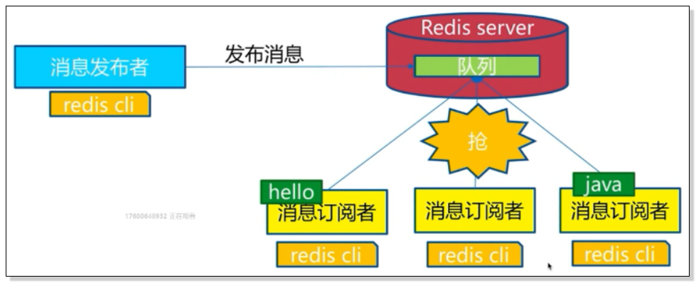

下图展示了频道channel1，以及订阅这个频道的三个客户端——client2、client5和client1之间的关系


当有新消息通过PUBLISH命令发送给channel1时，这个消息就会发送给订阅它的三个客户端


> 命令

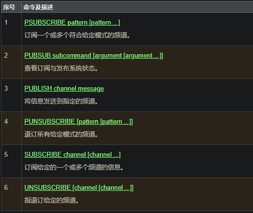

> 测试

订阅端：

~~~bash
127.0.0.1:6379> SUBSCRIBE kuangshenshuo #订阅一个频道
Reading messages... (press Ctrl-C to quit)
1) "subscribe"
2) "kuangshenshuo"
3) (integer) 1
#等待读取推送的信息
1) "message" #消息
2) "kuangshenshuo" #哪个频道的消息
3) "hello,kuangshen" #消息的具体内容
~~~

发送端：

~~~bash
127.0.0.1:6379> PUBLISH kuangshenshuo "hello,kuangshen" #发布者发布信息到频道
(integer) 1
~~~

> 原理

redis是使用C实现的，通过分析Redis源码里的pubcub.c文件，了解发布和订阅机制的底层实现，籍此加深对Redis的了解，Redis通过PUBLISH、SUBSCRIBE和PSUBSCRIBE等命令实现发布和订阅功能

通过SUBSCRIBE命令订阅某频道后，redis-server里维护了一个字段，字典的键就是一个个channel，而字典的值这是一个链表，，链表中保存了所有订阅这个channel的客户端。SUBSCRIBE命令的关键，就是将客户端添加到给定channel的订阅链表中。

通过PUBLISH命令想订阅者发送消息，redis-SERVER会使用给定的频道作为键，在它说维护的channel字典中查找记录了订阅这个频道的所有客户端的链表，遍历这个链表，将消息发布给所有订阅者。

PUB/SUB从字面上理解就是发布（PUBLISH）和订阅（SUBSCRIBE），在redis中，你可以设定对某一个key值进行消息发布及消息订阅，当一个key值上进行了消息发布后，所有订阅它的客户端都会收到相应的消息。这一功能最明显的用法就是用作实时消息系统，比如普通的即时聊天，群聊等功能

## Redis主从复制

### 概念

主从复制，是指将一台Redis服务器的数据，复制到其他Redis服务器。前者称为主节点（master/leader），后者称为从结点（slave/follower）；数据的复制时单向的，只能由主节点到从结点。Master以写为主，Slave以读为主

默认情况下，每台Redis服务器都是主节点；且一个主结点可以有多个从结点（或没有从结点），但一个从结点只能有一个主节点。

主从复制的作用主要包括：

1. 数据冗余：主从复制实现了数据的热备份，是持久化之外的一种数据冗余方式
2. 故障恢复：当主节点出现问题时，可以由从结点提供服务，实现快熟的故障恢复；实际上是一种服务的冗余
3. 负载均衡：在主从复制的基础上，配合读写分离，可以由主节点提供写服务，由从结点提供读服务（即写Redis数据时应用连接主节点，读Redis数据时应用连接从结点），分担服务器负载；尤其实在写少读多的场景下，通过多个从结点分担读负载，可以大大提高Redis服务器的并发量
4. 高可用基石：除了上述作用之外，主从复制还是哨兵模式和集群能够实施的基础，因此说主从复制时Redis高可用的基础

一遍来说，要将Redis运用于工程项目汇总，只使用一台Redis时万万不能的，原因如下：

1. 从结构上，单个Redis服务器会发生单点故障，并且一台服务器需要处理所有的请求负载，压力较大
2. 从容量上，单个Redis服务器内存容量有限，就算一台Redis服务器内存容量为256G，也不能将内存用作Redis存储内存，一般来说，单个Redis最大使用内存不应该超过20G

电商网站上的商品，一般都是一次上传，无数次浏览的，说专业点也就是“多读少写”

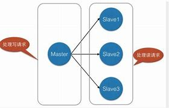

主从复制，读写分离！80%的情况下都是子进行读操作！减缓服务器的压力！架构中经常使用！

只要在公司中，主从复制就算必须要使用的，因为在真实的项目中不可能单机使用Redis

### 环境配置

只配置从库，不用配置主库

~~~bash
127.0.0.1:6379> info replication #查看当前库的信息
# Replication
role:master #角色
connected_slaves:0 #没有从机
master_failover_state:no-failover
master_replid:0f5e6954dfe3490262d01902538d63cf001c864d
master_replid2:0000000000000000000000000000000000000000
master_repl_offset:0
second_repl_offset:-1
repl_backlog_active:0
repl_backlog_size:1048576
repl_backlog_first_byte_offset:0
repl_backlog_histlen:0
~~~

复制3个配置文件，然后修改对应的信息

1. 端口：进程占用的端口号
2. pid名字：记录了进程的ID，文件带有锁，可以防止出现的多次启动
3. log文件名字：明确日志文件的位置
4. dump.rdb名字：持久化文件的位置

修改完毕之后，启动我们的3个redis服务器，可以通过进程信息查看

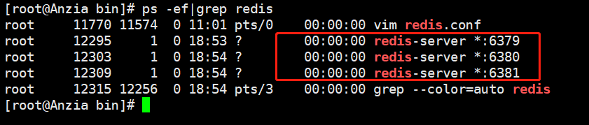

### 一主二从

==默认情况下，每台Redis服务器都是主节点==

我们一般情况下只用配置从机就好了

主（79）从（80，81）

~~~bash
#从机
127.0.0.1:6380> SLAVEOF 127.0.0.1 6379 #SLAVEOF host 6379 找谁当老大
OK
127.0.0.1:6380> info replication
# Replication
role:slave #当前角色是从家
master_host:127.0.0.1 #可以看到主机的信息
master_port:6379
master_link_status:up
master_last_io_seconds_ago:8
master_sync_in_progress:0
slave_repl_offset:0
slave_priority:100
slave_read_only:1
connected_slaves:0
master_failover_state:no-failover
master_replid:e9fd131afe119c6f15284b0443dee6b0329343de
master_replid2:0000000000000000000000000000000000000000
master_repl_offset:0
second_repl_offset:-1
repl_backlog_active:1
repl_backlog_size:1048576
repl_backlog_first_byte_offset:1
repl_backlog_histlen:0

#主机
127.0.0.1:6379> info replication
# Replication
role:master
connected_slaves:1 #多了从机的配置
slave0:ip=127.0.0.1,port=6380,state=online,offset=42,lag=0 #多了从机的信息
master_failover_state:no-failover
master_replid:e9fd131afe119c6f15284b0443dee6b0329343de
master_replid2:0000000000000000000000000000000000000000
master_repl_offset:42
second_repl_offset:-1
repl_backlog_active:1
repl_backlog_size:1048576
repl_backlog_first_byte_offset:1
repl_backlog_histlen:42
~~~

真实的主从配置应该是在配置文件中配置，这样的话是永久的，我们这里使用的是命令，暂时的。

> 细节

主机可以写，从机不能写只能读！主机中的所有信息和数据，都会自动被从机保存！

主机能写能读：

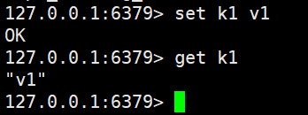

从机只能读：

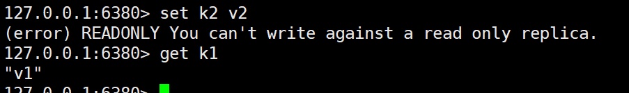

测试：主机断开连接，从机依旧连接到主机的，但是没有写操作，这个时候，主机如果回来了，从机依旧可以直接获取到从机写的信息

如果是使用命令行，来配置的主从，这个时候如果重启了，就会变回主机。只要变为从机，立马就会从主机中获取值。

> 复制原理

Slave启动成功连接到master后会发送一个sync同步命令

Master接到命令，启动后台的存盘进程，同时收集所有接受到的用于修改数据集命令，在后台进程执行完毕之后，==master将传送整个数据文件到slave，并完成一次完全同步==

- 全量复制：slave服务在接收到数据库文件后，将其存盘并加载到内存中
- 增量复制：Master继续将新的所有收集到的修改命令依次传给slave，完成同步
- 但是只要是重新连接master，一次完全同步（全量复制）将被自动执行，我们的数据一定可以在从机中看到

> 人体蜈蚣模型

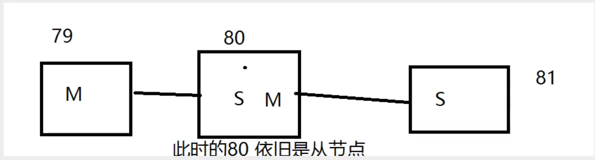

这时候也可以完成我们的主从复制

如果没有老大了，这个时候要手动设置一个老大

如果主机断开了连接，我们可以使用`slaveof no one`让自己变成主机，其他的结点就可以手动连接到最新的这个主节点（手动）

~~~bash
127.0.0.1:6381> info replication
# Replication
role:master
connected_slaves:0
master_failover_state:no-failover
master_replid:83173e247a193e9760312c2198ca0562f1ea0433
master_replid2:e9fd131afe119c6f15284b0443dee6b0329343de
master_repl_offset:2516
second_repl_offset:2517
repl_backlog_active:1
repl_backlog_size:1048576
repl_backlog_first_byte_offset:267
repl_backlog_histlen:2250
~~~

## 哨兵模式

（自动选举老大的模式）

> 概述

主从切换技术的方法是：当主服务器宕机后，需要手动把一台从服务器切换为主服务器，这就需要人工干预，费时费力，还会造成一段时间内服务不可用。这不是一种推荐的方式，更多时候，我们有限考虑哨兵模式

能够后台监控主机是否故障，如果故障了根据投票数自动将从库转换为主库

哨兵模式是一种特殊的模式，首先Redis提供了哨兵的命令，哨兵是一个独立的进程，作为进程，它会独立运行，其原理是==哨兵通过发送命令，等待Redis服务器响应，从而监控运行的多个Redis实例==

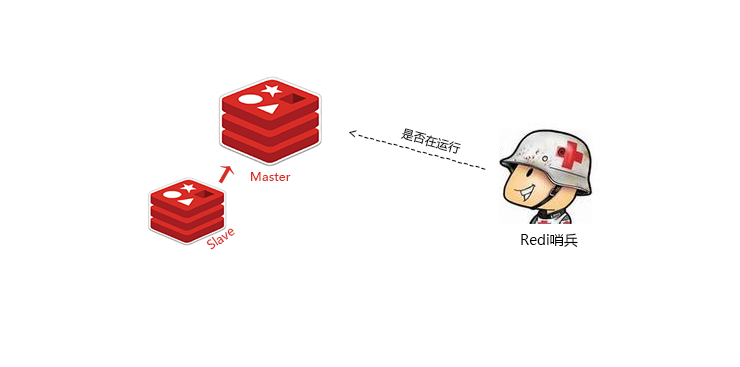

这里的哨兵由两个作用

- 通过发送命令，让Redis服务器返回监控其运行状态，包括主服务器和从服务器
- 当哨兵检测到master宕机，会自动将slave切换成master，然后通过发布订阅模式通知其他的从服务器，修改配置文件，让它们切换主机

然而一个哨兵进程对Redis服务器进行监控，可能会出现问题，为此，我们可以使用多个哨兵进行监控。各个哨兵之间还会继续监控，这样就形成了多哨兵模式

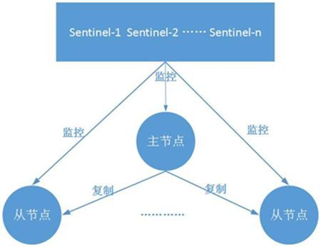

假设主服务器宕机，哨兵1先检测到这个结果，系统并不会马上进行failover过程，仅仅是哨兵1主观的认为主服务器不可用，这个现象称为**主观下线**。当后面的哨兵也检测到主服务器不可用，并且数量达到一定值时，那么哨兵之间就会进行一次投票，投票的结果由一个哨兵发起，进行failover[故障转移]操作。切换成功后，就会通过发布订阅模式，让各个哨兵把自己监控的从服务器实现切换主机，这个过程称为**客观下线**

>  测试

我们目前的状态是一主二从！

1. 配置哨兵配置文件 sentinel.conf

   ~~~bash
   # sentinel monitor 被监控的名称 host port 1
   sentinel monitor myredis 127.0.0.1 6379 1
   sentinel auth-pass myredis 密码
   ~~~

   后面的这个数字，代表主机挂了，sentienl投票看让谁接替成为主机，票数最多，就会成为主机

2. 启动哨兵

   ~~~bash
   [root@Anzia bin]# redis-sentinel redis_config/sentinel.conf 
   12505:X 02 Apr 2021 20:52:12.283 # oO0OoO0OoO0Oo Redis is starting oO0OoO0OoO0Oo
   12505:X 02 Apr 2021 20:52:12.283 # Redis version=6.2.1, bits=64, commit=00000000, modified=0, pid=12505, just started
   12505:X 02 Apr 2021 20:52:12.283 # Configuration loaded
   12505:X 02 Apr 2021 20:52:12.284 * monotonic clock: POSIX clock_gettime
                   _._                                                  
              _.-``__ ''-._                                             
         _.-``    `.  `_.  ''-._           Redis 6.2.1 (00000000/0) 64 bit
     .-`` .-```.  ```\/    _.,_ ''-._                                   
    (    '      ,       .-`  | `,    )     Running in sentinel mode
    |`-._`-...-` __...-.``-._|'` _.-'|     Port: 26379
    |    `-._   `._    /     _.-'    |     PID: 12505
     `-._    `-._  `-./  _.-'    _.-'                                   
    |`-._`-._    `-.__.-'    _.-'_.-'|                                  
    |    `-._`-._        _.-'_.-'    |           http://redis.io        
     `-._    `-._`-.__.-'_.-'    _.-'                                   
    |`-._`-._    `-.__.-'    _.-'_.-'|                                  
    |    `-._`-._        _.-'_.-'    |                                  
     `-._    `-._`-.__.-'_.-'    _.-'                                   
         `-._    `-.__.-'    _.-'                                       
             `-._        _.-'                                           
                 `-.__.-'                                               
   
   12505:X 02 Apr 2021 20:52:12.284 # WARNING: The TCP backlog setting of 511 cannot be enforced because /proc/sys/net/core/somaxconn is set to the lower value of 128.
   12505:X 02 Apr 2021 20:52:12.287 # Sentinel ID is 40c3c9fdd1216f6d1f2a3086d190bd2d80f0c03e
   12505:X 02 Apr 2021 20:52:12.287 # +monitor master myredis 127.0.0.1 6379 quorum 1
   
   ~~~

   如果Master节点断开了，这个时候就会从从机中随机选择一个服务器（者里面会有一个投票算法）

   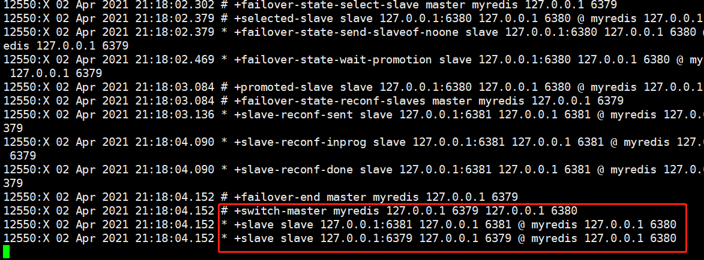

   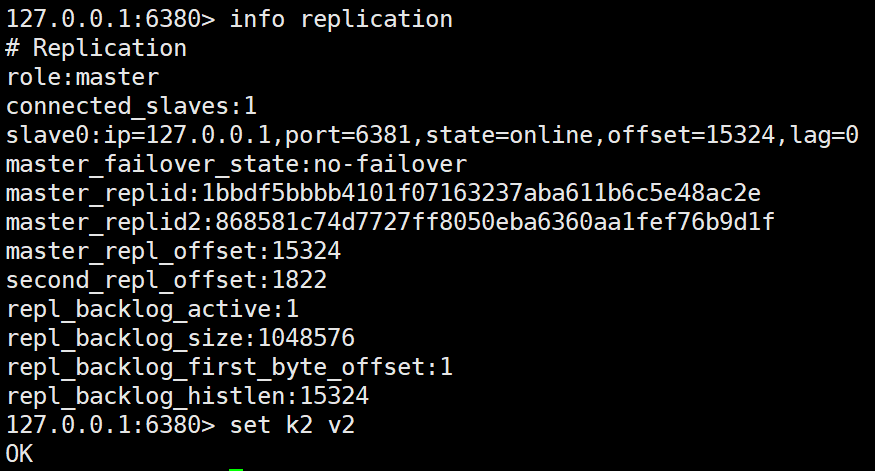

   如果掉线的主机此时回来了，只能归并到新的主机下，当做从机，这就是哨兵模式的规则

> 哨兵模式

优点：

1. 哨兵集群，机遇主从复制模式，所有的主从配置优点，它全有
2. 主从可以切换，故障可以转移，系统的可用性就会更好
3. 哨兵模式就算主从模式的升级，手动到自动

缺点：

1. Redis不好在线扩容，集群容量一旦到达上限，在线扩容就十分麻烦
2. 实现哨兵模式的配置其实是很麻烦的，里面有很多选择

> 哨兵模式的全部配置

百度找

## Redis缓存穿透和雪崩

Redis缓存的使用，极大的提升了应用程序的性能和效率，特别是数据查询方面，但同时，它也带来了一些问题。其中，最要害的问题，就算数据的一致性问题，从严格意义上讲，这个问题无解。如果对数据的一致性要求很高，那么久不能使用缓存

另外的一些典型问题就是，缓存穿透，缓存血本和缓存击穿

### 缓存穿透

> 概念

缓存穿透的概念很简单，用户想要查询一个数据，发现redis内存数据库没有，也就是缓存没有命中，于是向持久层数据库查询。发现也没有，于是本次查询失败。当用户很多的时候，缓存都没有命中，于是都去请求了持久层数据库，这会给持久层数据库造成很大的压力，这时候久相当于出现了缓存穿透

> 解决方案

**布隆过滤器**

布隆过滤器是一种数据结构，对所有可能查询的参数以hash形式存储，在控制层先进行校验，不符合则丢弃，从而避免了对底层存储系统的查询压力：

![布隆过滤器 的图像结果](data:image/jpeg;base64,/9j/4AAQSkZJRgABAQAAAQABAAD/2wBDAAsJCQcJCQcJCQkJCwkJCQkJCQsJCwsMCwsLDA0QDBEODQ4MEhkSJRodJR0ZHxwpKRYlNzU2GioyPi0pMBk7IRP/2wBDAQcICAsJCxULCxUsHRkdLCwsLCwsLCwsLCwsLCwsLCwsLCwsLCwsLCwsLCwsLCwsLCwsLCwsLCwsLCwsLCwsLCz/wAARCAC0AJcDASIAAhEBAxEB/8QAGwAAAgMBAQEAAAAAAAAAAAAAAAUBBAYDAgf/xABZEAABAwMCAgMJCQwECQ0AAAABAgMEAAURBhITITFBURQVFiJVYXGS0Qc1VFaBkZOVoSMlMkJFU5SxwcLS0yRigqMmMzRDUnKiw+E2REZlc3R1g6Sys7S1/8QAFQEBAQAAAAAAAAAAAAAAAAAAAAH/xAAUEQEAAAAAAAAAAAAAAAAAAAAA/9oADAMBAAIRAxEAPwD63SybftP251LE65RI7qkBxKHXMKKCSkK5eg1cmOuR4k19tIW4xGfeQk9CloQVAH04pNpq3wxp+w8RKH1OQmpKnHEgqW5J/pC1fKVE0HTwt0efy3b/AJXgP11PhZo/y5bPlkIH66Y977d8FZ9UUd77b8FZ9UUC/wAKtIH8u2r9Ka9tT4UaR8u2n9MY/iq73ttnwRj1BR3stfwRj1BQU/CjSPl6z/p0f+Kjwo0j5etH6bH/AIqt967V8DY9QVXmR7BBYXIkxWUsowFFDClnn5mwT6eVB48KNI+XrT+msfxVHhTpDy7av0tn21zty9PXCKuW3CS0y2kKdVIZSlCRs3qKXBltQTzCiFHBBHSKGXdNvMXB9MdgdwFQlIIaKkDbvbOQdvjpwpPjdCh0HkA9+FWkPLlr/Sm/bUHVekB+XLb+kIqYS9PT3pbMWO2vuYoCl8EhpQUORQvGDzyMebsOTf73W34Kz6ooF3hbo8fly3fTpoOrdH+WoH0v/CmXe+3fBWfVFHcFu+Cs+oKBZ4XaP8twPldx+sV6GrNHn8uW75X0j9dMe4Ld8FZ9QUG3249MVn1RQUBqnSJ6L7af7UxlP61U4BBAIOQRkEdYqobZaj0xGOr8QUqd3vaut7KlbWrdYn5bKRy3uy5AjrJx/ohAx/rUGhooooPDiA4242ehxCkH0KBFItHOFzTVgyc8GL3LkcwoR1qYCh5jtyPTTedGVMhzIgecZ7pZcYLrJ2uIC0lJKFdR7DSl61XthEONZbo3AhRYrUdDHcbDwyjlu3ODPZ81A+qazPe7XWf+UTBHnt0X2Ud79d/GGN9Wx/bQaaorNdwa8+MEQ+m2MfsXQYOveq+wT6ba1/MoNNVG5w3Z8KVFbkLjqeaW3xEJQTzGMK3AnHbjB84pN3Fr/n9+7f8AVqOX95QIGvseNqCHnr221jH2qoO0bT78S3S4DVweUmWHWVBQxHixnVHciGxz2kJO1OVHt8xYrtFuVCft7TKY8Z/HGRGShBcA2ghRKTzIABPTy5EYyFPe/Xnxgi/V0f20d79eZ56hjY81tje2gt2ywptkt2S3NkOIdZWlxp0khbylpVxSd2OQSAOXWefPAd1me9+uvjDH+rY3to7366+MLH1dGoNNUVme92u/jHH+rovsrmmNrJb78ZGqIqpDCGnHmhb4u9tDu7YVDHXtOPRQaqprM97td/GKP8tujGjvfrwdGoIh/wBa2sfsUKDS0gk/cdXWRzp7tsl0i4HSkx32Hwojs5kVyEPXwI+/VvIyMlVtR0fI6KZt2tsXZ67uuLckLiNQmUqI2MNJJWsNgD8Y81egdnIGVFFFAVFTUUBU1FFBRuzjrMCQ40soWlcYhSSQcF9sEZ84yKvc+fpNLr571Tz2JaV8zqDTLt9NBFZ2Jcr25qu8wHoUhNpat8NUR9SUBvjBS9yxg58fKgP+y89aOqCPfed/4Zbv/nl0F6iiigKmoqaCKzkC0dz6r1FdO7ZTi5cCBxGF8IMBKlOIQEhKc+IG+XP8Y9Oa0lL2uV5uPntlrP8AfzBQX6miigiiiigmiiigyNvvNxVFnupld2OOyYbFuTLjKYd3LWhD7jrMdsFLfjbkJJKsJ5nxsJ8rv9/QhtbkRgLCHXvERJSwEhbzOHipJVkbN/SkeMMkDxjr6KDHs6lu8x1MNuKGXZjDKIrqWJOWnHA0Vvuh0bUpSC4pGQQdowo5IFcX3VCI1vDjaEvmLbJD75jPqbLchyEHOK3tzvSFLzggDn4ox4u4ooFt996Lp5mCfVUDTLt9JpHqyc1bdP3iU6y+62lkNqEdKFKTxVBsLIWoDAJGaaw5ImRIksNOtCUw1IS0+Eh1sOpCwlwJJGRnnzNBYpeg/fmYO21wT6siT7aYUtSR38fHWbTHPzSXfbQULzOmxbhaG48l1KXJEXjRkxitL8dbxQ8sO8JWSgYJSFowMqyr8E8H75ekyHVMRI64SXHOGVNy+O40h2G1uBA25VxVKT4vQ315OzT0fPQYfwsvTTDwMFsuMtR1ZcblqVgtkqLpSlKd6jjanCenkVdB2rSy4004UlJW2hZSoFJSVJBwQrnmvfz1NAUvb9+Z/ntdt+yRLphS5Hv1K89qh/7MiR7aBjRRRQRRU1FBNFFFBFFFFAVWnzoltiSZ0pRSxHRvWUpKlHJCUpSkcySSAB569PTYEdYbflxmXCkLCHnm21FBJG4JWQcdNIdVT7YqyStsyIopl2lwJS+0oqLc+O5gAK81Bzlaks8yNJiTLPfFx30KZkNrtyylSVdKVbVGuo1fahgd774ABj3sfwOqsu2ypLy3YlyszL6XH1odcuFsKFO90vPMuJSwNygNwzxNx7OvddMy8DYWr1DbTn+iCTeoLio53DiGaoDDm4ZDYH4P2poeeF9tP4NuvyuvlbXRy/tEVA1bbydwtN+JxjcLeegc+nfSJ8LeaXGd1LBeZdfiB1M26QH0pZaVAeKuGtOwncl84IwQQOggJl9ENuYlcO8WgMR3YCo5j3GBEKw0pgr3tMbUbchRKcYOMddBpImp7XLeaZUzcIq3nW2GDOiOModec3FLSFcwVYBPoFPK+ZCTcxcNHOXG9w5DTN4y40mfDd+6qirSt47FE7B45TlXLdjAyEj6Ii4WxeNk2GrPRtkMn9Sqgs0UApIBBBBGQQcgjtBooCl6T9+nh22pj7JLvtphS/8ALR89qH2ST7aBhRXGTJjRGVyJDgbZQUBSiFK5rUEJACQSSSQBgV7Q60ttLqT9zUgOBSwUeKRnJC8EfKKD3RXJUmIlxtlT7IddLobQXE7lloBSwkZz4uRn017U40jO9xtOBk7lpHLOM8zQeqKOVFBNRU1FBlLVbLbeHNQy7nGZlOjUF0jMl9KXC0xGUmOltO4HA8XOP6x7aYK0npRQINqh4IwcNIB+wVz01yOqm+tvU91P0obfH/urQUGXkaP0LGZekP2yMhlhtTjqyknahIyeQBPoAFcI2l/c9lOymo9viOLi7eNhJ2p3A4IURtI5EZBPR5q0N2gd84EqCVJSl8ICipJIIQsLxyIIzgDPPHZSO2WG824XxtMlgd8gpxEplbiXozmCAhDa0FOOZIVuyOjBxkhxhac9zyeqSmHAiumM6plwpScbgSnKVYwQcHBB6qmJYPc8nPOsxIEZ5bTaXVlLLobCVLW2MOKSE5yk8s9VW7bYZlvXcHGX0tuOMQo0ZQWpbauEwELeeZCUp3AlRSOfRknKzU2Wx3C2Si67KbVHKXUBppb+QEkJZ35whWE53ZQDk5HTiqOqNIaSbVuTaoucY5oBHzGvStKaUXndaYR/8lv2U7oqBBZFLNz1Y0lSkxYUu226Gxk8NltiA0s7E9ABKvsrQVn7P4l91y32zrXIHZh23tJ/dNaCgKXHHfpA6za3PskJpjS5Xv1H89rlfZIY9tB7ukE3CIY4MfPGYeAlxxJYUWlhYDjRUkkcupQP7aibKo2yJa5EkSGYz1sXudZyXW4bjTpbdClEHcUn0AgYOMqc0UGNa0SGskT0KWA6htbkXeoIKQEklTud+QNxGMjIwM5FlOkmnHXpE1+PIkPy1ynVGGkI8ZqWjhpStajtBe3DmeaB25GoooOMRjuaLEjlZWY8dlgrPIr4aAjcR58ZorvRQFRU1FBmG4Gq7YqWm2KtTqJkyXcJC5zUguqfkOlRA4TqU7UjakcuqunF90Mf5jT5/szB/vDWjqaDM8f3Q/glhPyzB+9Upe90QjJjafT5v6Yf36b3Vx1qC6tpZQsOxEhSekBUhtJHygkfLV3toM3xPdEOfuOnvUmn/e1PE90P83p76Kb/ADq0lZvVUnUUVOnl2WOXl9+ovdgLzTSFx1JU1wVlwj8MqGCAcFOfSEcT3Q/zenvopv8AOoL/ALoaf+a2BfLqMxP7xrSCigVWm3yYr13my3ELl3WSzIeDYw2ylqO2whlGeeBg8/PTaoqaApev35hdhtc/7JEWmFUHffe3Htt1zHzPQzQX6KKKCKKKKCaKKKApEu8PQ06mdmpYItr5ENpglC3m+40SwgqcPNXMlRA5AZxyp7WYl6phx5UhlUF3ESU+iUtamUrDDMeU4qQyjO5X+KUkY7eo+KAXytUXp15QgtW1LDQ4brnHVIQt0LklS2HAhIUjDWByHMns5WU6tdaZkvPQeK1HJbW408EuLfUh95CEM7CNoDfjKK+Wc4OKseEcJvjMm2vJcipaEhCVwy2yXloQw2FoWQSveMBIOOfXyPFOsLQplmQmFKLLwDbStrBKpJQyeCUBRV/nUjdjHT5twXF3HvpYlTOCWd0ppoo3pcTlmchoqQtPIpOMg4Hop/20kelR51halMNLZadVC2NOICFN7ZbaCkpHLkQad9vpoJpddf8AEwj2XS1f/abFMaX3f/JY57LlaD/65kUF1S0NoWtakoQhJWtayEpSlIyVKJ5YFKRqG29xx56kSW478+RARvZWXAtnjErU02CvaQ2SOWcEZA6mrrTL7brLzaHGXUKbdbcSFIWhQwUqSeRB66oNWO0MJQhllTbaH5MpLbbriWw9IDqXF7AcZIWoej0cgId5gTZkiEwpanWWg+VBCiypouKbBS6PFzyzjP8AwZ0vhWi3W94vRUOIUWSwoF5xSFI38QZSokZBzg+c9tMKAqg977Wv/uF1H95DNX6XSDi7WfzxLoPtjH9lAxooooIooooJooooCqne21cR13uCHxHXUvuL4DW5bqc4Wo4ySMnn5z21aooKabXZ0sqjpt8JLCgAppMdoNkBfEGUgY6efp51URpywImLliE1uVHVG4RA7mS0tKUqSlnG3BCQMdHLo5829FAtujbTNrU0y2htptyChtDaQlCEiS1gJSnlimfb6azmsrk7abFJmohrlpRJgpdQhwNlKS+jCs7VdKtqej8bzU/ZW4tplbrfCcW2hTje7dw1qSCUbhjOOjooOlLrx/kSD2XGz/8A6EemFULuCYQABJE61KwkEnxZzB6BQMKijtooJoqKKCaWyj997H52LoP9lk0xpdL99bEf6tyT87SD+ygZUVFFBNRRRQTRUUUHGZKYgxJk18kMRI70l4jmQ20grVgHHPlypM7eb/v3RNP90RVpbcYeXPDK3ELQFgqaLJIPPBGT0UayH+DV5PSlKIq1jp3NoktKWk+YgEH009SEgJCeSQAEjsHVQZ7v1qn4rfNdEftYo796o+KyvrJr+VWkooMu7d9QvILT2klONkpJSqewpJKVBQOC1jkQCPRXvv7qXl/gq9z/AOsGP4K0tRQZrv8Aak+Ksj9PY/gqRftSH/oq/wDLcGB+5WkqldJ7Vshvyl7SpAAZbUojjOqOENjAJ59fLl0nkKBR391J8VnfrGP/AAVIvmpvis59Ys/y64Rr9dU2q4LkMl25w5JiKLcV1LGQtKFOqK1JQQnn+OM8uQ3V0tWpVz29QSXWmkxbeOJHdQ4FBxKkFQSQOec+KMDng9fKqPffvU/xWX8tya/lUd+9U/FY/WjX8mutgu0y4rmpmKa4iODsbjsOJbaKUBLuXlEg5VnAODgdfSH9QZvv1qr4rD60R/Irmu5alcdYeXpRBcj8Qsq77DxeInYrkGMcxWnowKDOC86q+K6frRP7Y9HfvVI6dLK/s3Ns/rZFaPAowKBBHvN/dkR2XtOPMNuOJQ493aytLST0rKQgE4pqmfEXPkW5KlGTHisS3RtO1Lb63EI8boz4p5e2rVZ+0JAvuuNwBc7ttigvr4Sre1tR6AQr5zQaCipooEerHYzenb4h8FXdMN2HHbT+G9KkDhMtoHaVEfNnqpjGdDceK3JeZElDDCXwVoB4gQnccE13dZZeCQ6hKwlaXEhYyAtPQoZ66VStM6bmvuyZVtiuvvK3OuLbSVLVgDKjjNA048c9DzXro9teg42ehaPWT7aReB2kfJMT6NPso8DdI+So3yIFA+3J/wBJPzipyD0EfOKz/gbpLyXH+RIqPAzSXkxj5qDQkgcyQB5yK5OpivJ2O8JacpOFlJGUqCh19oHzUjVozSShg21nHoqRo3SIAAtUbA/qD2UDRMO1oZejhDJZefckuoWveHHnHeMpat5JOTzrm1b7GwXizHht8Zxp1wI2BKnGs7FbQcZGTjlS/wADtJeSovqD2VPgdpHyVF9QeygYxYdlgnMNiHHJaQySyG0FTaCSlKiDk4ycZ7T21b40f86166PbSPwO0j5Ki+on2UeB2kfJMX6NPsoHnGj/AJ5r10e2o48f88166PbSXwO0j5Ji/Rp9lR4H6R8kxfo0+ygecZjqcbPoWkk9fIA1KXW1EgLTkHBGRkHsI6aTMaV01FeZkxbfHZkMq3suoQkKQrBGQcec1YlWW3Tm1MTIsd1grS7gp8YuAk5PVQMC6ynmpxsDzrSP1mkNuWF6k1S+1yiKjWqO44ogJcmMJd4nCJ5EJSpCVEdfLpFdhp2GFsKBQlMdC24yWmUI4KCUFKUq5nACQPZiugsu1TJS+lPDHMBhO0+KBy555nJOSc5oGpdaHStHrD0UUtFoASlPH3JBUrC2kqTvWoqUoDPoA7APmKBrRRRQFFFFAUUUUBRRRQFFFFAUUUUBRRRQFFFFAUUUUBRRRQf/2Q==)

**缓存空对象**

当存储层不命中后，即使返回的空对象也将其缓存起来，同时会设置一个过期实践，之后再访问这个数据将会从缓存中获取，保护了后端数据源

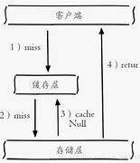

但是这种方法会存在两个问题：

1. 如果空值能够被缓存起来，这就意味着缓存需要更多的空间存储更多的键，意味这当中可能会有很多的空值的键
2. 即使对空值设置了过期实践，还是会存在缓冲层和存储层的数据会有一段实践窗口不一致，这对于需要保存一致性的业务会有影响

### 缓存击穿

> 概述

我们需要注意和缓存击穿的区别，缓存击穿，是指一个key非常热点，在不停的扛着大并发，大并发集中对这一个点进行，当这个key在失效的瞬间，持续的大并发就穿破缓存，直接亲求数据库，就像在一个屏障上凿开一个洞。

当某个key在过期的瞬间，有大量的亲求并发访问，这类数据一般是热点数据，由于缓存过期，会同时访问数据库来查询最新数据，并且回写缓存，会导致数据库瞬间压力过大

> 解决方案

**设置热点数据永不过期**

从缓存层面来看，没有设置过期实践，所以不会出现热点key过期后产生的问题

**加互斥锁**

分布式锁：使用分布式锁，保证对于每个key同时只有一个线程去查询后端服务，其他线程没有获得分布式锁的权限，因此只需要等待即可。这种方式将高并发的压力转移到了分布式锁，因此对分布式锁的考验很大

### 缓存雪崩

缓存雪崩，是指在某一个时间段，缓存集中过期失效，Redis宕机

产生雪崩的原因之一，比如双十二零点，很快就会迎来一波抢购，这波商品实践比较集中的放入了缓存，假设缓存一个小时。那么道路凌晨一点钟的时候，这批商品的缓存就都要过期了。而对这批商品的访问查询，都落到了数据库上，对于数据库而言，就会产生周期性的压力波峰，于是所有的请求都会达到存储层，存储层调用量会暴增，造成存储层也会挂掉的情况

![缓存雪崩 的图像结果](data:image/jpeg;base64,/9j/4AAQSkZJRgABAQAAAQABAAD/2wBDAAsJCQcJCQcJCQkJCwkJCQkJCQsJCwsMCwsLDA0QDBEODQ4MEhkSJRodJR0ZHxwpKRYlNzU2GioyPi0pMBk7IRP/2wBDAQcICAsJCxULCxUsHRkdLCwsLCwsLCwsLCwsLCwsLCwsLCwsLCwsLCwsLCwsLCwsLCwsLCwsLCwsLCwsLCwsLCz/wAARCAC0AS8DASIAAhEBAxEB/8QAGwABAAIDAQEAAAAAAAAAAAAAAAUGAQMEBwL/xABeEAABAwMBAgULDQkLCwUAAAABAAIDBAURBhIhEzFBUXEUFRYiNFVhgZGU0zI1U3SEk6GztMHR0uEjQkVSVFaSlbEkJSYzZHKFpLLD1DZDREZiY3OCosLwB2Vmo8T/xAAaAQEBAAIDAAAAAAAAAAAAAAAAAQIEAwUG/8QAJREBAAEDAgYCAwAAAAAAAAAAAAECAxEEIQUSEzFRgXHxFSJB/9oADAMBAAIRAxEAPwD1tQtVqGkp5CyCiuVeGSTwSyW6GKRkU8D+DfFIZJGHaB8CmlXtHja0/b5X75p5K6epcd5fUPqpTI4nnJygx2VR8ti1F5pT/NOnZVB3l1D5lH80qsOy38UeQJst/FHkCCv9lVP3n1D5gPmkTsrpe9F/8wPzPVg2W/ijyBNlv4o8gQV/srpO9N//AFefrp2VUvei/wDmB+d6m6h4ghllED5TG3aEcQZtu8A2iB8KjLNdjdmzSMo9iBj5WCcOaYy9kpbwRaQH7YGC7cRk4zkYAc/ZVTd6NQeYj55E7Kac8Vm1B5kz0q6aS8UdZcJ6GJodsxySxSMjfgNhk6nlE20AAdrIZzgZ5N+qG/U9RWUtJDSyO4Z9Sx0m5rQIpCwSNMgaS3AJdu3Egb8oNXZVFyWPUR9xw/PMnZUzvFqLzSn+edWHA5h8CYHMPgQV7spb3h1F5rTf4hOylveHUfmlMf2TqxYHMPIFjA5h5Agr3ZVB99ZdQt6aJh/sylSVPdqKaiNfKJ6SASCI9XxmB7XOkbE3LXc5IA6V3lrfxR5AoHUo2madgP8AEVGorXHUtHE9jeEmYDyY22sPiQT6IniQETxJ4kBE8SeJARPEniQcNfdbfbm7VQ+Qu7QmKmikqJmteXNa90UILw0kEZxjIUd2XWDlNyHTa7j6JYtrRNqLWEkw2nwdaKOEO3hlMKYzgDPO5zyVO8FF7G3yBBB9l2nuV9wHTbLj6FZ7LtNcs9aOm2XP0Cm+Ci9jZ+iE4KH2Nn6IQQnZdpj8qqh0225j+4Tsu0x+V1P6uuXoFN8DD7Gz9ELHAw+xs/RCCF7L9L/ldT+rrn6BOy7TPJU1Z6LZc/QL6p7zaqmudQw00z5AGEuEOCwO2iXSxuw9rRu3kY7YLfVXK1UtVTUs3BB00kULjjJjlnOIGOaBnL9+OhBzdlum/Zq0/wBGXP0Cx2Xae/HuH6ruXoVvrbtaaCSSGVm1NHwBdHEwPcRITnZazJyAMkEDORjOVJtZE5rXcE0bQBw5mHDIzgg8qCF7LbBz3I/0XcfQp2W2Lmuf6ruHolOcFF7Gz9EJwUXsbPIEEH2W2HmuY/ou4eiWey2wHidcCeQdbbgCfG6ID4VN8FF7Gz9EJwUXsbPIEH39IVf0mWttdRCzfFS3e9U8D+MSRNrZS1zTzb8eJT0rS+ORgLml7XM2mktc3aGMtI355lBGx11PTW+jtF1nt9NR04gEcUVNKJHZzwj3Txudnn3oJ/KKu9atVji1PU+Ojtx/uE616uxu1RP46C3ehVVYkVd62aw/OZ/6vt/oljrZrLdjUzvDm30HzRhETtRA2phlhc+RrZGlrjFI6N+CMbnsId8KiLfp2ltvDy09RMaySJsUc8pJZEGxCIbMDCIzxbW8E5J371o616yJ36okDf8AYt9uG/8A5oivoWvV/wCdE/mFt9CipmlpIaSmipos7MbNkvJHCSO5XucMdsTkk85UYdM2jhmVDGyMlbPTzF23tl3AvbKWkyAntnAOcc5J5d609a9W/nRUeY270Kx1r1b+c9R5jbvQoLGmVXetWrPzoqfMrd6FY606r/Oiq8zt3oUFjymVXetOq8f5UVXmdu9AnWrVw4tUT+Ohtx/uUFiyoDVThHQUFQPV0t7ss0TeV7zVsi2QOfDitfWzWQ/1mcf51voPmjC6m2ipqG2l11rX1k1urJK1jhGyCN8mwWR7cUWGksydlBMoniTxKIIniTxICJ4k8SAieJCggaLMep9Tx52hUUFmrN33hAnp9l3hOzlTygpbTcYHXaptlZHHcLlWRVE89XBw7WwRx8GyBjNpoAaOLfz865+pdfD8L2w9Nt+iZVVlTKrfU+vh+E7Sem3P+adatvWbc5u+n/8AmpSP/wBKC0rByQQCQcHBwNx59+5Vto129odHX2J7TntmUUrmnk3FtVhDF/6gHGK2yN58UE2fhqSiNkWnZmXOW4OudUNt73uEGIpp8lha2oe3tS1uHbLQwDtvLIU9tjFTVV1VHBLVyzB8TxGD1PFG3g4mRufvyBkk7t7jyblGdT6+P4StI/o9/p06m1930tP6ud6dB01+n4K2eSpdUztmcQ8ZI4IPjbsw5YzZyGb+XJ2jv5pSkgdTU1JTukdK6CCKF0r87UhY0NL3ZJOTx8aguptf99bV+rnenWOptfd9bV+rj6dFWVFWuptfd9bX+rj6ZZ6l1732tf6uPp0FkyirQp9eEZF2tTt5G63EjIOCMidfQh17xGvtOOcUEgd4szkfAiLGiIoCh9Q1lZQW19RSPayfh6WIPewPDWySBh7V25TCgdWD95pfBVUB/rDEFZfqLUbIpZBXtyxpcB1LT4OOQ9qvQC9kbHPe5rWMYXvc8gNa0DaLnE7sBeVTdzVX/BkPkaSvRrrQVVzo46WGqZTxvfG6p2oTLwsQGeD3PbgE4J378Y5d9VTq+9VtTcIrnSvcxlI4i3xOcQySEkbZmb/veXmGzyhXi3V1PcqSCrgJ2JAQ5jsbcUjTh8TwOVp3H7V5w4P3teQXB743FowCWPLCQDnjwrTpK3VcEEdxNa10Fypo5n0bYA1rJc4a8SFxOcbjuGfEgtSIiiCIiCsaguDqW6aba1zg2nnFVVAHDTDOeoxtDwAvPiVmH0qiaqppHXRjOG3XGCmhYSzJp/uzafLd+/1RcOLerzG1zI42OdtuaxrXPIxtEAAux4eNVX2iIogiIgIiICIiAiIgIiIH2rySnji2IzwcedkDexud3iXra8ng9QzoP7Sqq9aVwLS0ANAFZXDDQAB92cdwCnlA6Vz1rkG7dXVg/wCvKnlEEREBERBglVu/Xx0PC0FA/FQAG1NQ3eKcO+8jPsh+Dj4zhT9RHLNBPFFM+CR7HMZNG1rnxE7tpoeC3I6FRLtbBaZaWFtQ+ds8M0pMrI2vD2vaCcsAznOTnl6VVa7RdpbPMQduSglfmoiBJdG48c0WeX8YcvHx8foEE8FRFFPBI2SKVjXxvYctc08RBXlpaXvhjDi3hZ6eEuADi0SyNjJAduzvXoFmszrO2ojbX1FRBK4PbDMyJrIn/fOZwbQd/KPp3hLoiKIKD1V6y1XgnoT/AFiMKcULqcfvJX+B9Ef6zEgoMw/c1X4IJT5Gkr1WM5ZGedrD8AXlUvc9X4YJ/wCw5ep0xzT0x54YT/0hVXmTweFmHNVVQ/8Aver3pv1hsntOP51RphioqR/Laz5Q9XjTBzYLKf5MB5HuCiJhERAREQU3VPrtYvcvy6JXL7VTdU+u1j9y/LolcvtVUREUQREQEREBERAREQEREBeUQ7gBzF/9oherFzW42i0ZO7JAz0ZXlEfEcYPbSgHkOHu3hVV40of3uqfBcaz9rSrAq1paeBlDVsdLG1xuVRhrnsDjtNjxhpOd/IrKogiIgIiICp+rO67b7VqvjIlcFT9Wd1232rVfGRqqrTe6KEfy6h+PYvVefpXlTe6KH27RfHsXqvP0oCIiiMHiVM1TNfYXPgkliNprHxcEWQgPY+Mtk4GSQnjJGWnG/eOMb7otFVTU1ZBNTVDBJDM3Ze08vKCDyEcYPJhB5g1gka5h4pGuYf5rhg8aumm5L3VMdVVdSHUGwyGhjMMTHy7BAM+0wA7O7DefeeZRdPpWrNe+nqyH2uI7ZmLm7daw+pgc0bx/vDy8nqji6Ma1rWtaAGtADQ0AAAbgAByKq8xl7pqhzV9b8FS9XfTHrDZ/+A74x64ZtJU8ks8ouVawTTzT7LY6UhrpXmQgEx5wCdynLdRR26ipKKOR8jKdmwJJdnbfvLiXbIA5eZRHWiIgIiIKbqn12sfuX5dErl9qpuqfXax+5fl0SuX2qqIiKIIiICIiAiIgIiICIvmSRkbXPkc1rGjLnOOABzkoIu+WWnvFO1rthtTBtPpJnDOw8je1/wDsu3B3l5FQOClgkkgmj4KaB3ByRHHaEc2N2OUHm+D1QEEAgjBAII5QoqektNdWTxVtDTyvETIWSyNB4SMt4Qxk+DO7pKxmumnGZ7qgNPWWKtkiulTEw08Tw+ia5jczyt4qhxIzst/zfh38gV0C+C6KGMuOGxxM4gAA1rRgAAeQLXSzuniEj2Bj9uRjmA7WyWuxx46FJuUxVyzO46EWuWaKFjpJXtYwAkl3gGdw41mORssccjQQ17WvbtDBwRkZB3rLMdkfaIioKoas7qtvtap+MjVvVQ1Z3VbPa1T8ZGqqstH7oofbtF8exeq8/SvKm90UPtyh+PYvVedAWOXyLKfYoirQSalvD7hVUN1bRUsNwrqCCEUtPMHNpJXQGXblbtZcQc7+Rbut+tfzijP8620nzYX3pTdbaxh4473fmY5sV8xU+grvUOtx+H6Y9Ntg+ssdQa3P4fpx0W2n+dxUTd7tdYK6eLqiSOCW6wRREPkgbFA1jIw9zn5w0uzk4wcE8Q39moa+tdII6KaeKKhp2XF8rHMjjqJXSiCJge4gloyScEhxwByltV19b9acuoo/FbqROtusz/rJjot1F87VrvtyrIIKGFjpqad7iKhsb2bYdKx0EMW2w+qcSXjBOAwk+GWs87ai20EjXSPZwLWNklm4eSUM7TbfId5Jwc5386Ijet2tBxajYf59upP+0BdlurquSsr7ZUlksttpbc6oqmt4MTVFS2R7gIxuAADTx8qlsKCtn+UWtBzmyv8ALSFvzKCeREQU3VPrtY/cvy6JXL7VTdU+u1j9y/LolcvtVUREUQymRzqD1NU1VLQQvpppIXvrYI3PiIDiwh5Lc45cBVTrrdu+Nb779iD0dF5x11u3fGt99+xOut2741vvv2K4Ho64ZrnQwV0Fvme5k08Imic4Yidl5YGbecbRwcAqjddLv3xrfffsXPNPNUvL6mWSd5jERdM7aPBglwaPGUV6fn/zCKnWTUEsUlLb610kzZ5BBST4L5WvPFHKBvI5nY3cvOrbKHmN+xII3bOQ8ta4N8JDtyiMTCoLP3O9jJAQfujNtjh+KcEFcorHb4qunMbiCHbB4WNzSN5G7OPEtJnr48DrhbZefaDYn+QPcP2LTJWPILZ3QOaDnLIxKM84MMm0PIuv1Wo6UePWzKmMt0T+pnBlM9slO7fE3Paho3lmeMEcY+xYJE0lU4B7cviwXAhzXtjbvGeULVFEyZrJZdiU7Ykhk4N8bw0cW0XHaOPCunIAJJAAGSTuAAXh9bxWu7m1R2zn4mPDaptR3l8mWabg2SNwIe2kIGGyyD1Jb4Bx9PQkcs0L52xxtIlLJA9xwxrtkNdkDfncCvg1VKN5mYM49USPvdrl8CzFPBMZBE9ruDcA7HJneCuH8nqur1/7jDLkpxh8ScG6SNlRM0uf28rpSG4hYclrW8gJwBjwrrkr4WYEcckhPqO12A48zdrefE1c8jZCCYuCEu5ofK0uw3O/GMH4V8RSPjc7gnQyTHtXuZHJPLnmc4PwOjcu34ZxKqc0zP7T3neZlx12/DugdcJHl87YYosdpE3afLv5XvOAOgDxrqUe1t5k/wA5FCDyvia5w6GNJH/UuyCOWOMNlmfM/JJe5rGE+ANYAML2NqvnjO/trTGG1VDVndVs9rVPxkat6qGrO6rZ7WqfjI1zist7oofblD8oYvVedeVN7oofblD8oYvVedAT7ETAURVNP3S0UlPcurLhRUklVerxWxQVdRFBK2CaqfsOMcjg4bQG0N3Kprr5pw8V5tR6K6m+utststk7tuWkge7AGXxtJx0kLUbHYjx2+lPTDGf2hUYfd9Nua4Putpc1wLXB9XSlpBGCDl3EVrN20o5gjN0shYAwBhq6MtAYQ5oA2sbuRffWDT+797aPn/iYvqqGu0ljtVXS0vWSmmE0ccr5MxR8G18wg3N2Dk788YRUyb3pnIJvNoJByCa2lJB4sjt06+6a79Wjz6m+uvvrNZPyCl96Z9CdZrL+QU3vbPoQYF8067ivFqPRXUx/71H2l8dRqDVlXA5j6Z0Nmp2SxnajlkZC+Uua4dqcB7RuP2d7rHYneqt9KemGM/tC7YKenpo2RQRtjjaMNbGA1oHMANyiNqIiCm6p9drH7l+XRK5faqbqn12sfuX5dErl9qqiIiiI672w3WlZTcOYCyoinEgY2TezaGNkkceedQXYZJ32f5pH9dW5EFR7DJO+z/NI/rp2GSd9n+aR/XVuRBUew2Tvs/zSP66hbhaKujuNPbKV766oqKUVDPuYiawcI6MulcCWhoxvP7c7vSFjZbtF2BtEAE4GSBkgZQQ1lsNPa28NI4T18jcS1BGGsB/zcDTxN+E8vMJlzQ4Frmtc0gghwBBHhBWUQRElLLtng7TbAzPqiWue4c+NhoHlK1miqN+act3g4puAj+EHa+FS8zzGxz2xSSkYxHFs7biebbcB8K4nMulQTwjYoIyP4sSOcf8AmMeCf0gF12r08XKd8/EfTOJxLlg4OJ7oGMqNrJc90khmDSANznl7sHwLpIyCCAQRgjnBXxLCIGBpnJcQdlkYZBFG3le4jfjm37/hHzG2YQ4haeDjjceFnLiHBrSe1BO0fgXh9Vwu91eW3G/jOcfMtqm5GN3waOjOxtQMJZktLskjI2c5z4ltigghGIo2MAaG9qMdqN4C+S+ZwAiaHOZEyeXjIDSB2rfCd5HR4V9M6okdO6PZfGwxAMxh5Dow7LXE4PQtOjQaq5EREZznHplz0w+y4NaXOOA0EnAJ3dA3qOYyke5zmVDJI3OcdlvAwFhO8tB2APLv8K64miSUtM87OEdlu8do/GDG5jxu5wtr6KpztMfC9+R2xDonkeEjaafG1dtoOG36cXqPr04664nZrhgoZHbLKmsjeeJnDujJ6NntT5V2Q0XBODhVVz8HOzNUOe0+AhwXC6FzQW1NtEsZyXPpgwPz4WsIyejC7qE0vAkU5nMYcRs1Bm243ADLMT9sAvaaXPLvDWl18iqGrO6rZ7WqfjI1b+RVDVndVs9rVPxka3EVlvdFD7cofj2L1XnXlTe6KH25Q/HsXqvOgIiKIIiICpGrji52/wAFJG7yVkZV3VI1h64UB/kR+CqjKC7oiICIiAiIgpuqfXax+5fl0SuX2qm6p9drH7l+XRK5faqoiIogiIgIiICIiAiIgLGCsog5IqJjXOkmeZ5nPLi+QANbzBjBuAHIuiRhfHKwYy5j2jPFkjG9faLCKKae0Dmpad1PCxhO1IQ10rhxOfgDdnkHIsU1M6ndV9sCyWYSRNxvY3YA2fLnCpWonytvdWBJI0cDSEBrnAeoPMV26WfIbhWtc97h1BE7DnucM8O4ZwSpFummIiI7KtVRSx1DSDlj8drIzAe0jeCtzGvaxge7beGtDnYxtEDecL6RWKYjeIQwiIsgVQ1Z3Vbfa1T8ZGreqhqzuu2+1ar4yNZKrTe6KH25Q/HsXqnOvKm90UPtyh+PYvVedAREUQREQFSNZbq63nmoZz5KiIq7qhatkknuggMfBimoe1kc7dKJnNkLgANwGyQUF9Rc1BUurKOiqnRcEamCOfgy7aLA9ocAXYHJjkXSgIiICIiCm6p9drH7l+XRK5faqZqn12sfuX5dErn9qqiIiiCIiAiIgIiICIiAsrCICItFXNNBTzzQ076iSNheyCNzWvlxxtaXbs8yCjak9fKr2vR/2XLs0qf3zqx/7cw/1gqGuFxbda19a2F0LZIoYwxzw933MOyTgDn4vAui2XGS11MtSylNSZadtK2Jsmw90jpQ5ob2rsk8Q/8AMVXoqLXC+V8ULpYxFK6NjpIw8P4N5GS3bGAccWVsUQREQFUNWd1W32tU/GRq3qoas7qtntap+MjVVWm90UPtyh+PYvVF5U3uih9uUPx7F6rzoCL4mligimnlcGRQxvllceJrGNLnE45gFXoarVlzpqK4ULrbSU1ZTQVEdNW08008W20OIfIyVoPP6kKIsiKvbGux/pNjPTR1PzVCY177LYfNav8AxCKsKqeq7e+pmsskYdtVNQLTMW5OI6hweHnHI3D/ACrs/h6PvtPnpp6wf36x/Dw/m8emGs9Mgn2taxrWNADGtDWgcQaBgAL6Vezr7/497zW+mTa17z6e8cFb6dUWFFXs69/H0/5vWenWP4fey2Ae5av/ABCCxeNFXtnXnLUWLxUlT/iE2NeZ31Vkx4KOo+eoQcuoqG5VV0s0lNSyzQsMAlkjLNmIsq45Tt7TgcYBPEVa+fxqv8Hrr8qsvmc/+IWNjXg/0myHpo6j5qhBYUVe/h6Ae3sDjyZp6tv7Jyux9ylo3afpayNj6+6Tvp3ily2KMxwvmklAkJdsDAHH98FESqIiAiIgIiICIhQEUFNdbrUy1sVlpKWY2+sfRVb66SSNjpBFHL9wMQdnG0Q7ON4WrqvXXLa7QeiqqR/dqqsSblXerNbj8E2nz2o9CnV2tu81s8/n9Cgj9SWUQulutK3ETjt18TRuYdwNQ0Dk9kHj5879N2gkR3WrjLXlpNBE8dtHG4YM7wfvnD1PMPC446TXa0HHZLYf6Qm9AnV+s+8lt/WE/wDh0FhHIs5Vd6v1r3ltn6wn/wAOnV2te81sHTXz+gQWJFXertb957UOmuqD+yFOrNcd6bT57U+hQWJVnUdvudbUUElHT8MyOCeOTEsTNlznscN0hHMVs6r1z3rs46aupP7Ik6q10fwbZfOar0aCvMsOoeHpC6gLWMqqWR73VFPhrWSte44DieIcy9DVd6q1z3ts3hxU1Xo1kVmt+I2u0/zhV1O7xcF86CQvrOEsmoGfj2q4s8tO8LZaHiW1WaTdiS30T93F20LCl1qqWittyqqoZp4aWZ0rd5LwWkbAA5XcQ6Vw2F8dvstjo6+pp46unt1JHNHJNG17CIxhpBOd3EoibRc/VtAeKqpvFNH9Kz1XRHiqaf31n0oN6LV1RTHimh98Z9Kzw9P7LF7436UGquq4qKkqaqQOLYYpJA2Nu095a0u2Wt5/GOkDeq9arjeh14FU2WqljhbWQ7XBxwRvniNQIi55DgwbgM54ieXfY5J6JzXMkmp9lwLXtfJHggjBBBK0sdaIzUFklE01Dg6oIfCOFIYI8v379wA6Aqqs2W/3OtulLTSTQvpxQv6qLgA7qiJzsua5gDeIgncBxcy3QXuonvUcbqiY05qJ209PFwDBJFKzZhLxJhxBDXSDBzhw4+JT+bLtB+1b9sRmEODoMiM7izPN4EDrIHueH28Pc9srnbUG0XtGy15PHkcQKDuRc/Vtv/K6X36P6ydW2/8AK6X3+P6yiOhFz9W2/wDK6X3+P6yyKuiPFU0x6Jo/pQb1A3HDdS6Pd+PT32HB4geChkyPDuUzw9OeKaE9EjD86gru5s990bBAdqogqK24SuaQRHRCmfA7a8D3OaB0HmQWJERAREQEREBOVEQQGmRswXthHbM1De2vJ43E1Bfk+IqfVe004SyapqITtUdRf6t9K8HLX7EccMrmkbsF7XYVh38yoIniTxKAsOLWglxAABJJ3AAbySVnxLBGeMeAhBWIb5WTXdgbtutc0tTSQcHTyOcXUu58pOCd5cMY+9bnp56rUtxirhSMhibI65RxMhm2Q8UhBjLnFrjvJG0M4wXAHw2dtDRtnjqGwtE0YqBG4ZGz1Q5r5SBxZcQCThaprbbXkyvooXyCUTlwjbwhkDg7ayN+eVVUTebtWU9W2lpqhkDGxwmaTgRJI17pNtzWcIOD3MacjP3w8dhjeJGMkAcA9rXAPaWvAIzhzTvBXJPTw1DTDIxs8B22TNlDJI37ecghwwccRW8kx07yAYxHCSNkB+wGtyA0cuEG/ITcoGmr7nL1Xwrg0xRTOYGwhv3Rgzh21nHEfLyra2rreDnc6U9pE3YxBsl8j5xE0tBZkjdhva78qImMhMjnUL1ZXlsoa7JDowHyR7IYDNIzJPBt3dqAN3j3L66tq2xyunMjGiRjInQwSHbPbFxBAxs8WDk8SCXexkrXMkaHMdjLSMg4Od4K4KqxWOtmfPVUNPLM8NDnvjaXEAYGSRlEQc3Yvpg/gyl96Z9C+XaW0vkfvXSe9s+hEVDsU0t3spf0G/QvnsT0t3spv0AiIrLdKaVGcWul8cbT+0L67FdLd66T3pn0IiDPYtpfvXSe9M+hZ7FtL966T3pn0IiIdi+mO9lJ70z6FnsX0x3spPemfQiKB2L6Y72UvvbPoXydLaX72UvvbfoREHwdKaWI9a6Xfu3MA/YpWnoqOlZAyCFjGwxNgiDQO1jbvDQeZEQdCIiAiIgIiICwd6Igh6+yWepipIJaZvBU3CcCyNz42s297sCMjjUedMaeAP7lf5xUfXRFVa+xqw/k8viqqkfses9jVi5IqgdFZVj+8REDsbsn4lX57WekXx2M2IvBMdSccW1W1hHwyIiDYNMWD2Cbzqq+uh0xp/Hc8vnNT9dEQdNJZ7db3yy0bZoXlrWPxPK5r254nNe4jo3L4nsVqqZpKioZNLUP3PlfUTBztgBgyGODeLwIiDWNL6da0htK4Db2yBPOAXYxtEB3GjtOWJ2yHQSuDRwY2qmpOGtO2AMv5DvCIgP01YZOD24JXFmNgmpqctwdoY7fkO8LX2OWOPeyGcZO/wDdVTg44sjbwiIP/9k=)

其实集中过期，倒不是非常致命，比较致命的缓存血本，是缓存服务器某个节点宕机或断网。因为自然形成的缓存雪崩，一定是在某个时间段集中创建缓存，这个时候，数据库也是可以顶住压力的。无非就是对数据库产生周期性的压力而言。而缓存服务节点的宕机，对数据库服务器造成的压力是不可预知的，很有可能瞬间就把数据库压垮

> 解决方案

**redis高可用**

这个思想的含义是，既然redis有可能挂掉，那我多增设几台redis，这样一台挂掉之后其他的还可以继续工作，其实就是搭建的集群（异地多活）

**限流降级**

这个解决方案的思想是，在缓存失效后，通过加锁或者队列来控制读数据库写缓存的线程数量。比如对某个key只允许一个线程查询数据和写缓存，其他线程等待

**数据预热**

数据加热的含义就是在正式部署之前，我先把可能的数据预先访问一遍，这样部分可能大量访问的数据就会加载到缓存中。在即将发生大并发访问前手动触发加载缓存不同的key，设置不同的过期实践，让缓存失效的时间点尽量均匀


